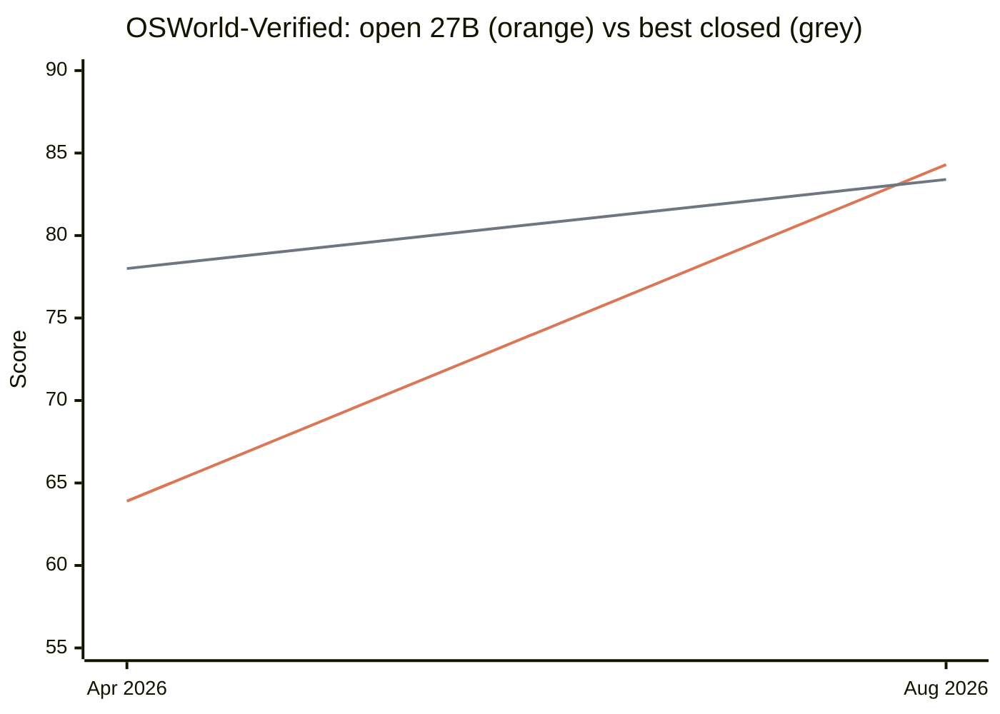

## When a free model caught up with the paid ones

On August 14, 2026, Alibaba's Qwen lab published Qwen3.8-27B, under a permissive license and with a 262,144-token context window. It takes text, image, and video input,[^qwen] an open model, runnable by anyone, with no subscription.

The numbers that matter are the comparative ones. Next to the three closed models that were the top of the market when it shipped — Claude Opus 4.8, GPT-5.5, and Gemini 3.1 Pro[^opus]:

| Benchmark[^bench] | Qwen3.8-27B | Opus 4.8 | GPT-5.5 | Gemini 3.1 Pro |
| --- | --- | --- | --- | --- |
| OSWorld-Verified (computer use) | 84.3 | 83.4 | 78.7 | 76.2 |
| SWE-bench Pro (coding) | 61.7 | 69.2 | 58.6 | 54.2 |
| Terminal-Bench 2.1 (terminal) | 73.0 | 74.6 | 78.2 | 70.3 |
| GPQA Diamond (scientific knowledge) | 89.2 | 93.6 | 93.5 | 94.3 |

Nobody wins every category. On scientific knowledge the open model is the worst of the four, and not by a little. On the terminal it sits behind GPT-5.5 and Opus, but ahead of Gemini. On coding it loses only to Opus, and clears both GPT-5.5 and Gemini comfortably — the two most widely used paid models in the world. And on computer use it beats all three.

That last row is worth opening up, because it's the one that matters most to anyone trying to automate office work. OSWorld-Verified drops the agent inside a real computer — operating system running, applications installed — and asks it to finish 369 tasks: edit a spreadsheet, find a file, change a setting. There's no written exam and no multiple choice. When a task ends, a script inspects the machine's actual state and validates whether it was done or not. The score is the percentage of tasks completed.[^osworld] There the open model is ahead of all three.

There's also cost. In a legal-agent study run by Harvey over a synthetic law firm of roughly 10,000 documents, a version of the 27B handled the tasks at about US$ 0.13 per query against US$ 1.32 for Opus 4.8 — ten times cheaper, with slightly better strict accuracy, 30% against 25%. In this case, that model had been trained on the test corpus itself, so the number shows what a 27B absorbs with domain-specific tuning, not how the open weights perform.[^harvey]

And a second observation: Qwen's scores are self-reported by Alibaba, and independent verification is still missing. The same skepticism applies to any number published by whoever makes the product.

There's one more observation to make, about scope, and it's the most important one: this compares against the generation that was the top in May, not against what those same companies shipped afterwards — Opus 5 landed on July 24. What the table shows isn't an open model leading today's top. It's an open 27-billion-parameter model, one that anyone can download and run, reaching the previous top while the top keeps moving. What matters here, and what the rest of this piece rests on, is that this model:

## You don't need a datacenter, just a strong machine under the desk

The closed models — Opus, GPT, Gemini — run on the infrastructure of whoever built them and reach you through an API, billed by usage. Qwen3.8-27B runs on a graphics card you can buy online right now.

A model is, in practice, a giant file of parameters. The more decimal places you keep for each number, the more memory the file takes — and there's a process, called quantization, that trims that precision until the file shrinks without any noticeable drop in answer quality. That's what makes Qwen3.8-27B fit: compressed, it takes about 16 GB and runs entirely inside the 32 GB of memory on an Nvidia RTX 5090 card.[^gpu]

Speed runs from 45 to more than 200 tokens per second, depending on the compression technique. A token is roughly a fragment of a word — anywhere in that range, text comes out faster than a person can read it.

Local hardware isn't cheap. The median US price for this card in August 2026 is around US$ 4,700. In Brazil the card runs between R$ 20,000 and R$ 25,000.[^price] The irony is that it's expensive precisely because of the AI buildout, which swallowed the world's memory supply.

That's still a high price to run something locally, and there's no point dressing it up: nearly R$ 22,000 for a card is not a trivial decision for a small company, let alone for a person. Compared with a professional subscription at US$ 100 a month, the card would take some 50 months to pay for itself — and that's the card alone, without the rest of the machine or the power bill, against a subscription that still buys a better model. In most cases, today, it isn't worth it. But two things point the same way. The first is the order of magnitude — this is a one-time purchase of a desktop part, not a datacenter contract, and the price of the card tends to fall over time.

The second is that hardware is specializing for exactly this use. Apple put a neural accelerator inside every GPU core starting with the M5 series and carried the architecture across the whole line, through the M5 Ultra and the M6 announced this month.[^apple] It's an explicit bet on local inference, backed by unified memory reaching 128 GB on the M5 Max — and unified memory is the single biggest unlock for running a large model locally today. It's defensible to expect that before long, running a model this size stops requiring a top-of-the-line card and becomes just another property of the machine someone already owns.

## The closing gap

Qwen3.6-27B shipped on April 22, 2026. The 3.8 shipped on August 14. Four months, same model size:

*Orange: the open 27B, from 63.9 (version 3.6, April 22) to 84.3 (version 3.8, August 14). Grey: the best closed score on the same test, from 78.0 (Opus 4.7, April 16) to 83.4 (Opus 4.8, May 28). The gap was 14.1 points in April; by August the open model was in front.*[^curva]

And not only on that test. Terminal-Bench 2.1 went from 63.4 to 73.0, and DeepSWE, the hardest of the three, more than tripled: 13.3 to 42.2. Not one extra parameter.

This is what people mean by a "Moore's law for AI." The analogy is loose — Moore was talking about transistors per unit of silicon, on an 18-to-24-month cadence — but the practical effect is the same: the same capability costs less each round, and the price drop happens too fast for the market to settle around it.

There's one detail the hardware analogy hides. The gain didn't come only from better cards. It came from a model of the same size doing what, six months earlier, only a much larger model could do. Efficiency is rising on both sides at once.

## From scarce asset to infrastructure

Nobody subscribes to a CPU. Nobody rents RAM by the month. The overwhelming majority of people who use a computer every day have no idea which filesystem is organizing their documents, and don't need to. These are layers of technology that became invisible by becoming universal.

In my view, that's where AI is heading. Not a scarce asset held by a handful of companies able to fund billions in infrastructure, but a computing resource everyone has, the way everyone has a processor, memory, and an operating system.

Much of this is already present tense, not forecast. You can wire a model into virtually any work that passes through a screen: writing code, artwork in Canva, the entire Microsoft 365 suite, customer support and internal helpdesk flows, configuring your own computer in plain language, provisioning a server without being technical, and anything at all that can be done with a browser open.

Of course, several of those carry real risk when the person asking doesn't know what they're asking for. Misconfigured servers, exposed data, permissions granted far too broadly — and that's before the security questions specific to handing an agent web access and credentials. That deserves an article of its own, which this isn't. None of it changes the argument that follows.

## The two attributes

Work that was purely manual — that required neither **intent** nor **validation** — is narrowing, and running out.

I picked those two words carefully, because I think they're what separates the roles that keep gaining value from the ones that keep losing it.

**Intent** is deciding what needs to exist: for whom, toward what goal, under what constraint. **Validation** is judging whether what came back is fit for purpose, and saying what changes if it isn't.

Between the two sits the middle: turning intent into an artifact. It's that middle that's getting cheap, and getting automated.

## Three scenarios

**Marketing.** An executive holds the intent — which message, for which audience, chasing which objective and which organizational KPI. They hand that to a team that turns the instruction into artwork and copy. Days or weeks later the material comes back and they validate it: this is what I had in mind, the tone is right, here we change this. The value always sat at the two ends. What changed is that the middle now takes minutes, the executive can produce it themselves, and the validation cycle fits inside the same day instead of the same fortnight.

**Finance.** A director wants to know what the target company is worth under three growth scenarios and two debt structures. That's the intent. An analyst builds the model: projected P&L, discounted cash flow, WACC, sensitivity analysis. A week of spreadsheet. It comes back and the director validates: the churn assumption is too optimistic, redo it at double. The spreadsheet is the middle. The judgment about which assumptions are defensible, and which ones the buyer across the table will attack, is intent and validation.

**Product and engineering.** A PO holds the intent — this screen needs to reduce checkout abandonment, and the hypothesis is that the field count is the problem. A developer translates that into code. The PO validates and tests it.

The simplified version of that example deserves a correction, because it's unfair: development work is almost never the mechanical translation of a closed specification. A developer exercises intent constantly — choosing structure, picking between alternatives with different costs, deciding what counts as an error case — and validates their own output before anyone else sees it. That's exactly why the profession isn't manual labor.

So the criterion isn't the job title. It's **how much of a person's day is the mechanical translation of a decision somebody else already made**. The more of it there is, the more exposed they are.

## In the end, it's all delegation

Investors delegate to the board, which delegates to the CEO, who delegates to their directors, and so on down. Every link in that chain receives intent from above, forms its own intent within its slice, and validates what comes from below. There's no clean line separating the people who think from the people who execute — there's a gradient, and almost everyone sits somewhere along it.

What AI does is push the gradient. The pure-execution end loses value first and fastest. The rest holds, but with an ever-cheaper middle inside every link.

## What the news actually says

The news isn't the score against this or that closed model. It's where that score was set: a graphics card bought online, four months after the previous version of the same size.

While AI was an expensive subscription from half a dozen companies, you could treat it as an optional tool — something the innovation team pilots while the rest of the company watches. That's over. In ten years, or fewer, an AI agent will be as unremarkable as a spreadsheet or a browser — and the closer we get to that point, the more the work that carries no intent, and whose validation always belongs to someone else, keeps running out.

[^qwen]: Qwen3.8-27B weights published by Alibaba's Qwen lab: 27.78 billion parameters, Apache 2.0, native 262,144-token context, text, image, and video input. See [DataNorth AI](https://datanorth.ai/news/alibaba-releases-qwen3-8-27b) and [Simon Willison's write-up](https://simonw.substack.com/p/qwen-38-27b-is-excellent-but-it-defaults).
[^opus]: These three were the closed frontier in mid-August 2026: Claude Opus 4.8 released May 28 and succeeded by Opus 5 on July 24 ([Wikipedia](https://en.wikipedia.org/wiki/Claude_%28language_model%29), [LLM Stats](https://llm-stats.com/blog/research/claude-opus-4-8-launch)); Gemini 3.1 Pro released February 19, 2026; GPT-5.5 released by [OpenAI](https://openai.com/index/introducing-gpt-5-5/) in 2026.
[^bench]: Qwen3.8-27B scores per the model card published by Alibaba ([Northflank](https://northflank.com/blog/qwen3-8-27b-performance-benchmarks-gpu-requirements-and-how-to-run-it)); Opus 4.8, GPT-5.5, and Gemini 3.1 Pro from [Vellum](https://www.vellum.ai/blog/claude-opus-4-8-benchmarks-explained)'s compilation, on the Terminus-2 harness; GPT-5.5's GPQA from the [pricepertoken](https://pricepertoken.com/leaderboards/benchmark/gpqa) leaderboard. Benchmarks measure what they measure, and the harness changes the answer: on Terminal-Bench the order between GPT-5.5 and Opus 4.8 flips depending on which harness is used. Read the table as orders of magnitude, not a league table.
[^gpu]: NVFP4 checkpoint of Qwen3.8-27B quantized with NVIDIA Model Optimizer for the 32 GB GeForce RTX 5090, serving the full native context: [Hugging Face](https://huggingface.co/gittensor-model-hub/Qwen3.8-27B-NVFP4-RTX5090). Local throughput figures via [Kingy AI](https://kingy.ai/blog/qwen3-8-27b-local-hardware-requirements/).
[^price]: US street price for August 2026 via [videocardprices.com](https://videocardprices.com/card/nvidia-rtx-5090/); Brazilian price range via [TecMundo](https://www.tecmundo.com.br/voxel/500406-rtx-5090-chega-por-ate-r-20-mil-no-brasil-veja-preco-das-rtx-50-no-pais.htm). August 2026 figures, subject to change.
[^apple]: A Neural Accelerator in every GPU core starting with the M5 ([Apple Newsroom](https://www.apple.com/newsroom/2025/10/apple-unleashes-m5-the-next-big-leap-in-ai-performance-for-apple-silicon/)), extended across the line through the M6 and M5 Ultra in August 2026 ([Apple Newsroom](https://www.apple.com/newsroom/2026/08/apple-introduces-m6-and-m5-ultra-for-a-big-leap-in-performance-and-ai-compute/)). Mac Studio with M5 Max reaches 128 GB of unified memory ([Apple Newsroom](https://www.apple.com/newsroom/2026/08/apple-introduces-new-mac-studio-with-m5-max-and-m5-ultra/)).
[^osworld]: OSWorld-Verified is XLANG Lab's revision of the original OSWorld, fixing more than 300 infrastructure and task-wording issues; the score is the fraction of tasks completed, averaged over three runs ([XLANG Lab](https://xlang.ai/blog/osworld-verified)). Scores cited: Qwen at 84.3 per the model card; Opus 4.8 at 83.4, GPT-5.5 at 78.7, and Gemini 3.1 Pro at 76.2 per [Vellum](https://www.vellum.ai/blog/claude-opus-4-8-benchmarks-explained) and the [BenchmarkList](https://benchmarklist.com/benchmarks/osworld_verified/) leaderboard.
[^harvey]: Harvey's legal-agent study and the domain-tuning caveat, plus the survey of where the scores come from, via [Orca Router](https://www.orcarouter.ai/blog/qwen-3-8-27b-benchmarks).
[^curva]: The closed line uses the best published OSWorld-Verified score at each date: Opus 4.7 at 78.0 ([Vellum](https://www.vellum.ai/blog/claude-opus-4-7-benchmarks-explained)) and Opus 4.8 at 83.4. It stops there deliberately: Opus 5, from July 24, doesn't publish OSWorld-Verified — it reports OSWorld 2.0, a different and harder test where Opus 4.8 itself scores 55.7 rather than 83.4. Mixing the two scales would make a pretty, wrong chart. Two releases per side is a direction, not a projection.
