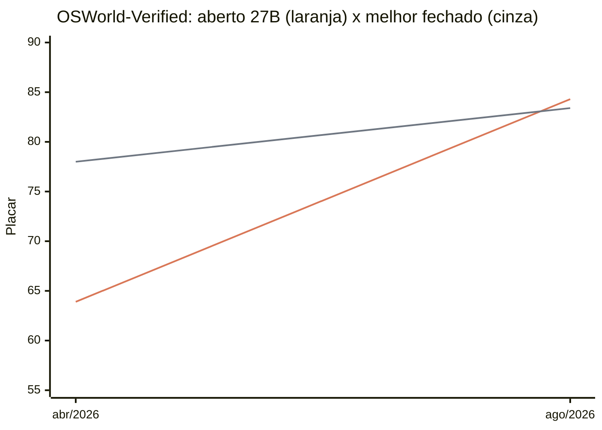

## Quando um modelo de graça alcançou os modelos pagos

Em 14 de agosto de 2026, o laboratório Qwen, da Alibaba, publicou o Qwen3.8-27B, de licença livre, com janela de contexto de 262.144 tokens. Aceita entrada de texto, imagem e vídeo,[^qwen] sendo um modelo aberto, executável por qualquer um, sem assinatura.

Os números que interessam são os de comparação. Ao lado de três modelos fechados de ponta — Claude Opus 4.8, GPT-5.5 e Gemini 3.1 Pro[^opus]:

| Benchmark[^bench] | Qwen3.8-27B | Opus 4.8 | GPT-5.5 | Gemini 3.1 Pro |
| --- | --- | --- | --- | --- |
| OSWorld-Verified (uso de computador) | 84,3 | 83,4 | 78,7 | 76,2 |
| SWE-bench Pro (programação) | 61,7 | 69,2 | 58,6 | 54,2 |
| Terminal-Bench 2.1 (terminal) | 73,0 | 74,6 | 78,2 | 70,3 |
| GPQA Diamond (conhecimento científico) | 89,2 | 93,6 | 93,5 | 94,3 |

Nenhum ganha em todas as categorias. Em conhecimento científico o modelo aberto é o pior dos quatro, e não por pouco. No terminal ele fica atrás do GPT-5.5 e do Opus, mas passa o Gemini. Em programação perde só para o Opus, e passa com folga pelo GPT-5.5 e pelo Gemini, os dois modelos pagos mais usados do mundo. E em uso de computador ele ganha dos três.

Vale explicar essa última linha, porque é a que mais interessa a quem quer automatizar trabalho de escritório. O OSWorld-Verified larga o agente dentro de um computador de verdade, com sistema operacional rodando e aplicativos instalados, e manda ele concluir 369 tarefas: editar uma planilha, encontrar um arquivo, mudar uma configuração. Não é prova escrita nem múltipla escolha. Ao fim de cada tarefa, um script inspeciona o estado real da máquina e valida se fez ou não fez. O placar é a porcentagem de tarefas concluídas.[^osworld] Nele o modelo aberto está na frente dos três.

Uma ressalva de escopo. Usei o Opus 4.8 na tabela porque é o modelo fechado mais forte com placar publicado nas mesmas provas que o Qwen: o Opus 5, de 24 de julho, reporta o OSWorld 2.0 no lugar do OSWorld-Verified, uma prova diferente e mais dura, em que o próprio 4.8 cai de 83,4 para 55,7.[^curva] Misturar as duas escalas daria um número bonito e errado.

E o 4.8 não é uma referência fraca. Foi o topo por meses e deu conta de praticamente tudo que precisei nesse período, de programação a tarefas do dia a dia. Mas já temos o Opus 5, que é melhor. Então o que a tabela mostra não é um modelo aberto liderando o topo de hoje. É um modelo aberto de 27 bilhões de parâmetros, que qualquer um baixa e roda, que alcançou o topo anterior. Mas claro, o topo continuou se movendo.

## Não precisa de um datacenter, só de uma máquina potente debaixo da mesa

Os modelos fechados — Opus, GPT, Gemini — rodam na infraestrutura de quem os construiu e chegam até você por uma API, cobrados por uso. O Qwen3.8-27B roda em uma placa de vídeo que você pode comprar em um e-commerce agora mesmo.

Um modelo é, na prática, um arquivo gigante de parâmetros. Quanto mais casas decimais são armazenadas em cada número, mais memória o arquivo ocupa, e existe um processo (quantização) que corta essa precisão até o arquivo encolher sem que a qualidade da resposta caia de forma perceptível. É isso que faz o Qwen3.8-27B caber: comprimido, ele ocupa cerca de 16 GB e roda inteiro dentro dos 32 GB de memória de uma placa RTX 5090 da Nvidia.[^gpu]

A velocidade vai de 45 a mais de 200 tokens por segundo, dependendo da técnica de compressão. Um token é, aproximadamente, um pedaço de palavra — em qualquer ponto dessa faixa o texto sai mais rápido do que alguém consegue ler.

A placa necessária para rodar o modelo ainda não é barata. A mediana de preço nos Estados Unidos em agosto de 2026 está em torno de US$ 4.700. No Brasil, ela sai entre R$ 20 mil e R$ 25 mil.[^preco]

Ainda é um valor alto para rodar local, e não adianta disfarçar: quase R$ 22 mil em uma placa não é decisão trivial nem para uma empresa pequena, muito menos para uma pessoa. Comparada a uma assinatura profissional de US$ 100 por mês, cerca de R$ 500, a placa levaria uns 50 meses para se pagar — e isso é a placa sozinha, sem o resto da máquina nem a conta de luz, contra uma assinatura que ainda entrega um modelo melhor.

Na maioria dos casos ainda não vale a pena. Mas duas coisas apontam na mesma direção. A primeira é a ordem de grandeza — é uma compra única de uma peça de desktop, não um contrato de datacenter, e o preço da placa tende a cair com o tempo.

A segunda é que o hardware está se especializando para exatamente esse uso. A Apple colocou um acelerador neural dentro de cada núcleo de GPU a partir da série de chips M5 e repetiu a arquitetura em toda a linha, até o M5 Ultra e o M6, anunciados neste mês.[^apple] É uma aposta explícita em inferência local, apoiada em memória unificada que chega a 128 GB no M5 Max — e hoje é a memória unificada que mais destrava a execução local de modelos grandes. É defensável esperar que, em pouco tempo, rodar um modelo desse porte deixe de exigir uma placa de topo de linha e vire só mais uma característica da máquina que a pessoa já tem.

## A distância diminuindo

O Qwen3.6-27B saiu em 22 de abril de 2026. O 3.8 saiu em 14 de agosto. Quatro meses, mesmo tamanho de modelo:

*Laranja: o 27B aberto, de 63,9 (versão 3.6, 22 de abril) para 84,3 (versão 3.8, 14 de agosto). Cinza: o melhor placar fechado na mesma prova, de 78,0 (Opus 4.7, 16 de abril) para 83,4 (Opus 4.8, 28 de maio). A distância era de 14,1 pontos em abril; em agosto o aberto passou à frente.*[^curva]

E não foi só nessa prova. O Terminal-Bench 2.1 foi de 63,4 para 73,0, e o DeepSWE, o mais duro dos três, mais que triplicou: de 13,3 para 42,2. Nenhum parâmetro a mais.

É a isso que as pessoas se referem quando falam em uma "lei de Moore da IA". A analogia é imprecisa — Moore falava de transistores por área de silício, com cadência de 18 a 24 meses — mas o efeito prático é o mesmo: a mesma capacidade custa menos a cada rodada, e a queda de preço acontece rápido demais para o mercado se acomodar.

E há um detalhe que a analogia com hardware esconde. O ganho não veio só de placas melhores. Veio de um modelo do mesmo tamanho fazendo o que, seis meses antes, só um modelo muito maior fazia. A eficiência está subindo dos dois lados ao mesmo tempo.

## De ativo escasso a item de infraestrutura

Ninguém assina uma CPU. Ninguém contrata memória RAM por mês. A esmagadora maioria das pessoas que usam um computador todo dia não sabe qual sistema de arquivos está organizando seus documentos, e não precisa saber. São camadas de tecnologia que foram abstraídas até se tornarem invisíveis e universais.

Na minha análise, é para lá que a IA está indo. Não um ativo escasso na mão das poucas empresas capazes de bancar bilhões em infraestrutura, que monetizariam isso com assinaturas caríssimas. Mas sim um recurso computacional a que todo mundo terá acesso, assim como todo mundo tem processador, memória e sistema operacional.

Hoje os modelos já podem ser atrelados a praticamente qualquer trabalho feito em computador: geração de código, artes de marketing, a suíte inteira do Office (Microsoft 365), atendimento a cliente, análise e criação de relatórios e dashboards, até mesmo configurações do próprio computador ou de servidores, em linguagem natural — ou qualquer coisa que se resolva com um navegador aberto.

Claro, várias dessas coisas têm risco real quando quem pede não sabe o que está pedindo. Servidor mal configurado, dado exposto, permissão ampla demais — e isso sem entrar nos riscos de segurança específicos de dar a um agente acesso à web e às suas credenciais. Vale um artigo inteiro sobre isso, mas não muda o argumento a seguir.

## Os dois atributos mais importantes

Com essa popularização e commoditização da inteligência artificial, o trabalho puramente "braçal" (o que não exige nem **intenção** nem **validação**) vai diminuir.

Escolhi essas duas palavras com cuidado, porque acho que são elas que separam as posições que vão ganhando valor das que vão perdendo.

**Intenção** é decidir o que vai ser feito: para quem, por que, com qual objetivo, sob qual restrição, com qual tom. **Validação** é julgar se o que voltou serve, e dizer o que muda se não servir.

Entre uma coisa e outra existe o meio: transformar a intenção em artefato. É este meio que está barateando e sendo automatizado.

## Três cenários

**Marketing.** Um executivo tem a intenção: qual mensagem, para qual público, atrás de qual objetivo e para mover qual KPI da organização. Ele repassa isso a um time que transforma a instrução em artes e textos. Dias ou semanas depois, o material volta para ele, que valida: "É isso que eu tinha em mente?", "O tom está certo?", "Vamos dar mais ênfase aqui". O valor continua nas duas pontas, mas o meio agora leva minutos e o próprio executivo consegue produzi-lo — e o ciclo de validação passa a caber no mesmo dia em vez de na mesma quinzena.

**Financeiro.** Um diretor quer saber quanto vale a empresa alvo sob três cenários de crescimento e duas estruturas de dívida. Essa é a intenção. Um analista monta o modelo: projeção de resultado, fluxo de caixa descontado, WACC, análise de sensibilidade. Uma semana de planilhas. O material volta e o diretor valida: "a premissa de churn está otimista demais, refaça com o dobro". A planilha foi o meio. O julgamento sobre quais premissas são plausíveis e quais o comprador do outro lado vai contestar é a validação.

**Produto e engenharia.** Um gerente de produto precisa reduzir o abandono no checkout, e a hipótese é que o problema seja o número de campos no formulário. O desenvolvedor traduz isso em código. O gerente valida e testa.

Aqui cabe uma observação, porque essa versão simplificada é injusta: o trabalho de desenvolvimento quase nunca é uma tradução mecânica de uma especificação fechada.

O desenvolvedor exerce intenção o tempo todo: em decisões de arquitetura, no tratamento de casos de erro e na validação inicial do próprio resultado.

O critério, então, não é o cargo. É **quanto do dia da pessoa é transformar uma decisão já tomada por outra pessoa**. Quanto mais for, mais exposto está.

## Tudo, no fim, é delegação

Investidores delegam ao conselho, que delega ao CEO, que delega aos seus diretores e assim por diante. Cada elo dessa corrente recebe uma intenção de cima, forma a sua própria intenção no recorte que lhe cabe, e valida o que veio de baixo. Não existe uma linha limpa separando quem pensa de quem executa — existe um espectro, e quase todo mundo está em algum ponto dele.

O que a IA faz é empurrar esse espectro. O extremo da execução pura perde valor primeiro e mais rápido. O resto continua, mas com o meio cada vez mais barato e automatizável dentro de cada elo.

## O que a notícia realmente diz

A notícia não é o placar contra esse ou aquele modelo fechado. É onde o placar foi obtido: uma placa de vídeo comprada em e-commerce, quatro meses depois da versão anterior do mesmo tamanho.

Enquanto a IA for uma assinatura cara de meia dúzia de empresas, dá para tratá-la como ferramenta opcional, algo que a área de inovação testa e o resto da empresa observa — mas isso logo vai deixar de ser verdade.

Em dez anos, ou menos, um agente de IA vai ser tão banal quanto uma planilha ou um navegador, e quanto mais próximos estivermos desse momento, mais o trabalho sem intenção, e cuja validação depende de outro, vai diminuir.

[^qwen]: Pesos do Qwen3.8-27B publicados pelo laboratório Qwen (Alibaba): 27,78 bilhões de parâmetros, Apache 2.0, contexto nativo de 262.144 tokens, entrada de texto, imagem e vídeo. Ver [DataNorth AI](https://datanorth.ai/news/alibaba-releases-qwen3-8-27b) e a [análise de Simon Willison](https://simonw.substack.com/p/qwen-38-27b-is-excellent-but-it-defaults).
[^opus]: Claude Opus 4.8 lançado em 28 de maio e sucedido pelo Opus 5 em 24 de julho, que não publica placar nas provas desta tabela ([Wikipedia](https://en.wikipedia.org/wiki/Claude_%28language_model%29), [LLM Stats](https://llm-stats.com/blog/research/claude-opus-4-8-launch)); Gemini 3.1 Pro lançado em 19 de fevereiro de 2026; GPT-5.5 lançado pela [OpenAI](https://openai.com/index/introducing-gpt-5-5/) em 2026.
[^bench]: Placares do Qwen3.8-27B conforme o cartão do modelo publicado pela Alibaba ([Northflank](https://northflank.com/blog/qwen3-8-27b-performance-benchmarks-gpu-requirements-and-how-to-run-it)); Opus 4.8, GPT-5.5 e Gemini 3.1 Pro na compilação da [Vellum](https://www.vellum.ai/blog/claude-opus-4-8-benchmarks-explained), no harness Terminus-2; GPQA do GPT-5.5 pelo leaderboard do [pricepertoken](https://pricepertoken.com/leaderboards/benchmark/gpqa). Benchmarks medem o que medem, e a escolha do harness muda o resultado: no Terminal-Bench, a ordem entre GPT-5.5 e Opus 4.8 se inverte dependendo de qual harness é usado. Leia a tabela como ordem de grandeza, não como placar de campeonato.
[^gpu]: Checkpoint NVFP4 do Qwen3.8-27B quantizado com o NVIDIA Model Optimizer para GeForce RTX 5090 de 32 GB, servindo o contexto nativo completo: [Hugging Face](https://huggingface.co/gittensor-model-hub/Qwen3.8-27B-NVFP4-RTX5090). Números de desempenho local em [Kingy AI](https://kingy.ai/blog/qwen3-8-27b-local-hardware-requirements/).
[^preco]: Preço de rua nos EUA em agosto de 2026 em [videocardprices.com](https://videocardprices.com/card/nvidia-rtx-5090/); faixa de preço no Brasil em [TecMundo](https://www.tecmundo.com.br/voxel/500406-rtx-5090-chega-por-ate-r-20-mil-no-brasil-veja-preco-das-rtx-50-no-pais.htm). Valores de agosto de 2026, sujeitos a variação.
[^apple]: Neural Accelerator em cada núcleo de GPU a partir do M5 ([Apple Newsroom](https://www.apple.com/newsroom/2025/10/apple-unleashes-m5-the-next-big-leap-in-ai-performance-for-apple-silicon/)), estendido a toda a linha até o M6 e o M5 Ultra em agosto de 2026 ([Apple Newsroom](https://www.apple.com/newsroom/2026/08/apple-introduces-m6-and-m5-ultra-for-a-big-leap-in-performance-and-ai-compute/)). O Mac Studio com M5 Max chega a 128 GB de memória unificada ([Apple Newsroom](https://www.apple.com/newsroom/2026/08/apple-introduces-new-mac-studio-with-m5-max-and-m5-ultra/)).
[^osworld]: O OSWorld-Verified é a revisão que o XLANG Lab fez do OSWorld original, corrigindo mais de 300 problemas de infraestrutura e de enunciado; o placar é a fração de tarefas concluídas, com média de três execuções ([XLANG Lab](https://xlang.ai/blog/osworld-verified)). Placares citados: 84,3 do Qwen conforme o cartão do modelo; 83,4 do Opus 4.8, 78,7 do GPT-5.5 e 76,2 do Gemini 3.1 Pro conforme [Vellum](https://www.vellum.ai/blog/claude-opus-4-8-benchmarks-explained) e o leaderboard do [BenchmarkList](https://benchmarklist.com/benchmarks/osworld_verified/).
[^curva]: A linha fechada usa o melhor placar publicado em OSWorld-Verified em cada data: Opus 4.7 em 78,0 ([Vellum](https://www.vellum.ai/blog/claude-opus-4-7-benchmarks-explained)) e Opus 4.8 em 83,4. Ela para aí de propósito: o Opus 5, de 24 de julho, não publica OSWorld-Verified — reporta OSWorld 2.0, uma prova diferente e mais dura, em que o próprio Opus 4.8 faz 55,7 e não 83,4. Misturar as duas escalas daria um gráfico bonito e errado. São duas versões de cada lado, não uma série longa: leia como direção, não como projeção.
