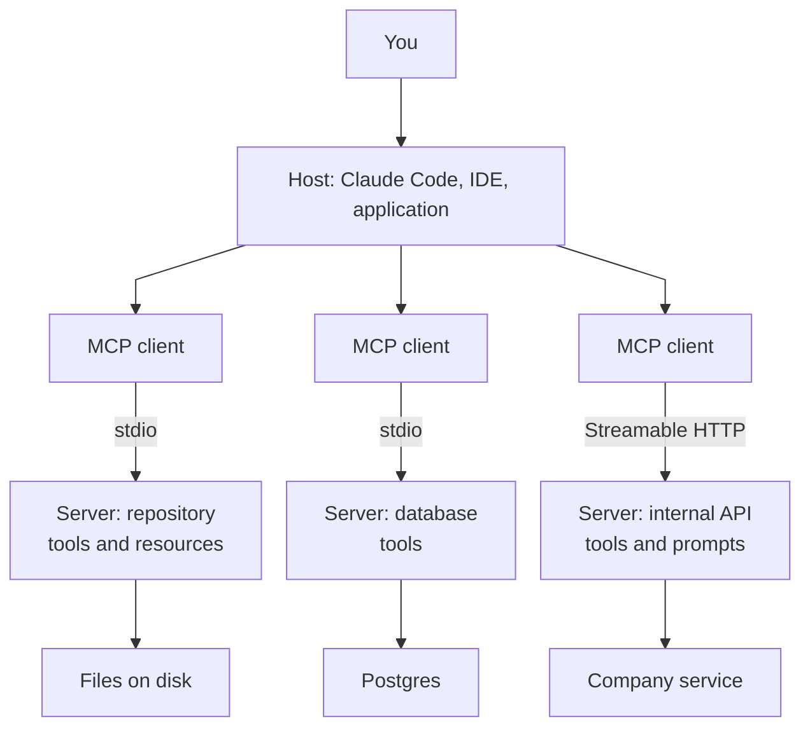
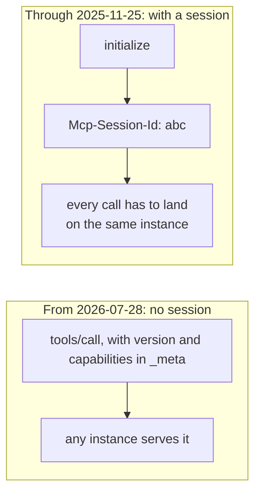

Anyone using an AI agent today has gone through the Model Context Protocol without necessarily knowing it. Every time the model reads a file from your repository, queries a database, or opens a ticket, there is an MCP server in the middle.

I told the long history of the field [in a separate article](../the-story-of-ai/). This one is about the piece of plumbing that turned "agent" from a demo into a working tool: where it came from, what changed in the July 2026 revision — the one everyone calls MCP 2 — and how to build one for your own code or processes.

## The problem it solves

MCP was opened by Anthropic on 25 November 2024, written by David Soria Parra and Justin Spahr-Summers.[^origem] The problem it attacks is arithmetic, not intelligence.

Before it, wiring a model to a tool was hand work, one pair at a time. Every vendor had its own function-calling format, every application wrote its own adapter, and none of it was reusable. Ten AI applications needing a hundred data sources is a thousand integrations to write and maintain. Put a protocol in the middle and it becomes a hundred and ten: each source speaks the protocol once and serves any application; each application understands the protocol once and sees every source.

ChatGPT plugins, from March 2023, had tried to solve the same thing from the opposite direction: one format, but one vendor's format. Writing a plugin meant writing for a single client, and the work died with the vendor's decision to discontinue them in April 2024.

The difference in outcome showed up fast. On 26 March 2025 OpenAI announced MCP support in the Agents SDK and the desktop app; on 9 April, Demis Hassabis said Gemini would adopt it too.[^adocao] Four months after launch, a competitor's standard had won. On 9 December 2025 Anthropic donated the protocol to the Agentic AI Foundation, under the Linux Foundation, co-founded with Block and OpenAI alongside goose and AGENTS.md.[^fundacao]

In my analysis, it didn't win on technical elegance. It won because the problem hurt everyone at the same time, and because the specification was small enough to implement in an afternoon.

## The three pieces and the two transports

An MCP server exposes three things, and what separates them is who pulls the trigger. **Tools** are functions the model decides to call. **Resources** are data the client reads and puts in context — a file, a query result, a document. **Prompts** are instruction templates the user invokes, not the model.[^pecas]

On the wire there are two transports. **stdio** runs the server as a child process on your machine and talks over standard input and output; that covers nearly every local server. **Streamable HTTP** serves remote servers, with OAuth authorization.



*The host opens one client per server. Each server knows one system and only that one.*

The part that usually takes a while to land: an MCP server is not a service with a model inside it. It is an adapter with no opinions. It doesn't know which model is on the other side, decides nothing, and keeps no conversation. It describes what it can do, and does it when told.

## MCP 2

Naming honesty first: officially there is no "MCP 2". Specification revisions are dated — `2024-11-05`, `2025-03-26`, `2025-06-18`, `2025-11-25` and `2026-07-28` — and the date only moves when compatibility breaks.[^versoes] "MCP 2" is what the market calls the 28 July 2026 revision, because the SDKs jumped to version 2 and because Cloudflare named it that on its own blog. It is the first incompatible revision since launch, and the largest rewrite the protocol has had.

It was necessary because of an inheritance. MCP was born out of stdio: one local process, one session, one connection held open end to end. When that was transplanted onto HTTP, the session became the `Mcp-Session-Id` header, and with it came sticky routing, state shared across instances, session draining on every deploy, and a stream held open just to be able to ask the user something mid-call. It was a desktop protocol pretending to be a server protocol.



*Without a session, a load balancer goes back to being a load balancer.*

What the revision changes, in order of impact:

- **A stateless core.** The `initialize`/`initialized` handshake is gone, and so is `Mcp-Session-Id`. Every request carries its own protocol version and client capabilities in the `_meta` field. A plain load balancer doing round-robin copes again — with no shared storage.
- **One discovery RPC.** `server/discover` is mandatory on the server and optional on the client: it returns supported versions, capabilities and identity in a single request.
- **MRTR instead of server-initiated requests.** When information is missing, the server returns `resultType: "input_required"` saying what it needs, and the client resubmits the original request with `inputResponses`. No more stream left hanging while the user answers.
- **Header-based routing.** `Mcp-Method` and `Mcp-Name` travel in the HTTP request, so gateways, rate limiters and firewalls stop having to open the JSON body to know what is going through.
- **Cacheable lists.** `tools/list` and its siblings now return `ttlMs` and `cacheScope`, and tool ordering has to be deterministic — which keeps the model's prompt cache stable across reconnects.
- **Extensions as a formal mechanism.** Tasks moved out of the core and became an extension, and that is the door MCP Apps and enterprise managed authorization come in through.
- **Harder authorization.** `iss` validation per RFC 9207, credentials bound to the issuer that minted them, and Client ID Metadata Documents in place of dynamic client registration.
- **A deprecation policy.** Roots, Sampling, Logging, dynamic registration and the HTTP+SSE transport all entered the deprecated state, with a twelve-month minimum window: removable from 28 July 2027, not before.[^depreciacao]

The feature list is less interesting than what it concedes. The protocol stopped pretending an agent session is a phone call and started treating it as what it always was: a sequence of independent requests. And the specification followed practice rather than leading it — Cloudflare was already running an unofficial stateless mode in production, across billions of tool calls, before it became the norm.[^stateless]

If you run local stdio servers, none of this changes your day: the SDK handles it. If you publish remote servers, it is the difference between needing stateful infrastructure and not.

## Building an MCP for your code or processes

Start with the opposite case. If it's a script one person runs when they remember to, a CLI solves it and costs less. MCP pays for itself in two situations: when more than one client needs the same capability, or when the thing deciding *whether* and *when* to call it is the model rather than you.

The most common case I see is the third-party system: there is an integration with an outside API — an acquirer, an ERP, a carrier — and there is the documentation the team wrote about it, with the fields that matter, the error codes, and the quirks nobody found in the vendor's manual. The two live in separate places, and the one who needs them together is precisely the agent. The example below packages that pair into a server.[^sdk]

```bash
uv init acquirer-mcp && cd acquirer-mcp
uv add "mcp[cli]"
```

```python {filename="acquirer.py"}
import os
from dataclasses import dataclass
from pathlib import Path

import httpx2
from mcp.server import MCPServer

mcp = MCPServer("acquirer")

API = "https://api.acquirer.example/v1"
DOCS = Path("/srv/integration-docs")
AUTH = {"Authorization": f"Bearer {os.environ['ACQUIRER_TOKEN']}"}


@dataclass
class Transaction:
    acquirer_id: str
    status: str
    amount_cents: int
    captured_at: str


@mcp.tool()
def find_transaction(merchant_id: str, external_id: str) -> Transaction:
    """Look up a transaction at the acquirer by the id our checkout sent as external_id.

    Start here whenever someone reports a payment that "did not go through": this says
    whether the acquirer ever saw it, and what state it stopped in.

    Args:
        merchant_id: Merchant code at the acquirer, from our merchants table.
        external_id: The id our checkout generated, in the form "ORD-<digits>".
    """
    r = httpx2.get(
        f"{API}/transactions",
        params={"merchant_id": merchant_id, "external_id": external_id},
        headers=AUTH,
        timeout=15.0,
    )
    r.raise_for_status()
    return Transaction(**r.json())


@mcp.tool()
def refund(acquirer_id: str, amount_cents: int, reason: str) -> str:
    """Refund a transaction at the acquirer, in full or in part. This moves real money.

    Read the amount from find_transaction and confirm it with the user before calling.
    Never infer the amount from what was said in the conversation.

    Args:
        acquirer_id: Acquirer-side id, as returned by find_transaction.
        amount_cents: Amount in cents, never more than the captured amount.
        reason: Free text, stored in the acquirer audit trail.
    """
    r = httpx2.post(
        f"{API}/refunds",
        json={"transaction_id": acquirer_id, "amount": amount_cents, "reason": reason},
        headers=AUTH,
        timeout=15.0,
    )
    r.raise_for_status()
    return r.text


@mcp.resource("docs://{endpoint}")
def endpoint_docs(endpoint: str) -> str:
    """Our integration notes for one acquirer endpoint: fields, error codes, known quirks."""
    return (DOCS / f"{endpoint}.md").read_text()


if __name__ == "__main__":
    mcp.run(transport="stdio")
```

Worth noticing what is *not* in the file: no hand-written JSON Schema, no request parsing, no validation code. The SDK builds all of it from the type hints, on both sides. `amount_cents: int` becomes an input schema that refuses text; the `Transaction` return becomes an output schema, and the tool hands back structured data instead of a block of text somebody downstream would have to reinterpret.

That's the point I most often see missed, and the one that most changes the result in practice: **the type hint is the schema and the docstring is the prompt**. `external_id: str` is already the validation. And the docstring isn't documentation for whoever maintains the code — it is literally the text the model reads to decide whether to call the tool, with which arguments, in what order. Writing `"""Refunds a transaction."""` throws away the only channel you have for instructing the model. The two docstrings above say when to call, when not to, and where each argument comes from; that's what they're for.

The `docs://{endpoint}` resource is there for the same reason, one level up. An agent about to call `/transactions` needs to know what the acquirer's error code means in your context, and that usually lives in the integration note your team wrote, not in the vendor's official API reference. Exposing the documentation alongside the call is what separates a server that works from one that gets it right.

Registered with a client, the server becomes available:

```bash
claude mcp add acquirer --env ACQUIRER_TOKEN=$ACQUIRER_TOKEN -- uv run /srv/mcp/acquirer.py
claude mcp list
```

The file equivalent, for the desktop app:

```json {filename="claude_desktop_config.json"}
{
  "mcpServers": {
    "acquirer": {
      "command": "uv",
      "args": ["run", "/srv/mcp/acquirer.py"],
      "env": { "ACQUIRER_TOKEN": "..." }
    }
  }
}
```

One trap that costs nearly everyone half an hour the first time: over stdio, standard output is the protocol channel. A debug `print()` injects garbage into the middle of the JSON-RPC stream and kills the server with no useful error.

```python
import sys

print("connected to acquirer")                    # breaks the server
print("connected to acquirer", file=sys.stderr)   # correct
```

Not by coincidence, that is exactly what the 2026 revision started recommending when it deprecated the protocol's own Logging feature: logs go to `stderr`, or to OpenTelemetry.

Three mistakes that show up later, once the server is running and starts to grow:

- **Too many tools in one server.** The whole list enters the context on every call, so each tool nobody uses is a fixed tax charged on every conversation. Small, specific servers beat generic ones.
- **Descriptions written for humans.** Same problem as the empty docstring, one level up: the model has no source other than what you wrote.
- **Destructive tools left unguarded.** `refund` moves real money. Behavior annotations have been in the specification since March 2025, and idempotency is still your job — the protocol doesn't solve that for you.

## Where MCP stands today

MCP became boring, in the best sense available. In under two years it went from one vendor's announcement to a foundation project with neutral governance, and the 2026 revision stripped out its last inheritance from being a local-machine protocol. Plumbing that works is plumbing nobody talks about.

The hard part moved. It is no longer wiring the model to the system; it is deciding what is worth exposing, with what description, and with how much write access. That is a product and risk decision, not an integration one — and it's exactly the kind of work that [stays with the human](../intent-and-validation/) even when the model writes the whole server by itself.

[^origem]: [Original announcement](https://www.anthropic.com/news/model-context-protocol), 25 November 2024. Specification, SDKs and reference servers all shipped open the same day, which helps explain the adoption speed.
[^adocao]: OpenAI announced on [26 March 2025](https://techcrunch.com/2025/03/26/openai-adopts-rival-anthropics-standard-for-connecting-ai-models-to-data/) and Google on [9 April](https://techcrunch.com/2025/04/09/google-says-itll-embrace-anthropics-standard-for-connecting-ai-models-to-data/).
[^fundacao]: [MCP joins the Agentic AI Foundation](https://blog.modelcontextprotocol.io/posts/2025-12-09-mcp-joins-agentic-ai-foundation/), 9 December 2025. The AAIF is a directed fund under the Linux Foundation; each project keeps technical autonomy over its own direction.
[^pecas]: The [server concepts documentation](https://modelcontextprotocol.io/docs/learn/server-concepts) covers all three. In practice tools is what nearly every server implements, and plenty of people never get around to using prompts.
[^versoes]: The revisions, in order: `2024-11-05`; `2025-03-26`, which brought Streamable HTTP, OAuth and tool annotations; `2025-06-18`, with OAuth 2.1, structured output and elicitation; `2025-11-25`, with experimental Tasks and icons; and [`2026-07-28`](https://modelcontextprotocol.io/specification/2026-07-28), the current one.
[^stateless]: The [revision changelog](https://modelcontextprotocol.io/specification/2026-07-28/changelog) lists nine major changes and twelve minor ones. [Cloudflare's post](https://blog.cloudflare.com/mcp-v2/) covers the operational side and is where the "MCP v2" nickname comes from.
[^depreciacao]: The [feature lifecycle policy](https://modelcontextprotocol.io/community/feature-lifecycle) defines the Active, Deprecated and Removed states, with a twelve-month minimum window before any removal. For Roots, the suggested migration is passing paths as parameters; for Sampling, calling the provider API directly; for Logging, `stderr` or OpenTelemetry.
[^sdk]: The snippets use version 2 of the Python SDK, which speaks the `2026-07-28` revision and earlier ones. The 1.x line stays available on a separate branch for anyone who hasn't migrated. TypeScript, Go and C# shipped updated on the same date.
