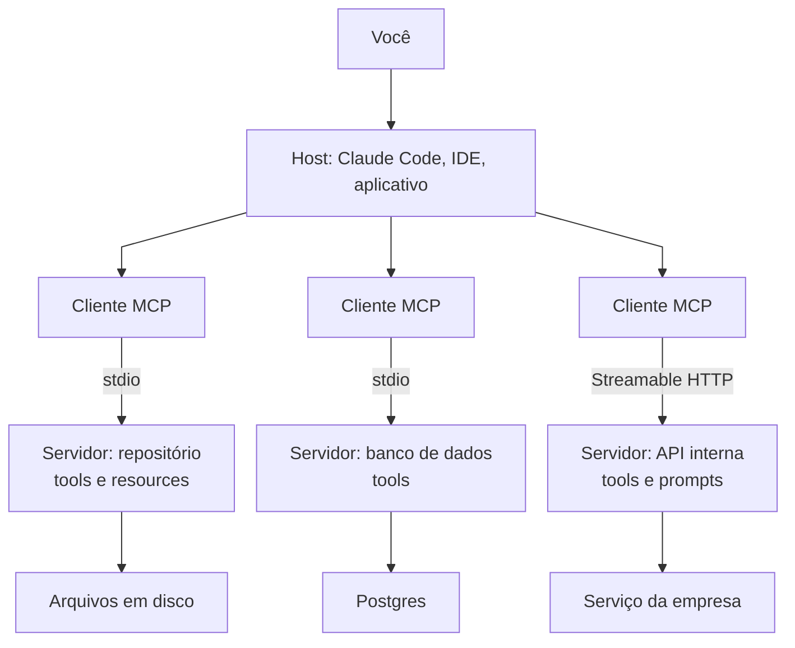
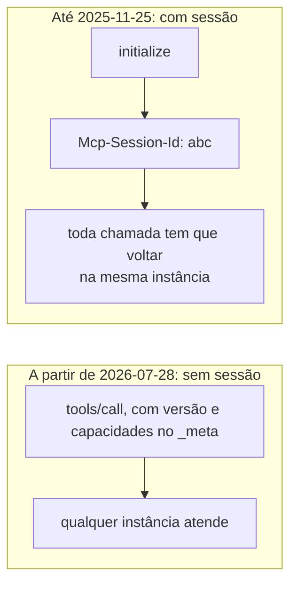

Quem usa um agente de IA hoje já passou pelo Model Context Protocol sem necessariamente saber. Toda vez que o modelo lê um arquivo do seu repositório, consulta um banco ou abre um chamado, tem um servidor MCP no meio do caminho.

Contei a história longa do campo [em outro artigo](../the-story-of-ai/). Este aqui é sobre a peça de encanamento que fez a palavra "agente" deixar de ser demonstração e virar ferramenta de trabalho: de onde ela veio, o que mudou na revisão de julho de 2026 — que todo mundo chama de MCP 2 — e como criar uma para o seu próprio código ou processo.

## O problema que ele resolve

O MCP foi aberto pela Anthropic em 25 de novembro de 2024, escrito por David Soria Parra e Justin Spahr-Summers.[^origem] O problema que ele ataca é de aritmética, não de inteligência.

Antes dele, ligar modelo a ferramenta era trabalho artesanal por par. Cada fornecedor tinha o seu formato de chamada de função, cada aplicação escrevia o próprio adaptador, e nada disso se reaproveitava. Dez aplicações de IA precisando de cem fontes de dados dão mil integrações para escrever e manter. Com um protocolo no meio, dão cento e dez: cada fonte fala o protocolo uma vez e passa a servir qualquer aplicação; cada aplicação entende o protocolo uma vez e passa a enxergar qualquer fonte.

Os plugins do ChatGPT, de março de 2023, tinham tentado resolver isso pelo caminho oposto: um formato só, mas de um fornecedor só. Quem escrevia um plugin escrevia para um cliente, e o trabalho morreu junto com a decisão do fornecedor de descontinuá-los, em abril de 2024.

A diferença de resultado foi rápida. Em 26 de março de 2025 a OpenAI anunciou suporte a MCP no Agents SDK e no aplicativo de desktop; em 9 de abril o Demis Hassabis disse que o Gemini adotaria também.[^adocao] Quatro meses depois do lançamento, o padrão do concorrente tinha ganhado. Em 9 de dezembro de 2025 a Anthropic doou o protocolo à Agentic AI Foundation, sob a Linux Foundation, fundada junto com Block e OpenAI, ao lado do goose e do AGENTS.md.[^fundacao]

Na minha análise, ele não venceu por ser tecnicamente bonito. Venceu porque o problema doía igual em todo mundo ao mesmo tempo, e porque a especificação era pequena o bastante para alguém implementar em uma tarde.

## As três peças e os dois transportes

Um servidor MCP expõe três coisas, e a diferença entre elas é quem puxa o gatilho. **Tools** são funções que o modelo decide chamar. **Resources** são dados que o cliente lê e coloca no contexto — um arquivo, o resultado de uma consulta, um documento. **Prompts** são modelos de instrução que o usuário invoca, não o modelo.[^pecas]

Do outro lado da linha existem dois transportes. O **stdio** roda o servidor como processo filho na sua máquina e conversa por entrada e saída padrão; é o caso de quase todo servidor local. O **Streamable HTTP** atende servidor remoto, com autorização por OAuth.



*O host abre um cliente por servidor. Cada servidor conhece um sistema e só ele.*

A parte que costuma demorar a cair a ficha: o servidor MCP não é um serviço com um modelo dentro. Ele é um adaptador sem opinião. Não sabe qual modelo está do outro lado, não decide nada, não guarda conversa. Descreve o que sabe fazer e faz quando mandam.

## O MCP 2

Antes do conteúdo, a honestidade de nomenclatura: oficialmente não existe "MCP 2". As revisões da especificação são datadas — `2024-11-05`, `2025-03-26`, `2025-06-18`, `2025-11-25` e `2026-07-28` — e a data só muda quando há quebra de compatibilidade.[^versoes] "MCP 2" é como o mercado chama a revisão de 28 de julho de 2026, porque os SDKs pularam para a versão 2 e porque a Cloudflare batizou assim no próprio blog. É a primeira revisão incompatível desde o lançamento, e a maior reescrita que o protocolo já teve.

Ela foi necessária por causa de uma herança. O MCP nasceu do stdio: um processo local, uma sessão, uma conexão aberta do começo ao fim. Quando isso foi transplantado para HTTP, a sessão virou o cabeçalho `Mcp-Session-Id`, e junto com ela vieram roteamento com afinidade de sessão, estado compartilhado entre instâncias, drenagem de sessão a cada implantação, e stream mantido aberto só para conseguir perguntar alguma coisa ao usuário no meio de uma chamada. Era um protocolo de área de trabalho fingindo ser de servidor.



*Sem sessão, o balanceador volta a ser um balanceador.*

O que a revisão muda, em ordem de impacto:

- **Núcleo sem estado.** Some o aperto de mão `initialize`/`initialized` e some o `Mcp-Session-Id`. Cada requisição carrega a própria versão de protocolo e as capacidades do cliente no campo `_meta`. Um balanceador de carga comum, distribuindo em round-robin, volta a dar conta — sem armazenamento compartilhado.
- **Um RPC de descoberta.** O `server/discover` é obrigatório no servidor e opcional no cliente: devolve versões suportadas, capacidades e identidade em uma requisição só.
- **MRTR no lugar de requisição iniciada pelo servidor.** Quando falta informação, o servidor devolve `resultType: "input_required"` dizendo o que precisa, e o cliente reenvia a requisição original com `inputResponses`. Acabou o stream pendurado esperando o usuário responder.
- **Roteamento por cabeçalho.** `Mcp-Method` e `Mcp-Name` viajam no HTTP, então gateway, limitador de taxa e firewall param de ter que abrir o corpo JSON para saber o que está passando.
- **Listas cacheáveis.** `tools/list` e companhia passam a devolver `ttlMs` e `cacheScope`, e a ordem das ferramentas tem que ser determinística — o que segura o cache de prompt do modelo entre reconexões.
- **Extensões como mecanismo formal.** Tasks saiu do núcleo e virou extensão, e é por ali que entram MCP Apps e a autorização gerenciada para empresa.
- **Autorização mais dura.** Validação do `iss` conforme a RFC 9207, credencial presa ao emissor que a criou, e Client ID Metadata Documents no lugar do registro dinâmico de cliente.
- **Política de depreciação.** Roots, Sampling, Logging, registro dinâmico e o transporte HTTP+SSE entraram como depreciados, com janela mínima de doze meses: removíveis a partir de 28 de julho de 2027, não antes.[^depreciacao]

A lista de recursos é menos interessante que o que ela admite. O protocolo parou de fingir que uma sessão de agente é uma ligação telefônica e passou a tratá-la como o que sempre foi: uma sequência de requisições independentes. E a especificação seguiu a prática, não o contrário — a Cloudflare já rodava um modo sem sessão não-oficial em produção, com bilhões de chamadas de ferramenta, antes de isso virar norma.[^stateless]

Para quem tem servidor stdio local, nada disso muda o dia a dia: o SDK cuida. Para quem publica servidor remoto, é a diferença entre precisar e não precisar de infraestrutura com estado.

## Criar um MCP para o seu código ou processo

Começo pelo contrário. Se é um script que uma pessoa roda quando lembra, um CLI resolve e sai mais barato. O MCP se paga em dois casos: quando mais de um cliente precisa da mesma capacidade, ou quando quem decide *se* e *quando* chamar é o modelo, e não você.

O caso mais comum que eu vejo é o terceiro sistema: existe uma integração com uma API de fora — adquirente, ERP, transportadora — e existe a documentação que o time escreveu sobre ela, com os campos que importam, os códigos de erro e as manhas que ninguém achou no manual do fornecedor. As duas coisas moram em lugares separados, e quem precisa das duas juntas é justamente o agente. O exemplo abaixo empacota esse par em um servidor.[^sdk]

```bash
uv init acquirer-mcp && cd acquirer-mcp
uv add "mcp[cli]"
```

```python {filename="acquirer.py"}
import os
from dataclasses import dataclass
from pathlib import Path

import httpx2
from mcp.server import MCPServer

mcp = MCPServer("acquirer")

API = "https://api.acquirer.example/v1"
DOCS = Path("/srv/integration-docs")
AUTH = {"Authorization": f"Bearer {os.environ['ACQUIRER_TOKEN']}"}


@dataclass
class Transaction:
    acquirer_id: str
    status: str
    amount_cents: int
    captured_at: str


@mcp.tool()
def find_transaction(merchant_id: str, external_id: str) -> Transaction:
    """Look up a transaction at the acquirer by the id our checkout sent as external_id.

    Start here whenever someone reports a payment that "did not go through": this says
    whether the acquirer ever saw it, and what state it stopped in.

    Args:
        merchant_id: Merchant code at the acquirer, from our merchants table.
        external_id: The id our checkout generated, in the form "ORD-<digits>".
    """
    r = httpx2.get(
        f"{API}/transactions",
        params={"merchant_id": merchant_id, "external_id": external_id},
        headers=AUTH,
        timeout=15.0,
    )
    r.raise_for_status()
    return Transaction(**r.json())


@mcp.tool()
def refund(acquirer_id: str, amount_cents: int, reason: str) -> str:
    """Refund a transaction at the acquirer, in full or in part. This moves real money.

    Read the amount from find_transaction and confirm it with the user before calling.
    Never infer the amount from what was said in the conversation.

    Args:
        acquirer_id: Acquirer-side id, as returned by find_transaction.
        amount_cents: Amount in cents, never more than the captured amount.
        reason: Free text, stored in the acquirer audit trail.
    """
    r = httpx2.post(
        f"{API}/refunds",
        json={"transaction_id": acquirer_id, "amount": amount_cents, "reason": reason},
        headers=AUTH,
        timeout=15.0,
    )
    r.raise_for_status()
    return r.text


@mcp.resource("docs://{endpoint}")
def endpoint_docs(endpoint: str) -> str:
    """Our integration notes for one acquirer endpoint: fields, error codes, known quirks."""
    return (DOCS / f"{endpoint}.md").read_text()


if __name__ == "__main__":
    mcp.run(transport="stdio")
```

Vale reparar no que *não* está no arquivo: não tem JSON Schema escrito à mão, não tem leitura de requisição, não tem código de validação. O SDK monta tudo a partir das anotações de tipo, dos dois lados. `amount_cents: int` vira um schema de entrada que recusa texto; o retorno `Transaction` vira um schema de saída, e a ferramenta devolve dado estruturado em vez de um bloco de texto que alguém do outro lado teria que reinterpretar.

Esse é o ponto que mais vejo passar batido, e o que mais muda o resultado na prática: **a anotação de tipo é o schema e a docstring é o prompt**. `external_id: str` já é a validação. E a docstring não é documentação para quem for manter o código — é literalmente o texto que o modelo lê para decidir se chama a ferramenta, com quais argumentos e em que ordem. Escrever `"""Estorna uma transação."""` é jogar fora o único canal que existe para instruir o modelo. As duas docstrings acima dizem quando chamar, quando não chamar e de onde tirar cada argumento; é para isso que elas servem.

O resource `docs://{endpoint}` está ali pelo mesmo motivo, um nível acima. Um agente que vai chamar `/transactions` precisa saber o que o código de erro do adquirente quer dizer no seu contexto, e isso costuma estar na nota de integração que o time escreveu, não na referência oficial da API. Expor a documentação junto com a chamada é o que separa um servidor que funciona de um que acerta.

Registrado no cliente, o servidor fica disponível:

```bash
claude mcp add acquirer --env ACQUIRER_TOKEN=$ACQUIRER_TOKEN -- uv run /srv/mcp/acquirer.py
claude mcp list
```

O equivalente em arquivo, para o aplicativo de desktop:

```json {filename="claude_desktop_config.json"}
{
  "mcpServers": {
    "acquirer": {
      "command": "uv",
      "args": ["run", "/srv/mcp/acquirer.py"],
      "env": { "ACQUIRER_TOKEN": "..." }
    }
  }
}
```

Uma pegadinha que custa meia hora a quase todo mundo na primeira vez: em stdio, a saída padrão é o canal do protocolo. Um `print()` de depuração injeta lixo no meio do JSON-RPC e derruba o servidor sem mensagem de erro que ajude.

```python
import sys

print("connected to acquirer")                    # quebra o servidor
print("connected to acquirer", file=sys.stderr)   # certo
```

Não por acaso, foi exatamente isso que a revisão de 2026 passou a recomendar ao depreciar o recurso de Logging do protocolo: log vai para `stderr`, ou para OpenTelemetry.

Três erros que aparecem depois, quando o servidor já está de pé e começa a crescer:

- **Ferramenta demais no mesmo servidor.** A lista inteira entra no contexto a cada chamada, então cada ferramenta que ninguém usa é imposto fixo cobrado em toda conversa. Servidor pequeno e específico bate servidor genérico.
- **Descrição escrita para humano.** Mesmo problema da docstring vazia, um nível acima: o modelo não tem outra fonte além do que você escreveu.
- **Ferramenta destrutiva sem cuidado.** `refund` move dinheiro de verdade. Anotação de comportamento existe na especificação desde março de 2025, e idempotência continua sendo responsabilidade sua — o protocolo não resolve isso por você.

## Estado do MCP hoje

O MCP ficou entediante, no melhor sentido possível. Em menos de dois anos saiu de anúncio de um fornecedor para projeto de fundação com governança neutra, e a revisão de 2026 tirou dele a última herança de protocolo de máquina local. Encanamento resolvido é encanamento que ninguém comenta.

O que ficou difícil mudou de lugar. Não é mais ligar o modelo ao sistema; é decidir o que vale expor, com que descrição, e com quanto poder de escrita. Isso é decisão de produto e de risco, não de integração — e é exatamente o tipo de trabalho que [continua sendo do humano](../intent-and-validation/) mesmo quando o modelo escreve o servidor inteiro sozinho.

[^origem]: [Anúncio original](https://www.anthropic.com/news/model-context-protocol), 25 de novembro de 2024. Especificação, SDKs e servidores de referência saíram abertos no mesmo dia, o que ajuda a explicar a velocidade de adoção.
[^adocao]: A OpenAI anunciou em [26 de março de 2025](https://techcrunch.com/2025/03/26/openai-adopts-rival-anthropics-standard-for-connecting-ai-models-to-data/) e o Google em [9 de abril](https://techcrunch.com/2025/04/09/google-says-itll-embrace-anthropics-standard-for-connecting-ai-models-to-data/).
[^fundacao]: [MCP joins the Agentic AI Foundation](https://blog.modelcontextprotocol.io/posts/2025-12-09-mcp-joins-agentic-ai-foundation/), 9 de dezembro de 2025. A AAIF é um fundo dirigido sob a Linux Foundation; cada projeto mantém autonomia técnica sobre a própria direção.
[^pecas]: A [documentação de conceitos de servidor](https://modelcontextprotocol.io/docs/learn/server-concepts) detalha as três. Na prática, tools é o que quase todo servidor implementa, e muita gente nunca chega a usar prompts.
[^versoes]: As revisões, em ordem: `2024-11-05`; `2025-03-26`, que trouxe Streamable HTTP, OAuth e anotações de ferramenta; `2025-06-18`, com OAuth 2.1, saída estruturada e elicitation; `2025-11-25`, com Tasks experimental e ícones; e [`2026-07-28`](https://modelcontextprotocol.io/specification/2026-07-28), a atual.
[^stateless]: O [changelog da revisão](https://modelcontextprotocol.io/specification/2026-07-28/changelog) lista nove mudanças maiores e doze menores. O [post da Cloudflare](https://blog.cloudflare.com/mcp-v2/) explica o lado operacional e é de onde vem o apelido "MCP v2".
[^depreciacao]: A [política de ciclo de vida](https://modelcontextprotocol.io/community/feature-lifecycle) define os estados Active, Deprecated e Removed, com janela mínima de doze meses antes de qualquer remoção. Para Roots, a migração sugerida é passar caminhos por parâmetro; para Sampling, chamar a API do provedor direto; para Logging, `stderr` ou OpenTelemetry.
[^sdk]: Os trechos usam o SDK Python na versão 2, que fala a revisão `2026-07-28` e as anteriores. A linha 1.x continua disponível em branch separada para quem ainda não migrou. TypeScript, Go e C# saíram atualizados na mesma data.
