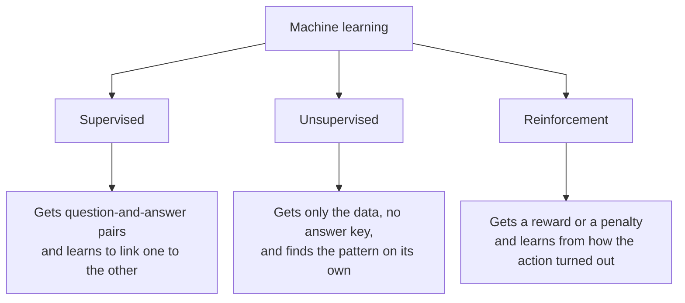
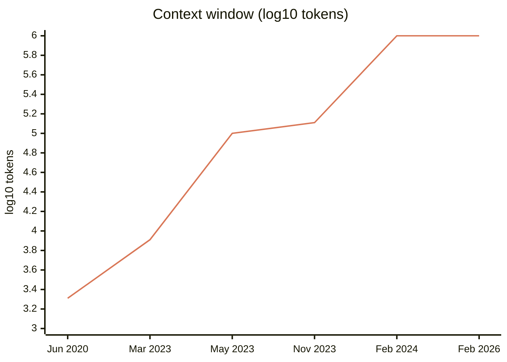

Almost everyone met Artificial Intelligence recently, during the hype built around a few advances and product uses that led to an explosion in adoption and application.

To understand what happened since 2021, what AI can and cannot do, and how to use it properly, you have to understand where it came from and how it works. I've been studying AI for more than ten years — I spent 2020 writing a thesis on long short-term memory networks (LSTMs) applied to supply-chain demand forecasting[^tcc] — and what follows is a run through the field: how it formed, where we stand, and what probably comes next.

## The milestones, in one table

| Year | What happened | Why it mattered |
| --- | --- | --- |
| 1950 | Turing proposes the imitation game | Swaps "can machines think?" for a test you can actually run |
| 1956 | The Dartmouth conference | McCarthy coins the term "artificial intelligence" |
| 1958 | Rosenblatt's Perceptron | First machine that learns on its own |
| 1969 | Minsky and Papert's *Perceptrons* | Opens the first AI winter |
| 1986 | Backpropagation | The algorithm that still trains every deep network |
| 1997 | Deep Blue beats Kasparov; LSTM arrives | Peak of the old paradigm, and the network that handles long sequences |
| 2012 | AlexNet wins ImageNet | Proves scale works, and turns the field upside down |
| 2016 | AlphaGo beats Lee Sedol | The moment "AI is coming" became global news |
| 2017 | The Transformer | Attention with no recurrence — the basis of everything since |
| 2020 | Scaling laws and GPT-3 | AI becomes a capital decision, not an architecture one |
| 2022 | ChatGPT | The chat box carries the technology to everyone |
| 2024 | o1 and the reasoning models | You can spend more at answer time, not just in training |
| 2025 | DeepSeek-R1 and coding agents | Reasoning from pure reinforcement; the agent that edits your repo |
| 2026 | Export directive over Fable 5 | First time a state switched off a model already in service |

## What "artificial intelligence" actually means

Artificial intelligence, in the Russell and Norvig definition I used in the thesis, is the field that seeks to understand and build intelligent entities. It's a deliberately wide definition, because the field has never had just one.

What changes from school to school is what counts as success. One path chases a faithful replica of human performance: the machine is right when it behaves like a person. The other chases rationality — given the information it has, the machine makes the best decision it can, human-looking or not.

That distinction isn't footnote philosophy. It separates two stories that ran in parallel for seventy years, and it explains why the second one won.

## The long prehistory

The artificial neuron dates to 1943. McCulloch and Pitts modeled the nervous system as a network of binary threshold elements and showed such a network computes any proposition of propositional logic. It learned nothing: the weights were fixed by the designer.

In 1950 Turing changed the question. Instead of "can machines think?", he proposed the imitation game, which became known as the Turing test: an interrogator talks to two interlocutors and tries to say which is the machine. He predicted that in about fifty years an average interrogator would have less than a 70% chance of correct identification after five minutes of questioning. The paper also sets out and answers most of the objections still raised today against the idea of thinking machines.[^origens]

The phrase "artificial intelligence" first appears in print in August 1955, in the proposal for the Dartmouth summer project signed by McCarthy, Minsky, Rochester and Shannon. McCarthy chose the name to break from cybernetics, and specifically from Norbert Wiener. His own account: "I wished to avoid having either to accept Norbert Wiener as a guru or having to argue with him."

1958 brought Rosenblatt's Perceptron: a trainable linear classifier with a convergence guarantee for linearly separable data, and a physical machine of 400 photocells with motor-driven potentiometers standing in for the weights. It was the first machine that learned with a proof behind it. It was also the first hype cycle: the US Navy press conference produced the *New York Times* line about "the embryo of an electronic computer that it expects will be able to walk, talk, see, write, reproduce itself and be conscious of its existence." Rosenblatt in print was far more careful than the press release.

The following year Arthur Samuel published the checkers work that coined *machine learning*: a program that improved by playing itself, using a linear evaluation function with learned weights. From it comes the definition the field has carried ever since — machine learning as the field of study that gives computers the ability to learn without being explicitly programmed. In Samuel's own words: "a computer can be programmed so that it will learn to play a better game of checkers than can be played by the person who wrote the program."[^samuel]

In 1969 Minsky and Papert published the book *Perceptrons*, and the effect was the opposite of the enthusiasm of ten years earlier. They proved that a single-layer perceptron cannot learn certain very simple functions. The famous example is exclusive-or: answer *yes* when one input or the other is true, but *no* when both are true at once. A rule any child picks up in a minute, and the machine could not.

Stacking layers would fix it, and both authors knew that. The trouble was that nobody had any idea how to train a network of several layers, and they suspected the limitation would come back in another form in bigger networks. The suspicion stuck, the money moved to the symbolic line, and neural network research sat nearly still for close to two decades.[^perceptrons]

What followed was the first winter, sealed by the 1973 Lighthill report, and a return through the symbolic door: expert systems. MYCIN, in 1976, held roughly 450 rules for diagnosing bacterial infections and recommending antibiotics. In a blind evaluation published in *JAMA* in 1979, MYCIN's recommendations were rated acceptable 65% of the time, against 42.5% to 62.5% for five Stanford infectious-disease specialists. It beat the doctors and was never used clinically — it died on liability, on the absence of a regulatory path, and on the fact that a session took half an hour of typing at a terminal.[^invernos]

In 1980 Digital Equipment Corporation — then the world's second-largest computer maker, behind only IBM — put an expert system into production. Its job was to assemble the configuration of every computer sold: pick which parts go into the order, check they were compatible with each other, and close the list. That was experienced-technician work, and getting it wrong was expensive. By the company's own accounting, the system saved between $25 and $40 million a year. It was the first time AI showed up as a line on the books.

The commercial boom followed, then Japan's Fifth Generation project with ¥57 billion staked on machines purpose-built to run AI, then the defensive American and European programs. And in 1987 that specialized hardware market collapsed, because ordinary workstations got cheaper and faster than the dedicated machines. Second winter.

The winters were funding and expectation cycles, not research stoppages. Backpropagation (1986), temporal-difference learning (1988), SVMs (1995) and LSTM (1997) all shipped *during* them. The field renamed itself — machine learning, pattern recognition, knowledge-based systems — rather than dying.

The turn came in 1986, with Rumelhart, Hinton and Williams: backpropagation applied to multilayer networks, showing that hidden units learned useful internal representations. It was precisely that ability to create new features that set the method apart from the perceptron convergence procedure — and it is from that paper that the way everyone trains a deep network today descends.[^backprop]

In the 1990s the field turned statistical. Cortes and Vapnik's Support Vector Machines (SVMs) had two advantages the neural network lacked. The first is that training an SVM always lands on the same answer, and it is provably the best answer available for that dataset — there was none of the risk, routine with neural networks, of training stalling on a mediocre model because of an unlucky starting point. The second is that there was mathematical theory telling you in advance when the model would hold up on new data. From 1995 to 2010 the SVM was the respectable default and the neural network was fringe, which owed as much to the SVM winning on merit as to any winter.

In May 1997 Deep Blue beat Kasparov 3½–2½. It matters to the story and it is not an ancestor of what came after: Deep Blue learned nothing. It was brute-force search at 200 million positions per second on dedicated silicon, with a hand-tuned evaluation function.

The answer came in two stages, both from the other paradigm. In March 2016 AlphaGo beat Lee Sedol 4–1 in Seoul, watched by some 200 million people, combining supervised learning from human games, reinforcement learning by self-play, and tree search. Go was thought to be a decade away, because its branching factor rules out the brute force that settled chess. The following year AlphaZero dispensed with the human games too: given only the rules, in 24 hours of self-play it beat Stockfish — the direct descendant of Deep Blue's paradigm. Twenty years separate the two, and that contrast is the whole thesis of the next section in a single anecdote.[^jogos]

## Machine learning, concretely

Machine learning is the branch that builds algorithms out of examples. You hand the program a collection of cases of some phenomenon and it assembles the statistical model that solves the problem on its own. Nobody writes the rules.

The example I used in the thesis is still the clearest one, and it's the spam filter. An algorithm with predefined rules requires every identification rule to be thought through and coded by the programmers. That works for a while, until the spammers identify the rules blocking them and adapt. The programmers then get complaints, identify the new patterns, fix the program and ship a new version.

A filter based on machine learning is trained on a set of already-categorized emails. As users categorize new ones, that set grows on its own. On retraining, the new pattern is learned without direct intervention from the programmers.

That's the difference that matters and it hasn't changed in seventy years: the model is built from the data rather than written by hand.

The field divides first by how the training works.

In reinforcement learning the algorithm — also called the agent — learns from a series of rewards or penalties. It identifies the environment it sits in, meaning which actions it can take, and after an action receives a penalty or reward telling it how effective that action was. Chess and Go are the classic examples.

In unsupervised learning the agent finds patterns in an input but gets no explicit feedback on hits or misses as it produces its outputs. The most common task is grouping a set into similar clusters based on one or more features.

In supervised learning the agent observes example pairs of input and output and learns a function mapping one onto the other. That's the category holding linear regression, decision trees and neural networks — and it's where my 2020 work sat.

Worth stressing that in practice the boundaries between these categories aren't sharp, and some problems need different kinds of learning combined in a single agent at different moments. Hold onto that sentence: it matters again in 2024.

## Neural networks

Artificial neural networks, also called multilayer perceptrons, are an architecture based on how the brain works, with neurons connected to each other forming a network. The idea comes from the thought that since the brain is an example of intelligent behavior, you could reverse-engineer it, looking for its mechanical principles in an attempt to replicate them.

Structurally they're made of nodes or units connected by directed links, each carrying a specific weight. Each unit computes a weighted sum of all its inputs and applies an activation function to that value. The result moves on.

<svg role="img" aria-label="Neural network with two hidden layers" viewBox="0 0 760 370" style="width:100%;height:auto;max-width:760px;display:block;margin:1.5rem auto;color:inherit;overflow:visible" xmlns="http://www.w3.org/2000/svg"><title>Neural network with two hidden layers</title><g fill="none" stroke="currentColor" stroke-width="1.4" font-family="inherit" font-size="15"><defs><marker id="ah" viewBox="0 0 10 10" refX="9" refY="5" markerWidth="6" markerHeight="6" orient="auto-start-reverse"><path d="M0,0 L10,5 L0,10 z" fill="currentColor" stroke="none"/></marker><marker id="ao" viewBox="0 0 10 10" refX="9" refY="5" markerWidth="6" markerHeight="6" orient="auto-start-reverse"><path d="M0,0 L10,5 L0,10 z" fill="#d97757" stroke="none"/></marker></defs><line x1="109" y1="120" x2="281" y2="85" stroke="currentColor" stroke-width="1.1" stroke-opacity="0.45"/><line x1="109" y1="120" x2="281" y2="155" stroke="currentColor" stroke-width="1.1" stroke-opacity="0.45"/><line x1="109" y1="120" x2="281" y2="225" stroke="currentColor" stroke-width="1.1" stroke-opacity="0.45"/><line x1="109" y1="120" x2="281" y2="295" stroke="currentColor" stroke-width="1.1" stroke-opacity="0.45"/><line x1="109" y1="190" x2="281" y2="85" stroke="currentColor" stroke-width="1.1" stroke-opacity="0.45"/><line x1="109" y1="190" x2="281" y2="155" stroke="currentColor" stroke-width="1.1" stroke-opacity="0.45"/><line x1="109" y1="190" x2="281" y2="225" stroke="currentColor" stroke-width="1.1" stroke-opacity="0.45"/><line x1="109" y1="190" x2="281" y2="295" stroke="currentColor" stroke-width="1.1" stroke-opacity="0.45"/><line x1="109" y1="260" x2="281" y2="85" stroke="currentColor" stroke-width="1.1" stroke-opacity="0.45"/><line x1="109" y1="260" x2="281" y2="155" stroke="currentColor" stroke-width="1.1" stroke-opacity="0.45"/><line x1="109" y1="260" x2="281" y2="225" stroke="currentColor" stroke-width="1.1" stroke-opacity="0.45"/><line x1="109" y1="260" x2="281" y2="295" stroke="currentColor" stroke-width="1.1" stroke-opacity="0.45"/><line x1="319" y1="85" x2="491" y2="120" stroke="currentColor" stroke-width="1.1" stroke-opacity="0.45"/><line x1="319" y1="85" x2="491" y2="190" stroke="currentColor" stroke-width="1.1" stroke-opacity="0.45"/><line x1="319" y1="85" x2="491" y2="260" stroke="currentColor" stroke-width="1.1" stroke-opacity="0.45"/><line x1="319" y1="155" x2="491" y2="120" stroke="currentColor" stroke-width="1.1" stroke-opacity="0.45"/><line x1="319" y1="155" x2="491" y2="190" stroke="currentColor" stroke-width="1.1" stroke-opacity="0.45"/><line x1="319" y1="155" x2="491" y2="260" stroke="currentColor" stroke-width="1.1" stroke-opacity="0.45"/><line x1="319" y1="225" x2="491" y2="120" stroke="currentColor" stroke-width="1.1" stroke-opacity="0.45"/><line x1="319" y1="225" x2="491" y2="190" stroke="currentColor" stroke-width="1.1" stroke-opacity="0.45"/><line x1="319" y1="225" x2="491" y2="260" stroke="currentColor" stroke-width="1.1" stroke-opacity="0.45"/><line x1="319" y1="295" x2="491" y2="120" stroke="currentColor" stroke-width="1.1" stroke-opacity="0.45"/><line x1="319" y1="295" x2="491" y2="190" stroke="currentColor" stroke-width="1.1" stroke-opacity="0.45"/><line x1="319" y1="295" x2="491" y2="260" stroke="currentColor" stroke-width="1.1" stroke-opacity="0.45"/><line x1="529" y1="120" x2="671" y2="190" stroke="currentColor" stroke-width="1.1" stroke-opacity="0.45"/><line x1="529" y1="190" x2="671" y2="190" stroke="currentColor" stroke-width="1.1" stroke-opacity="0.45"/><line x1="529" y1="260" x2="671" y2="190" stroke="currentColor" stroke-width="1.1" stroke-opacity="0.45"/><circle cx="90" cy="120" r="19" stroke="currentColor" stroke-width="1.6"/><text x="90" y="125" text-anchor="middle" font-size="14" font-weight="normal" fill="currentColor" fill-opacity="1" stroke="none">x1</text><circle cx="90" cy="190" r="19" stroke="currentColor" stroke-width="1.6"/><text x="90" y="195" text-anchor="middle" font-size="14" font-weight="normal" fill="currentColor" fill-opacity="1" stroke="none">x2</text><circle cx="90" cy="260" r="19" stroke="currentColor" stroke-width="1.6"/><text x="90" y="265" text-anchor="middle" font-size="14" font-weight="normal" fill="currentColor" fill-opacity="1" stroke="none">x3</text><circle cx="300" cy="85" r="19" stroke="currentColor" stroke-width="1.6"/><circle cx="300" cy="155" r="19" stroke="currentColor" stroke-width="1.6"/><circle cx="300" cy="225" r="19" stroke="currentColor" stroke-width="1.6"/><circle cx="300" cy="295" r="19" stroke="currentColor" stroke-width="1.6"/><circle cx="510" cy="120" r="19" stroke="currentColor" stroke-width="1.6"/><circle cx="510" cy="190" r="19" stroke="currentColor" stroke-width="1.6"/><circle cx="510" cy="260" r="19" stroke="currentColor" stroke-width="1.6"/><circle cx="690" cy="190" r="19" stroke="currentColor" stroke-width="1.6"/><text x="690" y="195" text-anchor="middle" font-size="14" font-weight="normal" fill="currentColor" fill-opacity="1" stroke="none">y</text><text x="90" y="350" text-anchor="middle" font-size="14" font-weight="normal" fill="currentColor" fill-opacity="0.7" stroke="none">Input</text><text x="300" y="350" text-anchor="middle" font-size="14" font-weight="normal" fill="currentColor" fill-opacity="0.7" stroke="none">Hidden layer</text><text x="510" y="350" text-anchor="middle" font-size="14" font-weight="normal" fill="currentColor" fill-opacity="0.7" stroke="none">Hidden layer</text><text x="690" y="350" text-anchor="middle" font-size="14" font-weight="normal" fill="currentColor" fill-opacity="0.7" stroke="none">Output</text><line x1="20" y1="190" x2="66" y2="190" stroke="#d97757" stroke-width="1.6" stroke-opacity="1" marker-end="url(#ao)"/><line x1="712" y1="190" x2="752" y2="190" stroke="#d97757" stroke-width="1.6" stroke-opacity="1" marker-end="url(#ao)"/></g></svg>

*Information runs left to right, and every line in the drawing carries a weight of its own. The transformations happen in the units of the middle layers — the hidden units — until the final value comes out. The number of layers and of units per layer are important parameters and vary with the complexity of the data.*

For a network to learn, three things are needed: a way to measure how wrong it was, a way to transform the value inside each unit, and a way to adjust the weights from the error it measured.

Training runs like this: the network takes the data in batches and processes batch by batch. Once it has been through all of them, that's one epoch. At the end of each epoch it measures the error and readjusts the weights walking the network backwards, from the result toward the input — hence backpropagation. Repeat for several epochs, until the weights stop moving.

All of 2026's AI is still that. Weights, activations, batches, epochs, a gradient running backwards. What changed is the scale and the shape of the connections between units.

## 2012: when it started working

In 2009 Fei-Fei Li's group published ImageNet: images organized by WordNet's noun hierarchy, labeled at scale through Mechanical Turk. Her contribution usually gets flattened to "she built a big dataset." The real thesis ran against the consensus: the bottleneck in computer vision was the *data*, not the algorithms. That was an unpopular claim in 2007 and hard to get funded.

In 2012 AlexNet won the ImageNet competition with 15.3% top-5 error against the runner-up's 26.2% — the largest gap in the competition's history. Five convolutional layers, 60 million parameters, trained on two 3 GB GeForce GTX 580 cards over five or six days.

Nothing in it was a new idea. Convolutional networks are LeCun, 1989. ReLU and dropout were recent but known. What was new is that scale made them work: labeled data in volume, parallel hardware, and enough capacity. Within a year essentially every serious vision group had switched to deep learning.[^imagenet]

My reading of it, twelve years on, is the one Rich Sutton wrote in 2019 and Sara Hooker formalized in 2020. Sutton: "the biggest lesson that can be read from 70 years of AI research is that general methods that leverage computation are ultimately the most effective, and by a large margin." Hooker called it the hardware lottery: a research idea wins "because it is suited to the available software and hardware and not because the idea is superior to alternative research directions."

Read that way, the winters weren't failures of ideas. They were losses in the hardware lottery. The perceptron lineage had the right idea and the wrong decade. Japan bet on logic-programming hardware and lost to commodity microprocessors. Lisp machines lost to Sun workstations. And deep learning won its lottery when graphics cards designed for video games turned out to be exactly the right shape: dense matrix multiplication with high memory bandwidth.[^licao]

## Sequences and memory

Convolutional networks solved images. Sequences — text, speech, time series — are a different problem, and that's where I spent 2020.

A recurrent neural network (RNN) is a neural network with a loop: what comes out of one step goes back in as the input to the next. That way it carries something of what it has already seen, which is what lets it handle data where order matters — text, speech, a month-by-month sales series.

<svg role="img" aria-label="Recurrent network unrolled through time" viewBox="0 0 760 320" style="width:100%;height:auto;max-width:760px;display:block;margin:1.5rem auto;color:inherit;overflow:visible" xmlns="http://www.w3.org/2000/svg"><title>Recurrent network unrolled through time</title><g fill="none" stroke="currentColor" stroke-width="1.4" font-family="inherit" font-size="15"><defs><marker id="ah" viewBox="0 0 10 10" refX="9" refY="5" markerWidth="6" markerHeight="6" orient="auto-start-reverse"><path d="M0,0 L10,5 L0,10 z" fill="currentColor" stroke="none"/></marker><marker id="ao" viewBox="0 0 10 10" refX="9" refY="5" markerWidth="6" markerHeight="6" orient="auto-start-reverse"><path d="M0,0 L10,5 L0,10 z" fill="#d97757" stroke="none"/></marker></defs><rect x="65" y="130" width="90" height="58" rx="6" stroke="currentColor" stroke-width="1.6"/><text x="110" y="165" text-anchor="middle" font-size="16" font-weight="600" fill="currentColor" fill-opacity="1" stroke="none">A</text><line x1="110" y1="250" x2="110" y2="194" stroke="currentColor" stroke-width="1.5" stroke-opacity="1" marker-end="url(#ah)"/><text x="110" y="275" text-anchor="middle" font-size="15" font-weight="normal" fill="#d97757" fill-opacity="1" stroke="none">x0</text><line x1="110" y1="124" x2="110" y2="72" stroke="currentColor" stroke-width="1.5" stroke-opacity="1" marker-end="url(#ah)"/><text x="110" y="58" text-anchor="middle" font-size="15" font-weight="normal" fill="#d97757" fill-opacity="1" stroke="none">h0</text><rect x="240" y="130" width="90" height="58" rx="6" stroke="currentColor" stroke-width="1.6"/><text x="285" y="165" text-anchor="middle" font-size="16" font-weight="600" fill="currentColor" fill-opacity="1" stroke="none">A</text><line x1="285" y1="250" x2="285" y2="194" stroke="currentColor" stroke-width="1.5" stroke-opacity="1" marker-end="url(#ah)"/><text x="285" y="275" text-anchor="middle" font-size="15" font-weight="normal" fill="#d97757" fill-opacity="1" stroke="none">x1</text><line x1="285" y1="124" x2="285" y2="72" stroke="currentColor" stroke-width="1.5" stroke-opacity="1" marker-end="url(#ah)"/><text x="285" y="58" text-anchor="middle" font-size="15" font-weight="normal" fill="#d97757" fill-opacity="1" stroke="none">h1</text><rect x="415" y="130" width="90" height="58" rx="6" stroke="currentColor" stroke-width="1.6"/><text x="460" y="165" text-anchor="middle" font-size="16" font-weight="600" fill="currentColor" fill-opacity="1" stroke="none">A</text><line x1="460" y1="250" x2="460" y2="194" stroke="currentColor" stroke-width="1.5" stroke-opacity="1" marker-end="url(#ah)"/><text x="460" y="275" text-anchor="middle" font-size="15" font-weight="normal" fill="#d97757" fill-opacity="1" stroke="none">x2</text><line x1="460" y1="124" x2="460" y2="72" stroke="currentColor" stroke-width="1.5" stroke-opacity="1" marker-end="url(#ah)"/><text x="460" y="58" text-anchor="middle" font-size="15" font-weight="normal" fill="#d97757" fill-opacity="1" stroke="none">h2</text><rect x="590" y="130" width="90" height="58" rx="6" stroke="currentColor" stroke-width="1.6"/><text x="635" y="165" text-anchor="middle" font-size="16" font-weight="600" fill="currentColor" fill-opacity="1" stroke="none">A</text><line x1="635" y1="250" x2="635" y2="194" stroke="currentColor" stroke-width="1.5" stroke-opacity="1" marker-end="url(#ah)"/><text x="635" y="275" text-anchor="middle" font-size="15" font-weight="normal" fill="#d97757" fill-opacity="1" stroke="none">x3</text><line x1="635" y1="124" x2="635" y2="72" stroke="currentColor" stroke-width="1.5" stroke-opacity="1" marker-end="url(#ah)"/><text x="635" y="58" text-anchor="middle" font-size="15" font-weight="normal" fill="#d97757" fill-opacity="1" stroke="none">h3</text><line x1="157" y1="159" x2="238" y2="159" stroke="#d97757" stroke-width="1.6" stroke-opacity="1" marker-end="url(#ao)"/><line x1="332" y1="159" x2="413" y2="159" stroke="#d97757" stroke-width="1.6" stroke-opacity="1" marker-end="url(#ao)"/><line x1="507" y1="159" x2="588" y2="159" stroke="#d97757" stroke-width="1.6" stroke-opacity="1" marker-end="url(#ao)"/><text x="372" y="206" text-anchor="middle" font-size="13" font-weight="normal" fill="#d97757" fill-opacity="0.85" stroke="none">internal state</text><line x1="22" y1="159" x2="62" y2="159" stroke="currentColor" stroke-width="1.5" stroke-opacity="0.4" marker-end="url(#ah)" stroke-dasharray="4 4"/><line x1="682" y1="159" x2="738" y2="159" stroke="currentColor" stroke-width="1.5" stroke-opacity="0.4" marker-end="url(#ah)" stroke-dasharray="4 4"/><text x="380" y="305" text-anchor="middle" font-size="13" font-weight="normal" fill="currentColor" fill-opacity="0.7" stroke="none">the same layer A, applied four times</text></g></svg>

*The same layer, unrolled through time. These are not four different layers: it is one layer applied four times, carrying forward what it kept from each step.*

Because of that recurrence, an RNN has a kind of short-term memory: its current function can be altered by earlier values interfering recursively with new inputs.

The problem is that this memory doesn't reach far. Each cell computes its gradient from the gradient already computed at the previous layer. If the adjustments there were small, the adjustments here will be smaller still. The gradient shrinks exponentially and vanishes as it propagates back through the network. The earliest layers fail to learn anything. That's the vanishing gradient, and in practice it means the network can't connect one piece of information to another that appeared many steps earlier.

Hochreiter diagnosed it in 1991, in his master's thesis — written in German and never formally published, which is why the result took years to circulate outside Germany and why the 1994 paper by Bengio, Simard and Frasconi is the one usually cited. In 1997 Hochreiter and Schmidhuber published the fix: Long Short-Term Memory, or LSTM.

The core of an LSTM is its gates. The cell uses them to manipulate the information it holds, deciding at each step whether to store, read or delete. That way it carries forward only the information that is actually useful to the model.

<svg role="img" aria-label="Inside an LSTM cell" viewBox="0 0 760 310" style="width:100%;height:auto;max-width:760px;display:block;margin:1.5rem auto;color:inherit;overflow:visible" xmlns="http://www.w3.org/2000/svg"><title>Inside an LSTM cell</title><g fill="none" stroke="currentColor" stroke-width="1.4" font-family="inherit" font-size="15"><defs><marker id="ah" viewBox="0 0 10 10" refX="9" refY="5" markerWidth="6" markerHeight="6" orient="auto-start-reverse"><path d="M0,0 L10,5 L0,10 z" fill="currentColor" stroke="none"/></marker><marker id="ao" viewBox="0 0 10 10" refX="9" refY="5" markerWidth="6" markerHeight="6" orient="auto-start-reverse"><path d="M0,0 L10,5 L0,10 z" fill="#d97757" stroke="none"/></marker></defs><rect x="20" y="26" width="672" height="250" rx="12" stroke="currentColor" stroke-width="1.3"/><text x="38" y="292" text-anchor="start" font-size="13" font-weight="normal" fill="currentColor" fill-opacity="0.7" stroke="none">LSTM cell</text><line x1="40" y1="62" x2="233" y2="62" stroke="#d97757" stroke-width="2.2" stroke-opacity="1" marker-end="url(#ao)"/><text x="44" y="46" text-anchor="start" font-size="13" font-weight="normal" fill="#d97757" fill-opacity="1" stroke="none">cell state (in)</text><circle cx="255" cy="62" r="16" stroke="#d97757" stroke-width="1.8"/><text x="255" y="68" text-anchor="middle" font-size="18" font-weight="normal" fill="#d97757" fill-opacity="1" stroke="none">×</text><line x1="273" y1="62" x2="413" y2="62" stroke="#d97757" stroke-width="2.2" stroke-opacity="1" marker-end="url(#ao)"/><circle cx="435" cy="62" r="16" stroke="#d97757" stroke-width="1.8"/><text x="435" y="67" text-anchor="middle" font-size="18" font-weight="normal" fill="#d97757" fill-opacity="1" stroke="none">+</text><line x1="453" y1="62" x2="675" y2="62" stroke="#d97757" stroke-width="2.2" stroke-opacity="1" marker-end="url(#ao)"/><text x="671" y="46" text-anchor="end" font-size="13" font-weight="normal" fill="#d97757" fill-opacity="1" stroke="none">cell state (out)</text><rect x="180" y="152" width="150" height="56" rx="8" stroke="currentColor" stroke-width="1.5"/><text x="255" y="174" text-anchor="middle" font-size="12.5" font-weight="normal" fill="currentColor" fill-opacity="1" stroke="none">forget gate</text><text x="255" y="192" text-anchor="middle" font-size="12.5" font-weight="normal" fill="currentColor" fill-opacity="1" stroke="none">what to erase from the state</text><rect x="360" y="152" width="150" height="56" rx="8" stroke="currentColor" stroke-width="1.5"/><text x="435" y="174" text-anchor="middle" font-size="12.5" font-weight="normal" fill="currentColor" fill-opacity="1" stroke="none">input gate</text><text x="435" y="192" text-anchor="middle" font-size="12.5" font-weight="normal" fill="currentColor" fill-opacity="1" stroke="none">what to write into the state</text><rect x="540" y="152" width="150" height="56" rx="8" stroke="currentColor" stroke-width="1.5"/><text x="615" y="174" text-anchor="middle" font-size="12.5" font-weight="normal" fill="currentColor" fill-opacity="1" stroke="none">output gate</text><text x="615" y="192" text-anchor="middle" font-size="12.5" font-weight="normal" fill="currentColor" fill-opacity="1" stroke="none">what to show on the outside</text><line x1="255" y1="148" x2="255" y2="82" stroke="currentColor" stroke-width="1.5" stroke-opacity="1" marker-end="url(#ah)"/><line x1="435" y1="148" x2="435" y2="82" stroke="currentColor" stroke-width="1.5" stroke-opacity="1" marker-end="url(#ah)"/><path d="M675,76 L675,118 L615,118 L615,148" stroke="currentColor" stroke-width="1.3" stroke-opacity="0.6" marker-end="url(#ah)" fill="none"/><rect x="38" y="222" width="190" height="48" rx="8" stroke="currentColor" stroke-width="1.5"/><text x="133" y="242" text-anchor="middle" font-size="12.5" font-weight="normal" fill="currentColor" fill-opacity="1" stroke="none">this step's input</text><text x="133" y="259" text-anchor="middle" font-size="12.5" font-weight="normal" fill="currentColor" fill-opacity="1" stroke="none">+ previous step's output</text><path d="M230,246 L255,246 L255,212" stroke="currentColor" stroke-width="1.3" marker-end="url(#ah)" fill="none"/><path d="M230,246 L435,246 L435,212" stroke="currentColor" stroke-width="1.3" marker-end="url(#ah)" fill="none"/><path d="M230,246 L615,246 L615,212" stroke="currentColor" stroke-width="1.3" marker-end="url(#ah)" fill="none"/><line x1="692" y1="180" x2="736" y2="180" stroke="#d97757" stroke-width="1.8" stroke-opacity="1" marker-end="url(#ao)"/><text x="712" y="166" text-anchor="middle" font-size="12.5" font-weight="normal" fill="#d97757" fill-opacity="1" stroke="none">step output</text></g></svg>

*The cell state is the top line. Olah describes it as a production line where the cell's output is "manufactured," its flow altered or not depending on what the gates decide. The gates are internal networks activated by a sigmoid, returning values between 0 and 1 — 0 means nothing passes, 1 means the information passes through whole.*

There are three gates. The input gate decides what to write, the output gate decides what to expose, and the forget gate is what lets the cell reset itself on continuous input streams — without it the state grows without bound and the network saturates. With that structure, the LSTM dominated sequence modelling for close to twenty years: speech recognition, machine translation, handwriting recognition.[^lstm]

## Where my thesis stopped

The work compared four methods over the monthly sales series of Canadian manufacturing from 1992 to 2020: a naïve forecast as benchmark, exponential moving average, multivariate linear regression, and LSTM. I measured everything with mean absolute error and root mean squared error.

The LSTM didn't come first in either scenario. With simple univariate inputs there was no gain at all from machine learning. With multivariate inputs, six prior months per forecast, the gain was significant — on monthly sales in the tens of millions, the accuracy difference between methods exceeded a hundred thousand Canadian dollars, which would have changed planning in practice. But the method that captured that gain was multivariate linear regression. The conclusion I wrote was that, carrying far more complexity than linear regression and showing no better accuracy, the LSTM was not recommended for that problem.

I also wrote that hyperparameter selection was "more art than science." Six years on that remains partly true.

It's also where the story I knew at the time ended. The work is time-series forecasting, done with the toolkit that was standard for that kind of problem. In parallel, over in language processing, an architecture published in 2017 had already made recurrence unnecessary — and that is what the rest of this article is about.

## Attention Is All You Need

The attention mechanism was introduced in September 2014 by Bahdanau, Cho and Bengio, to fix the fixed-length vector bottleneck in machine translation: instead of compressing the whole sentence into one vector, the decoder learns to look directly at every position of the input for each word it produces.

In June 2017 *Attention Is All You Need* asked the obvious, uncomfortable question: if attention solves the problem, what is recurrence for? The answer was the Transformer, built entirely from attention, with no recurrence and no convolution.

The consequence is the most important thing in this section, and it speaks directly to what I'd written. In an RNN, to connect the first token to the last in a sequence of *n* positions, the information has to cross *n* steps — and the gradient has to come back through those same *n* steps. That is literally the vanishing-gradient mechanism. In self-attention, any position reaches any other in a single step.

<svg role="img" aria-label="Recurrence compared with self-attention" viewBox="0 0 760 350" style="width:100%;height:auto;max-width:760px;display:block;margin:1.5rem auto;color:inherit;overflow:visible" xmlns="http://www.w3.org/2000/svg"><title>Recurrence compared with self-attention</title><g fill="none" stroke="currentColor" stroke-width="1.4" font-family="inherit" font-size="15"><defs><marker id="ah" viewBox="0 0 10 10" refX="9" refY="5" markerWidth="6" markerHeight="6" orient="auto-start-reverse"><path d="M0,0 L10,5 L0,10 z" fill="currentColor" stroke="none"/></marker><marker id="ao" viewBox="0 0 10 10" refX="9" refY="5" markerWidth="6" markerHeight="6" orient="auto-start-reverse"><path d="M0,0 L10,5 L0,10 z" fill="#d97757" stroke="none"/></marker></defs><text x="40" y="44" text-anchor="start" font-size="15" font-weight="600" fill="currentColor" fill-opacity="1" stroke="none">Recurrence</text><circle cx="170" cy="90" r="20" stroke="currentColor" stroke-width="1.6"/><text x="170" y="96" text-anchor="middle" font-size="15" font-weight="normal" fill="currentColor" fill-opacity="1" stroke="none">1</text><circle cx="310" cy="90" r="20" stroke="currentColor" stroke-width="1.6"/><text x="310" y="96" text-anchor="middle" font-size="15" font-weight="normal" fill="currentColor" fill-opacity="1" stroke="none">2</text><circle cx="450" cy="90" r="20" stroke="currentColor" stroke-width="1.6"/><text x="450" y="96" text-anchor="middle" font-size="15" font-weight="normal" fill="currentColor" fill-opacity="1" stroke="none">3</text><circle cx="590" cy="90" r="20" stroke="currentColor" stroke-width="1.6"/><text x="590" y="96" text-anchor="middle" font-size="15" font-weight="normal" fill="currentColor" fill-opacity="1" stroke="none">4</text><line x1="192" y1="90" x2="288" y2="90" stroke="#d97757" stroke-width="1.8" stroke-opacity="1" marker-end="url(#ao)"/><line x1="332" y1="90" x2="428" y2="90" stroke="#d97757" stroke-width="1.8" stroke-opacity="1" marker-end="url(#ao)"/><line x1="472" y1="90" x2="568" y2="90" stroke="#d97757" stroke-width="1.8" stroke-opacity="1" marker-end="url(#ao)"/><path d="M170,124 Q380,168 590,124" stroke="currentColor" stroke-width="1.2" stroke-dasharray="5 4" stroke-opacity="0.55" fill="none"/><text x="380" y="166" text-anchor="middle" font-size="13" font-weight="normal" fill="currentColor" fill-opacity="0.75" stroke="none">for 1 to reach 4, the information crosses 3 steps</text><text x="40" y="232" text-anchor="start" font-size="15" font-weight="600" fill="currentColor" fill-opacity="1" stroke="none">Self-attention</text><path d="M170,258 Q240.0,210 310,258" stroke="#d97757" stroke-width="1.3" stroke-opacity="0.65" fill="none"/><path d="M310,258 Q380.0,210 450,258" stroke="#d97757" stroke-width="1.3" stroke-opacity="0.65" fill="none"/><path d="M450,258 Q520.0,210 590,258" stroke="#d97757" stroke-width="1.3" stroke-opacity="0.65" fill="none"/><path d="M170,258 Q310.0,188 450,258" stroke="#d97757" stroke-width="1.3" stroke-opacity="0.65" fill="none"/><path d="M310,258 Q450.0,188 590,258" stroke="#d97757" stroke-width="1.3" stroke-opacity="0.65" fill="none"/><path d="M170,258 Q380.0,166 590,258" stroke="#d97757" stroke-width="1.3" stroke-opacity="0.65" fill="none"/><circle cx="170" cy="280" r="20" stroke="currentColor" stroke-width="1.6"/><text x="170" y="286" text-anchor="middle" font-size="15" font-weight="normal" fill="currentColor" fill-opacity="1" stroke="none">1</text><circle cx="310" cy="280" r="20" stroke="currentColor" stroke-width="1.6"/><text x="310" y="286" text-anchor="middle" font-size="15" font-weight="normal" fill="currentColor" fill-opacity="1" stroke="none">2</text><circle cx="450" cy="280" r="20" stroke="currentColor" stroke-width="1.6"/><text x="450" y="286" text-anchor="middle" font-size="15" font-weight="normal" fill="currentColor" fill-opacity="1" stroke="none">3</text><circle cx="590" cy="280" r="20" stroke="currentColor" stroke-width="1.6"/><text x="590" y="286" text-anchor="middle" font-size="15" font-weight="normal" fill="currentColor" fill-opacity="1" stroke="none">4</text><text x="380" y="324" text-anchor="middle" font-size="13" font-weight="normal" fill="currentColor" fill-opacity="0.75" stroke="none">each position reaches any other in 1 step</text></g></svg>

*Above, for token 1 to influence token 4 the information travels three links — and the gradient returns through the same three. Below, every token reaches every other directly.*

The LSTM's gates were an ingenious fix for a problem recurrence had created. The Transformer didn't fix the problem: it deleted the cause. And it got for free the thing a recurrent architecture could never give — the whole sequence trains in parallel, which turns training time into GPU money.[^transformer]

In 2018 BERT and the first GPT established the pretrain-then-finetune recipe. Within eighteen months the language side of the field abandoned task-specific architectures. In time-series forecasting, where the LSTM was still a working tool, the shift took considerably longer to arrive — which is why the two stories, the one I studied and the one that exploded afterwards, look out of step with each other.

## Scale, alignment, and a chat box

In January 2020 Kaplan and co-authors published the scaling laws: a language model's loss follows smooth power laws in parameter count, data volume and compute spent, across more than seven orders of magnitude. Architectural details — width versus depth — are near-irrelevant within broad ranges.

That's the paper that turned AI research into an engineering discipline with a roadmap. If performance is predictable from budget, the decision stops being which architecture to invent and becomes how much capital to allocate. Five months later came GPT-3, at 175 billion parameters, and with it in-context learning: you stop fine-tuning the model and start instructing it in the prompt.[^escala]

Two relevant corrections landed in 2022. The first was DeepMind's Chinchilla, which trained more than four hundred models and showed Kaplan's allocation advice was wrong: parameters and tokens should grow roughly together. A 70-billion model trained on four times the tokens, at the same compute budget, beat models of 175, 178 and 530 billion. Every large model from 2020 to 2022 was undertrained.

The second was InstructGPT. Training the model to follow instructions from human feedback produced what still seems to me the decade's most striking number: outputs from the aligned 1.3-billion-parameter model were preferred to those of the 175-billion GPT-3, with a hundred times fewer parameters. Alignment stopped being a safety tax and became a capability multiplier.[^rlhf]

On November 30, 2022, OpenAI released ChatGPT. There was no new model capability in it: GPT-3.5, plus learning from human feedback, plus a chat box. It was a distribution event, not a research one. GPT-3 had existed for two and a half years and nobody outside the developer circle cared.

One note on the most-cited figure: the "100 million users in two months" mark is a UBS *estimate* from Similarweb data, published in February 2023, rather than a number OpenAI released.[^rlhf]

## The commodity begins

March 2023 brought GPT-4, and with it a milestone that went largely unremarked. The document called a "technical report" disclosed no architecture, no parameter count, no dataset and no training method. That was the moment "technical report" stopped meaning "paper" and frontier research closed.[^gpt4]

The same month Anthropic launched Claude, trained with constitutional AI rather than pure human feedback, and in May became the first to offer a 100,000-token window.

On the other side, Meta's LLaMA shipped in February 2023 under a research-only license — and leaked. The leak is what actually triggered the open-weights explosion. The commercially usable version arrived in July as Llama 2, and it's that one, not the first, that marks the start of the open-weights industry. In October, Mistral 7B under Apache 2.0 beat Llama 2's 13-billion model.[^gpt4]

The context window grew in a way worth looking at on a log scale, because on a linear one the early years disappear:

*From 2,048 tokens in GPT-3 to 1 million in Gemini 1.5 Pro in under four years — almost three orders of magnitude. The 1-million tier reaches the Opus class in February 2026.*[^contexto]

This was also the period when the field learned to distrust its own numbers. The idea going around was "emergent abilities": past a certain size, a model would start doing things smaller models simply could not, as if the capability appeared out of nowhere.

In 2023 a Stanford group showed that much of this came from the ruler, not the model. Picture a test scored all-or-nothing: the whole sum right scores a point, one wrong digit scores zero. A model getting more and more digits right scores zero for a long stretch and then, once it finally closes the sum, jumps from zero to a hundred. The jump is in the measurement. Switch to a ruler that gives partial credit and the same progress becomes a curve rising slowly, with no surprise in it. To make the point, they manufactured "emergence" in vision models by changing nothing but the metric.[^miragem]

In September 2024 came the second scaling law. OpenAI's o1 is trained by reinforcement to produce a long internal chain of reasoning before answering, making inference time a scaling axis of its own. Kaplan said spend more on training; o1 said you can also spend more while answering. On AIME 2024, GPT-4o scored 12% and o1 scored 74%.[^raciocinio]

Two pieces from 2024 explain most of what followed in 2025. The first is RLVR: reinforcement learning with verifiable rewards. Instead of teaching the model from what human raters prefer, you let an automatic checker give the score. Does the arithmetic match? Do the tests pass? Reward 1 or 0. It's cheap, and there's no pleasing the grader without actually being right. It also explains why math and code advanced much faster than writing and judgment: only those two can check themselves.

The second is the Model Context Protocol (MCP), opened by Anthropic in November 2024. Before it, wiring a model to each tool — the calendar, the database, the code repository — took a hand-built integration for every model-and-tool combination. MCP turned that into a single socket: the tool speaks MCP once and serves any model. OpenAI and Google adopted it, a rare case of a competitor's standard winning outright, and it was donated to the Linux Foundation's Agentic AI Foundation in December 2025. It's the reason "agent" became practical rather than a demo. I wrote about it in detail [in a separate article](../model-context-protocol/).[^raciocinio]

## Agents, verifiers, and the state

In January 2025 DeepSeek published R1 under an MIT license, showing that reasoning can be incentivized by pure reinforcement learning, with no human-annotated reasoning traces at all. The paper later passed peer review in *Nature* — the first frontier reasoning model to do so.

The number that circulated was the cost, and it's worth separating what each figure covers. The $5.576 million figure is from the DeepSeek-V3 paper, not R1, and covers only the final pretraining run, explicitly excluding prior research, ablations, data and hardware capital — the paper says so itself. The $294,000 disclosed in September 2025 is R1's incremental reinforcement-learning cost on top of the base model. SemiAnalysis estimated total hardware spend near $500 million. None of the three is, on its own, "the cost of building DeepSeek." On January 27, NVIDIA fell about 17%, losing roughly $589 billion in market value in a single day.[^deepseek]

In February 2025 Anthropic shipped Claude 3.7 Sonnet alongside Claude Code. The model is the first hybrid — extended reasoning you can switch on and off, with a thinking budget set in tokens. Claude Code is the product that normalized the workflow where the agent edits the repo, runs the tests and opens the PR. In May, Claude 4 became the first frontier model published under its own lab's elevated safety tier, because internal testing couldn't rule out uplift toward chemical, biological, radiological and nuclear weapons.

SWE-bench tells the story of that period better than any narrative: around 33% at the end of 2024, 72.7% in September 2025, 80.9% in November 2025. Benchmarks are saturating in months rather than years, and each harder replacement lasts a short while.[^agentes]

Prices fell alongside. According to Epoch AI, for a fixed capability level the inference price drops at a median of about 50× a year, and that pace has accelerated since 2024. The cleanest example is internal to a single lab: Opus 4.5, in November 2025, cut the price from $15/$75 to $5/$25 per million tokens — better model, a third of the price, eight months apart. One caveat Epoch itself makes and worth repeating: unit price fell, total spend rose.[^agentes]

And the release cadence changed character. Writing about Opus 5 in July 2026, Axios produced the line that best sums up the year: it's "Anthropic's fourth Claude 5 model release in less than two months, underscoring how AI deployment has shifted from blockbuster launches to rapid improvements on capability, cost and speed." The launch stopped being a useful narrative unit.

What made news in 2026 was something else. In April, Anthropic introduced Claude Mythos, a security-specialized model capable of finding novel vulnerabilities and writing exploits, and deliberately restricted access: it went to defenders first, through Project Glasswing, so critical infrastructure could be hardened before equivalent capability reached attackers. By May, more than ten thousand high- or critical-severity vulnerabilities found; by June, around 150 organizations across more than fifteen countries.

On June 12, 2026, the US government invoked export-control authority to suspend access to Claude Fable 5 and Mythos 5 by any foreign national, inside or outside the United States. Unable to distinguish nationality in real time, Anthropic disabled both models worldwide. They stayed down for nineteen days. It's the first time a state has compelled an AI company to revoke access to a deployed model based on the user's nationality — weights and APIs treated, in practice, as munitions.

In September, GPT-6 Astra became OpenAI's first model to reach the "Critical" cyber capability tier under its own preparedness framework, and the response took the same shape: restricted access, defenders first. Two labs, the same threshold, the same answer, in the same year.[^estado]

On the regulatory side, the EU AI Act was not delayed, whatever the headlines suggested. The Digital Omnibus package, in force since July 2026, deferred only the high-risk tier to December 2027. The Article 50 transparency obligations — telling the user they're interacting with an AI, labelling generated content — took effect on August 2, 2026, on schedule.[^estado]

## What it does and doesn't do

After all of that, the most important limitation is also the easiest to state: the model doesn't learn from use.

In a Transformer, nothing in the context window writes back into the weights. The conversation ends and nothing remains. Every "memory" feature shipped between 2024 and 2026 is retrieval, not learning — the system stores a piece of text and brings it back in the next prompt. That's useful and it isn't the same thing. Karpathy put it this way in October 2025: "there's no continual learning. You can't tell it one thing and expect it to remember." His analogy is that today's agents are interns, not employees.

The second limitation is the verification bottleneck. RLVR works where a cheap verifier exists. Maths and code have one. Writing, judgment, taste, choosing a research direction do not — and that is exactly where progress was slowest from 2024 to 2026. Whoever solves verification for open-ended domains sets the next curve.

The third is hallucination, and the best explanation I've read is from September 2025. Kalai, Nachum, Vempala and Zhang argue hallucination is a *scoring* artifact: binary-graded benchmarks reward a confident guess over "I don't know," so the model is optimized to be good at taking tests. Their prescription is socio-technical — change how benchmarks score abstention — rather than a fix inside the model.[^limites]

On the side of what works, the best data available isn't an exam benchmark. In September 2025 OpenAI published GDPval: 1,320 real tasks across 44 occupations, delivered as finished work and graded blind by experts averaging fourteen years of experience. GPT-5 tied or beat the human expert on up to 40.6% of tasks, at roughly a hundredth of the cost and time. That's a long way from "solves everything" and a long way from "useless."

## What probably comes next

The only falsifiable, dated claim I know of in the field is METR's, from March 2025: the length of task a model completes with 50% reliability has doubled roughly every seven months since 2019. If the curve holds, autonomous tasks running a day to a week arrive in the early 2030s. If it doesn't hold, the curve will show that quickly — which is the property missing from the rest of the debate.[^futuro]

The rest are positions, and it's worth knowing who holds which.

Sutskever, in November 2025, periodized it this way: 2012 to 2020 was the age of research, 2020 to 2025 the age of scaling, and from 2026 a new age of research begins. His argument is that another factor of 100 in scale "would make a difference but would not transform capabilities," and that the next advances need new learning methods rather than more GPUs. It closes the arc Kaplan's paper opened in 2020.

Karpathy talks about ten years or so before anything deserving the name general intelligence, and calls the 2020s the decade of agents — agents that lack continual learning, durable memory and reliable computer use.

Richard Sutton rejects the premise entirely: for him language models imitate people rather than learning from their own experience, which makes them a dead end. Yann LeCun voted with his feet — he left Meta in November 2025 after twelve years, founded AMI Labs, and raised around $1 billion in seed funding on the JEPA architecture, which learns representations of the world from video instead of predicting the next token. It's an explicit bet against the current paradigm.

On the other side, Dario Amodei wrote in October 2024 that powerful AI "could come as early as 2026, though there are also ways it could take much longer," and Demis Hassabis talks about something like a 50% chance by the end of the decade.[^futuro]

My own bet, and this is opinion, runs in two directions that reinforce each other.

The first is that inference moves down to the local machine. Efficiency is rising on both sides at once: models of the same size now do what six months earlier took a much larger one, and hardware is specializing for exactly this use — Apple put a neural accelerator inside every GPU core from the M5 series on, and unified memory in quantity is today what most decides whether a large model runs at home. It isn't that the subscription ends tomorrow. It's that running a model stops requiring a top-of-the-line card and becomes another property of the machine someone already owns, the way a processor, memory and an operating system are.

The second is that the agent becomes an ordinary part of using a computer. Nobody subscribes to a CPU or rents RAM by the month; in ten years, or fewer, an AI agent should be as unremarkable as a spreadsheet or a browser. I wrote about both at more length [in a separate article](../intent-and-validation/), starting from the case of an open 27-billion-parameter model that matched the previous closed-model ceiling while running on a graphics card you can order online.

There's also a constraint that is neither research nor opinion. The International Energy Agency projects data center electricity consumption at around 945 TWh by 2030. US grid interconnection queues run past 2,600 GW with multi-year delays, and a large training facility today needs 100 MW to 1 GW dedicated. The limit that binds first isn't the graphics card, it's the outlet.

## The pattern that repeats

If this history teaches one thing, it's that the field errs systematically in the same direction: it overestimates what a new capability means and underestimates how long the substrate takes to catch up with the idea.

The perceptron was right and twenty years early. MYCIN beat the Stanford specialists and never treated a patient. The LSTM was the most commercially deployed architecture of the 2010s and was made obsolete by a paper that removed the very thing it existed to fix. And the conclusion I reached in 2020, that multivariate linear regression solved that problem better than the neural network did, is still the most useful lesson I took from the whole exercise: between two methods of similar accuracy, the simpler one is the one that stays.

What changed since 2021 wasn't the idea. It was the substrate arriving, and arriving with a price falling too fast for the market to settle around it. The history is worth knowing because it tells you where to look when the next release gets described as a clean break with everything before it: in the table up top, almost none of them were.

[^tcc]: *Aplicação de Machine Learning na Cadeia de Suprimentos: Utilizando Aprendizagem de Longo Prazo para Previsão de Demanda* — my undergraduate thesis in Computer Science at URI Erechim, 2020, advised by Prof. Marcos André Lucas. The conceptual parts of this article on machine learning, neural networks and LSTM come from Chapter 3, rewritten for here.
[^origens]: The McCulloch and Pitts neuron is from 1943. Turing's paper is [*Computing Machinery and Intelligence*](https://academic.oup.com/mind/article/LIX/236/433/986238), in Mind, October 1950 — worth reading, it aged well. The [Dartmouth proposal](https://ojs.aaai.org/aimagazine/index.php/aimagazine/article/view/1904) is from August 1955. The Perceptron appeared in Psychological Review in 1958; the *New York Times* line came from the Navy press conference, not from Rosenblatt ([Cornell Chronicle](https://news.cornell.edu/stories/2019/09/professors-perceptron-paved-way-ai-60-years-too-soon)).
[^samuel]: *Some Studies in Machine Learning Using the Game of Checkers*, in the IBM Journal of Research and Development, 1959, with a sequel in 1967. In 1962 the program beat Robert Nealey, a Connecticut state champion.
[^perceptrons]: *Perceptrons: An Introduction to Computational Geometry*, MIT Press, 1969. The [2017 reissue](https://mitpress.mit.edu/9780262534772/perceptrons/) carries a foreword by Léon Bottou that places the book well in its time.
[^invernos]: MYCIN's numbers come from a blind evaluation published in [JAMA in 1979](https://jamanetwork.com/HttpHandlers/ArticlePdfHandler.ashx?journal=JAMA&articleId=366606&pdfFileName=jama_242_12_020.pdf). DEC's system was called XCON and was presented by John McDermott at [AAAI-80](https://cdn.aaai.org/AAAI/1980/AAAI80-076.pdf); the two savings figures come from DEC estimates of different years, hence the range. The phrase "AI winter" was coined at an AAAI panel in 1984, by Roger Schank and Marvin Minsky.
[^backprop]: *Learning representations by back-propagating errors*, [Nature 323](https://www.nature.com/articles/323533a0), 1986, with the longer treatment in Chapter 8 of *Parallel Distributed Processing*. SVMs come from Cortes and Vapnik, *Support-vector networks*, 1995.
[^jogos]: The 1997 match is told by [IBM itself](https://www.ibm.com/history/deep-blue) — Kasparov had won 4–2 in 1996. AlphaGo appeared in Nature in January 2016, before the Lee Sedol match; [AlphaZero](https://arxiv.org/abs/1712.01815) is from December 2017.
[^imagenet]: The [ImageNet paper](https://www.image-net.org/static_files/papers/imagenet_cvpr09.pdf) is from 2009 and the competition started in 2010. [AlexNet](https://proceedings.neurips.cc/paper_files/paper/2012/file/c399862d3b9d6b76c8436e924a68c45b-Paper.pdf) had 60 million parameters and ran on two consumer cards.
[^licao]: Two short pieces, both worth the time: [The Bitter Lesson](https://www.cs.utexas.edu/~eunsol/courses/data/bitter_lesson.pdf), by Rich Sutton, and [The Hardware Lottery](https://arxiv.org/abs/2009.06489), by Sara Hooker.
[^lstm]: The vanishing gradient was diagnosed in Hochreiter's 1991 thesis and in the 1994 paper by Bengio, Simard and Frasconi. LSTM appeared in Neural Computation in 1997, with the forget gate added by Gers, Schmidhuber and Cummins in [2000](https://dl.acm.org/doi/10.1162/089976600300015015). To see the cell drawn out in detail, the reference text is [Understanding LSTM Networks](https://colah.github.io/posts/2015-08-Understanding-LSTMs/), by Christopher Olah.
[^transformer]: Attention appears in [Bahdanau, Cho and Bengio](https://arxiv.org/abs/1409.0473), September 2014. [*Attention Is All You Need*](https://arxiv.org/abs/1706.03762) is from June 2017 and includes a table comparing the path between two positions in the sequence: n steps in a recurrent layer, one in self-attention. [BERT](https://arxiv.org/abs/1810.04805) is from October 2018.
[^escala]: [Scaling laws](https://arxiv.org/abs/2001.08361), January 2020; [GPT-3](https://arxiv.org/abs/2005.14165), May 2020; [Chinchilla](https://arxiv.org/abs/2203.15556), March 2022.
[^rlhf]: [InstructGPT](https://arxiv.org/abs/2203.02155) is from March 2022, and the comparison between the aligned 1.3-billion model and GPT-3 is in the paper's own abstract. [ChatGPT](https://openai.com/index/chatgpt/) shipped on November 30, 2022; the 100-million-user mark is a UBS estimate over Similarweb data, reported in February 2023.
[^gpt4]: The [GPT-4 report](https://arxiv.org/abs/2303.08774) states outright that it discloses no architecture, size, hardware or training data. On the open side: [LLaMA](https://arxiv.org/abs/2302.13971) in February 2023, [Llama 2](https://arxiv.org/abs/2307.09288) in July and [Mistral 7B](https://arxiv.org/abs/2310.06825) in October. Claude's constitutional AI is described [in this paper](https://arxiv.org/abs/2212.08073).
[^contexto]: GPT-3, 2,048 tokens; GPT-4, 8,192; Claude, 100k in May 2023; GPT-4 Turbo, 128k in November; [Gemini 1.5 Pro](https://blog.google/technology/ai/google-gemini-next-generation-model-february-2024/), 1 million in February 2024; Claude Opus 4.6, 1 million in February 2026. The axis is logarithmic because on a linear one the early points disappear.
[^miragem]: The original [emergent abilities](https://arxiv.org/abs/2206.07682) paper is from 2022; the [rebuttal](https://arxiv.org/abs/2304.15004) is from 2023 and took an outstanding-paper award at that year's NeurIPS.
[^raciocinio]: [o1](https://openai.com/index/learning-to-reason-with-llms/) was announced in September 2024 with no paper — the method wasn't published and the chain of reasoning isn't shown to the user. RLVR was formalized at roughly the same time in [Tülu 3](https://arxiv.org/abs/2411.15124) and in DeepSeek's GRPO. [MCP](https://www.anthropic.com/news/model-context-protocol) is from November 2024 and was donated to the Linux Foundation in December 2025.
[^deepseek]: [R1](https://arxiv.org/abs/2501.12948) is from January 2025 and later passed peer review in Nature. The $5.576M is in the DeepSeek-V3 paper and covers the final pretraining run; the $294K is R1's incremental cost, disclosed in [September 2025](https://www.theregister.com/2025/09/19/deepseek_cost_train/); the total hardware estimate is SemiAnalysis's.
[^agentes]: [Claude 3.7 Sonnet and Claude Code](https://www.anthropic.com/news/claude-3-7-sonnet), February 2025, and [Claude 4](https://www.anthropic.com/news/claude-4), May 2025. [SWE-bench](https://arxiv.org/abs/2310.06770) is from 2023. Price data is from [Epoch AI](https://epoch.ai/data-insights/llm-inference-price-trends), which cautions that the fastest declines are recent and may not persist; the [Opus 4.5](https://www.anthropic.com/news/claude-opus-4-5) cut is from November 2025.
[^estado]: [Project Glasswing](https://www.anthropic.com/glasswing), April 2026; [suspension of Fable 5 and Mythos 5](https://www.anthropic.com/news/fable-mythos-access) on June 12, with [redeployment](https://www.anthropic.com/news/redeploying-fable-5) from July 1 — [Simon Willison](https://simonwillison.net/2026/Jun/13/us-government-directive-to-suspend-access/) followed it closely. The [Axios](https://www.axios.com/2026/07/24/anthropic-releases-new-model-opus-5) line is from July 2026; on GPT-6 Astra, [Fortune](https://fortune.com/2026/09/03/openai-debuts-gpt-6-astra-computer-use-greg-brockman-says-start-of-agi/). The European Digital Omnibus came into force on July 27, 2026 ([EU Council](https://www.consilium.europa.eu/en/press/press-releases/2026/06/29/artificial-intelligence-council-gives-final-green-light-to-simplify-and-streamline-rules/)).
[^limites]: [*Why Language Models Hallucinate*](https://arxiv.org/abs/2509.04664), September 2025. [GDPval](https://openai.com/index/gdpval/) is from the same month — read the number as an order of magnitude: it's a tie-or-win rate, not a win rate, and it covers deliverables in 44 occupations, not everything a person does at work.
[^futuro]: The [METR](https://metr.org/blog/2025-03-19-measuring-ai-ability-to-complete-long-tasks/) curve is from March 2025, and the 50% reliability is part of the metric: at the measured horizon, half the attempts fail. The Sutskever, [Karpathy](https://www.dwarkesh.com/p/andrej-karpathy) and [Sutton](https://www.dwarkesh.com/p/richard-sutton) interviews are all from [Dwarkesh Patel's](https://www.dwarkesh.com/p/ilya-sutskever-2) podcast. On AMI Labs, [MIT Technology Review](https://www.technologyreview.com/2026/01/22/1131661/yann-lecuns-new-venture-ami-labs/); Amodei's essay is [Machines of Loving Grace](https://darioamodei.com/essay/machines-of-loving-grace). The energy figures come from the IEA's [Energy and AI](https://www.iea.org/reports/energy-and-ai).
