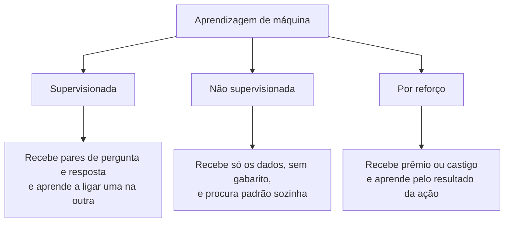
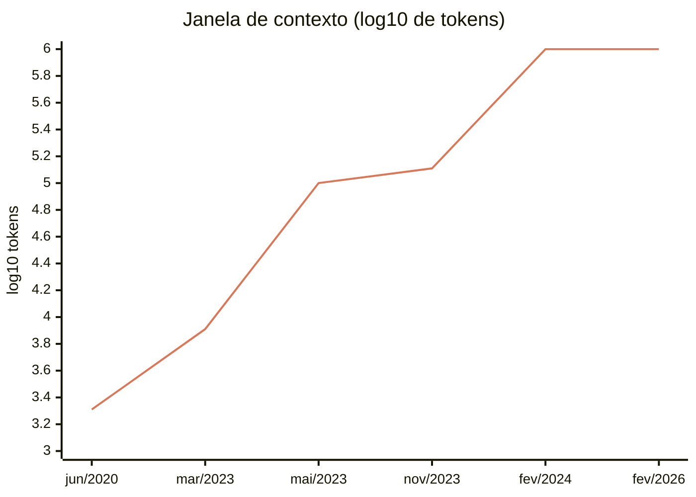

Quase todo mundo conheceu a Inteligência Artificial há pouco tempo, durante o hype criado em volta de alguns avanços e de usos em produto que levaram a uma explosão de adoção e aplicação.

Para entender o que aconteceu desde 2021, o que a IA consegue e o que não consegue fazer, e como usá-la direito, é preciso entender de onde ela veio e como ela funciona. Estudo IA há mais de dez anos — passei 2020 escrevendo uma monografia sobre redes neurais com memória de longo prazo, as LSTM, aplicadas à previsão de demanda na cadeia de suprimentos[^tcc] — e o que segue é um apanhado do campo: como ele se formou, onde estamos, e o que provavelmente vem depois.

## Os marcos, em uma tabela

| Ano | O que aconteceu | Por que importa |
| --- | --- | --- |
| 1950 | Turing propõe o jogo da imitação | Troca "máquinas pensam?" por um teste que dá para aplicar |
| 1956 | Conferência de Dartmouth | McCarthy cunha o termo "inteligência artificial" |
| 1958 | Perceptron de Rosenblatt | Primeira máquina que aprende sozinha |
| 1969 | *Perceptrons*, de Minsky e Papert | Abre o primeiro inverno da IA |
| 1986 | Backpropagation | O algoritmo que treina qualquer rede profunda até hoje |
| 1997 | Deep Blue vence Kasparov; nasce a LSTM | Auge do paradigma antigo, e a rede que resolve sequências longas |
| 2012 | AlexNet vence o ImageNet | Prova que escala funciona, e vira o campo de cabeça para baixo |
| 2016 | AlphaGo vence Lee Sedol | O momento em que "a IA está chegando" virou notícia global |
| 2017 | Transformer | Atenção sem recorrência nenhuma — a base de tudo que veio depois |
| 2020 | Leis de escala e GPT-3 | IA vira decisão de capital, não de arquitetura |
| 2022 | ChatGPT | A caixa de chat leva a tecnologia para todo mundo |
| 2024 | o1 e os modelos de raciocínio | Dá para gastar mais na hora de responder, não só no treino |
| 2025 | DeepSeek-R1 e os agentes de código | Raciocínio por reforço puro; o agente que edita o repositório |
| 2026 | Diretiva de exportação sobre o Fable 5 | Primeira vez que um Estado desliga um modelo já em operação |

## O que "inteligência artificial" quer dizer

Inteligência artificial, na definição de Russell e Norvig que usei na monografia, é o campo que busca compreender e construir entidades inteligentes. É uma definição larga de propósito, porque o campo nunca teve uma só.

O que muda de uma escola para outra é o que se considera sucesso. Um caminho é perseguir a réplica fiel do desempenho humano: a máquina acerta quando se comporta como uma pessoa. O outro é perseguir racionalidade — dadas as informações que ela tem, a máquina toma a melhor decisão que consegue, pareça humana ou não.

Essa distinção não é filosofia de rodapé. Ela separa duas histórias que correram em paralelo por setenta anos e explica por que a segunda venceu.

## A longa pré-história

O neurônio artificial é de 1943. McCulloch e Pitts modelaram o sistema nervoso como uma rede de elementos binários de limiar e mostraram que uma rede dessas computa qualquer proposição da lógica proposicional. O modelo não aprendia nada: os pesos eram fixados pelo projetista.

Em 1950, Turing trocou a pergunta. Em vez de "máquinas podem pensar?", propôs o jogo da imitação, que ficaria conhecido como teste de Turing: um interrogador conversa com dois interlocutores e tenta dizer qual é a máquina. Ele previu que, em cerca de cinquenta anos, um interrogador médio teria menos de 70% de chance de identificar corretamente a máquina após cinco minutos de conversa. O artigo também enumera e responde à maior parte das objeções que ainda hoje se levantam contra a ideia de máquinas pensantes.[^origens]

O termo "inteligência artificial" aparece impresso pela primeira vez em agosto de 1955, na proposta do projeto de verão de Dartmouth, assinada por McCarthy, Minsky, Rochester e Shannon. McCarthy escolheu o nome para se separar da cibernética — e, especificamente, de Norbert Wiener. A justificativa dele: "eu queria evitar ter de aceitar Norbert Wiener como guru ou ter de discutir com ele".

Em 1958 veio o Perceptron de Rosenblatt: um classificador linear treinável, com garantia de convergência para dados linearmente separáveis, e uma máquina física de 400 fotocélulas e potenciômetros motorizados no lugar dos pesos. Foi a primeira máquina que aprendia com uma prova por trás. Também foi o primeiro ciclo de hype: a coletiva da Marinha americana rendeu no *New York Times* a linha sobre "o embrião de um computador eletrônico que se espera que consiga andar, falar, ver, escrever, se reproduzir e ter consciência da própria existência". Rosenblatt, no que escreveu, era bem mais contido que o comunicado.

No ano seguinte, Arthur Samuel publicou o trabalho sobre damas que cunhou o termo *machine learning*: um programa que melhorava jogando contra si mesmo, com uma função de avaliação linear de pesos aprendidos. Dele vem a definição que o campo carrega desde então — aprendizagem de máquina como o campo de estudo que dá aos computadores a habilidade de aprender sem serem explicitamente programados. Nas palavras do próprio Samuel: "um computador pode ser programado de forma a aprender a jogar um jogo de damas melhor do que consegue jogar a pessoa que escreveu o programa".[^samuel]

Em 1969, Minsky e Papert publicaram o livro *Perceptrons*, e o efeito foi o oposto do entusiasmo de dez anos antes. Eles provaram que um perceptron de uma camada só não consegue aprender certas funções bem simples. O exemplo famoso é o "ou exclusivo": responder *sim* quando uma entrada ou a outra é verdadeira, mas *não* quando as duas são ao mesmo tempo. Uma regra que qualquer criança pega em um minuto, e a máquina não pegava.

Empilhar camadas resolveria, e os dois autores sabiam disso. O problema é que ninguém tinha ideia de como treinar uma rede de várias camadas, e eles suspeitavam que a limitação voltaria de outra forma nas redes maiores. A suspeita pegou, o dinheiro migrou para a linha simbólica, e a pesquisa em redes neurais ficou praticamente parada por quase duas décadas.[^perceptrons]

O que veio depois foi o primeiro inverno, selado pelo relatório Lighthill de 1973, e o retorno pela porta simbólica: sistemas especialistas. O MYCIN, de 1976, tinha cerca de 450 regras para diagnosticar infecções bacterianas e recomendar antibióticos. Numa avaliação cega publicada no *JAMA* em 1979, as recomendações do MYCIN foram consideradas aceitáveis em 65% dos casos, contra 42,5% a 62,5% de cinco especialistas em infectologia de Stanford. Ele venceu os médicos e nunca foi usado clinicamente — travou em responsabilidade civil, ausência de caminho regulatório e o fato de que uma sessão exigia meia hora digitando num terminal.[^invernos]

Em 1980, a Digital Equipment Corporation — na época a segunda maior fabricante de computadores do mundo, atrás só da IBM — colocou um sistema especialista em produção. A tarefa dele era montar a configuração de cada computador vendido: escolher quais peças entram no pedido, conferir se são compatíveis entre si e fechar a lista. Era trabalho de técnico experiente, e errar saía caro. Pela contabilidade da própria empresa, o sistema economizava entre 25 e 40 milhões de dólares por ano. Foi a primeira vez que IA apareceu como linha de resultado.

Veio o boom comercial, veio o projeto japonês de Quinta Geração com 57 bilhões de ienes apostados em máquinas feitas sob medida para rodar IA, vieram os programas defensivos americano e europeu. E em 1987 esse mercado de hardware especializado colapsou, porque estações de trabalho comuns ficaram mais baratas e mais rápidas que as máquinas dedicadas. Segundo inverno.

Os invernos foram ciclos de financiamento e expectativa, não paradas de pesquisa. Backpropagation (1986), aprendizado por diferença temporal (1988), SVMs (1995) e LSTM (1997) saíram todos *durante* os invernos. O campo se renomeou — aprendizado de máquina, reconhecimento de padrões, sistemas baseados em conhecimento — em vez de morrer.

A virada foi em 1986, com Rumelhart, Hinton e Williams: backpropagation aplicada a redes multicamada, mostrando que as unidades ocultas aprendiam representações internas úteis. Era exatamente essa capacidade de criar características novas que distinguia o método do procedimento de convergência do perceptron — e é desse artigo que vem a forma como se treina rede profunda até hoje.[^backprop]

Nos anos 1990 o campo virou estatístico. As Support Vector Machines (SVM), de Cortes e Vapnik, tinham duas vantagens que a rede neural não tinha. A primeira é que treinar uma SVM sempre chega ao mesmo resultado, e é comprovadamente o melhor resultado possível para aquele conjunto de dados — não existia o risco, rotineiro com redes neurais, de o treino travar num modelo medíocre por azar no ponto de partida. A segunda é que havia teoria matemática dizendo de antemão quando o modelo funcionaria em dados novos. De 1995 a 2010, SVM era o padrão respeitável e rede neural era coisa de margem, o que se deveu tanto ao mérito das SVMs quanto a qualquer inverno.

Em maio de 1997, o Deep Blue venceu Kasparov por 3½ a 2½. É importante para a história e não é ancestral do que veio depois: o Deep Blue não aprendia nada. Era busca bruta a 200 milhões de posições por segundo em silício dedicado, com função de avaliação ajustada à mão.

A resposta veio em duas etapas, e as duas do outro paradigma. Em março de 2016, o AlphaGo venceu Lee Sedol por 4 a 1 em Seul, diante de cerca de 200 milhões de espectadores, combinando aprendizado supervisionado sobre partidas humanas, reforço por autojogo e busca em árvore. Go era considerado uma década distante, porque o fator de ramificação inviabiliza a força bruta que resolveu o xadrez. No ano seguinte, o AlphaZero dispensou até as partidas humanas: recebeu apenas as regras e, em 24 horas de autojogo, venceu o Stockfish — descendente direto do paradigma do Deep Blue. Vinte anos separam um do outro, e esse contraste é a tese inteira da próxima seção em uma anedota.[^jogos]

## Aprendizagem de máquina, concretamente

Aprendizagem de máquina é o ramo que constrói algoritmos a partir de exemplos. Você entrega ao programa uma coleção de casos de algum fenômeno e ele monta sozinho o modelo estatístico que resolve o problema. Ninguém escreve as regras.

O exemplo que usei na monografia continua sendo o mais claro, e é o filtro de spam. Um algoritmo com regras pré-definidas exige que toda regra de identificação seja pensada e codificada pelos programadores. Isso funciona por um tempo, até que os criadores de spam identifiquem as regras que os bloqueiam e se adaptem. Os programadores então recebem reclamações, identificam os novos padrões, corrigem o programa e geram uma nova versão.

Um filtro baseado em aprendizagem de máquina é treinado sobre um conjunto de e-mails já categorizados. Conforme os próprios usuários categorizam novos e-mails, esse conjunto cresce dinamicamente. Ao ser retreinado, o novo padrão é aprendido sem intervenção direta dos programadores.

Essa é a diferença que importa e ela não mudou em setenta anos: o modelo é construído a partir dos dados, não escrito à mão.

O campo se divide primeiro pelo tipo de treinamento.

Na aprendizagem por reforço, o algoritmo — também chamado de agente — aprende a partir de uma série de recompensas ou punições. Ele identifica o ambiente em que está inserido, ou seja, quais ações pode tomar, e após certa ação recebe uma penalidade ou recompensa que diz a ele quão eficaz foi. Xadrez e Go são os exemplos clássicos.

Na aprendizagem não supervisionada, o agente aprende padrões a partir de uma entrada, mas não recebe nenhum feedback explícito sobre acertos ou erros conforme emite seus retornos. A tarefa mais comum é o agrupamento de um conjunto em grupos semelhantes com base em uma ou mais características.

Na aprendizagem supervisionada, o agente observa exemplos de pares de entrada e saída e aprende uma função que faz o mapeamento de uma na outra. É a categoria da regressão linear, das árvores de decisão e das redes neurais — e foi onde meu trabalho de 2020 se situou.

É importante ressaltar que na prática as distinções entre essas categorias podem não ser tão nítidas, sendo necessário em alguns problemas unir tipos diferentes de aprendizagem em um só agente em momentos diferentes. Guarde essa frase: ela volta a importar em 2024.

## Redes neurais

Redes neurais artificiais, também chamadas de multilayer perceptrons, são uma arquitetura que se baseia no funcionamento do cérebro, com neurônios conectados entre si formando uma rede. A ideia é inspirada no fato de que, como o cérebro é um exemplo de comportamento inteligente, seria possível fazer uma "engenharia reversa" nele, buscando seus princípios mecânicos na tentativa de replicá-los.

Estruturalmente, são compostas por nós ou unidades conectados por ligações direcionais, cada uma com um peso específico. Cada unidade calcula uma soma ponderada de todas as suas entradas e aplica sobre esse valor uma função de ativação. O resultado vai adiante.

<svg role="img" aria-label="Rede neural com duas camadas ocultas" viewBox="0 0 760 370" style="width:100%;height:auto;max-width:760px;display:block;margin:1.5rem auto;color:inherit;overflow:visible" xmlns="http://www.w3.org/2000/svg"><title>Rede neural com duas camadas ocultas</title><g fill="none" stroke="currentColor" stroke-width="1.4" font-family="inherit" font-size="15"><defs><marker id="ah" viewBox="0 0 10 10" refX="9" refY="5" markerWidth="6" markerHeight="6" orient="auto-start-reverse"><path d="M0,0 L10,5 L0,10 z" fill="currentColor" stroke="none"/></marker><marker id="ao" viewBox="0 0 10 10" refX="9" refY="5" markerWidth="6" markerHeight="6" orient="auto-start-reverse"><path d="M0,0 L10,5 L0,10 z" fill="#d97757" stroke="none"/></marker></defs><line x1="109" y1="120" x2="281" y2="85" stroke="currentColor" stroke-width="1.1" stroke-opacity="0.45"/><line x1="109" y1="120" x2="281" y2="155" stroke="currentColor" stroke-width="1.1" stroke-opacity="0.45"/><line x1="109" y1="120" x2="281" y2="225" stroke="currentColor" stroke-width="1.1" stroke-opacity="0.45"/><line x1="109" y1="120" x2="281" y2="295" stroke="currentColor" stroke-width="1.1" stroke-opacity="0.45"/><line x1="109" y1="190" x2="281" y2="85" stroke="currentColor" stroke-width="1.1" stroke-opacity="0.45"/><line x1="109" y1="190" x2="281" y2="155" stroke="currentColor" stroke-width="1.1" stroke-opacity="0.45"/><line x1="109" y1="190" x2="281" y2="225" stroke="currentColor" stroke-width="1.1" stroke-opacity="0.45"/><line x1="109" y1="190" x2="281" y2="295" stroke="currentColor" stroke-width="1.1" stroke-opacity="0.45"/><line x1="109" y1="260" x2="281" y2="85" stroke="currentColor" stroke-width="1.1" stroke-opacity="0.45"/><line x1="109" y1="260" x2="281" y2="155" stroke="currentColor" stroke-width="1.1" stroke-opacity="0.45"/><line x1="109" y1="260" x2="281" y2="225" stroke="currentColor" stroke-width="1.1" stroke-opacity="0.45"/><line x1="109" y1="260" x2="281" y2="295" stroke="currentColor" stroke-width="1.1" stroke-opacity="0.45"/><line x1="319" y1="85" x2="491" y2="120" stroke="currentColor" stroke-width="1.1" stroke-opacity="0.45"/><line x1="319" y1="85" x2="491" y2="190" stroke="currentColor" stroke-width="1.1" stroke-opacity="0.45"/><line x1="319" y1="85" x2="491" y2="260" stroke="currentColor" stroke-width="1.1" stroke-opacity="0.45"/><line x1="319" y1="155" x2="491" y2="120" stroke="currentColor" stroke-width="1.1" stroke-opacity="0.45"/><line x1="319" y1="155" x2="491" y2="190" stroke="currentColor" stroke-width="1.1" stroke-opacity="0.45"/><line x1="319" y1="155" x2="491" y2="260" stroke="currentColor" stroke-width="1.1" stroke-opacity="0.45"/><line x1="319" y1="225" x2="491" y2="120" stroke="currentColor" stroke-width="1.1" stroke-opacity="0.45"/><line x1="319" y1="225" x2="491" y2="190" stroke="currentColor" stroke-width="1.1" stroke-opacity="0.45"/><line x1="319" y1="225" x2="491" y2="260" stroke="currentColor" stroke-width="1.1" stroke-opacity="0.45"/><line x1="319" y1="295" x2="491" y2="120" stroke="currentColor" stroke-width="1.1" stroke-opacity="0.45"/><line x1="319" y1="295" x2="491" y2="190" stroke="currentColor" stroke-width="1.1" stroke-opacity="0.45"/><line x1="319" y1="295" x2="491" y2="260" stroke="currentColor" stroke-width="1.1" stroke-opacity="0.45"/><line x1="529" y1="120" x2="671" y2="190" stroke="currentColor" stroke-width="1.1" stroke-opacity="0.45"/><line x1="529" y1="190" x2="671" y2="190" stroke="currentColor" stroke-width="1.1" stroke-opacity="0.45"/><line x1="529" y1="260" x2="671" y2="190" stroke="currentColor" stroke-width="1.1" stroke-opacity="0.45"/><circle cx="90" cy="120" r="19" stroke="currentColor" stroke-width="1.6"/><text x="90" y="125" text-anchor="middle" font-size="14" font-weight="normal" fill="currentColor" fill-opacity="1" stroke="none">x1</text><circle cx="90" cy="190" r="19" stroke="currentColor" stroke-width="1.6"/><text x="90" y="195" text-anchor="middle" font-size="14" font-weight="normal" fill="currentColor" fill-opacity="1" stroke="none">x2</text><circle cx="90" cy="260" r="19" stroke="currentColor" stroke-width="1.6"/><text x="90" y="265" text-anchor="middle" font-size="14" font-weight="normal" fill="currentColor" fill-opacity="1" stroke="none">x3</text><circle cx="300" cy="85" r="19" stroke="currentColor" stroke-width="1.6"/><circle cx="300" cy="155" r="19" stroke="currentColor" stroke-width="1.6"/><circle cx="300" cy="225" r="19" stroke="currentColor" stroke-width="1.6"/><circle cx="300" cy="295" r="19" stroke="currentColor" stroke-width="1.6"/><circle cx="510" cy="120" r="19" stroke="currentColor" stroke-width="1.6"/><circle cx="510" cy="190" r="19" stroke="currentColor" stroke-width="1.6"/><circle cx="510" cy="260" r="19" stroke="currentColor" stroke-width="1.6"/><circle cx="690" cy="190" r="19" stroke="currentColor" stroke-width="1.6"/><text x="690" y="195" text-anchor="middle" font-size="14" font-weight="normal" fill="currentColor" fill-opacity="1" stroke="none">y</text><text x="90" y="350" text-anchor="middle" font-size="14" font-weight="normal" fill="currentColor" fill-opacity="0.7" stroke="none">Entrada</text><text x="300" y="350" text-anchor="middle" font-size="14" font-weight="normal" fill="currentColor" fill-opacity="0.7" stroke="none">Camada oculta</text><text x="510" y="350" text-anchor="middle" font-size="14" font-weight="normal" fill="currentColor" fill-opacity="0.7" stroke="none">Camada oculta</text><text x="690" y="350" text-anchor="middle" font-size="14" font-weight="normal" fill="currentColor" fill-opacity="0.7" stroke="none">Saída</text><line x1="20" y1="190" x2="66" y2="190" stroke="#d97757" stroke-width="1.6" stroke-opacity="1" marker-end="url(#ao)"/><line x1="712" y1="190" x2="752" y2="190" stroke="#d97757" stroke-width="1.6" stroke-opacity="1" marker-end="url(#ao)"/></g></svg>

*A informação corre da esquerda para a direita, e cada ligação do desenho carrega um peso próprio. As transformações acontecem nas unidades das camadas do meio — as unidades ocultas — até sair o valor final. A quantidade de camadas e de unidades por camada são parâmetros importantes e variam com a complexidade dos dados.*

Para uma rede aprender, são necessárias três coisas: um jeito de medir o quanto ela errou, um jeito de transformar o valor dentro de cada unidade e um jeito de ajustar os pesos a partir do erro medido.

O treino funciona assim: a rede recebe os dados divididos em lotes e processa lote por lote. Quando passou por todos, fechou uma época. No fim de cada época ela mede o erro e reajusta os pesos percorrendo a rede de trás para frente, do resultado em direção à entrada — daí o nome *backpropagation*. Repete-se isso por várias épocas, até os pesos pararem de mudar.

Toda a IA de 2026 ainda é isso. Pesos, ativações, lotes, épocas, gradiente correndo para trás. O que mudou foi a escala e o formato da conexão entre as unidades.

## 2012: quando começou a funcionar

Em 2009, Fei-Fei Li e seu grupo publicaram o ImageNet: imagens organizadas pela hierarquia de substantivos do WordNet, rotuladas em escala via Mechanical Turk. A contribuição dela costuma ser reduzida a "montou um dataset grande". A tese real era contrária ao consenso da época: o gargalo da visão computacional eram os *dados*, não os algoritmos. Era uma afirmação impopular em 2007 e difícil de financiar.

Em 2012, a AlexNet venceu a competição do ImageNet com erro top-5 de 15,3%, contra 26,2% do segundo colocado — a maior diferença da história da competição. Foram cinco camadas convolucionais, 60 milhões de parâmetros, treinadas em duas placas GeForce GTX 580 de 3 GB durante cinco a seis dias.

Nada ali era ideia nova. Redes convolucionais são de LeCun, 1989. ReLU e dropout eram recentes mas conhecidos. O que era novo é que a escala fez funcionar: dados rotulados em volume, hardware paralelo e capacidade suficiente. Em um ano, praticamente todo grupo sério de visão computacional tinha migrado para aprendizado profundo.[^imagenet]

A leitura que faço disso, doze anos depois, é a que Rich Sutton escreveu em 2019 e Sara Hooker formalizou em 2020. Sutton: "a maior lição que se pode tirar de setenta anos de pesquisa em IA é que métodos gerais que se apoiam em computação são, no fim, os mais eficazes — e por larga margem". Hooker chamou de loteria do hardware: uma ideia de pesquisa vence "porque é adequada ao software e ao hardware disponíveis, e não porque seja superior a direções alternativas".

Os invernos, lidos assim, não foram fracassos de ideia. Foram derrotas na loteria do hardware. A linhagem do perceptron tinha a ideia certa e a década errada. O Japão apostou em hardware de programação lógica e perdeu para microprocessadores genéricos. As máquinas Lisp perderam para workstations Sun. E o aprendizado profundo ganhou a loteria quando placas de vídeo projetadas para videogame se revelaram exatamente do formato certo: multiplicação densa de matrizes com banda de memória alta.[^licao]

## Sequências e memória

Redes convolucionais resolveram imagem. Sequência — texto, fala, séries temporais — é outro problema, e foi onde passei 2020.

Uma rede neural recorrente (RNR) é uma rede neural com um ciclo: o que sai de um passo volta como entrada do passo seguinte. Com isso ela carrega alguma coisa do que já viu, e é o que permite tratar dados em que a ordem importa — texto, fala, uma série de vendas mês a mês.

<svg role="img" aria-label="Rede recorrente desenrolada no tempo" viewBox="0 0 760 320" style="width:100%;height:auto;max-width:760px;display:block;margin:1.5rem auto;color:inherit;overflow:visible" xmlns="http://www.w3.org/2000/svg"><title>Rede recorrente desenrolada no tempo</title><g fill="none" stroke="currentColor" stroke-width="1.4" font-family="inherit" font-size="15"><defs><marker id="ah" viewBox="0 0 10 10" refX="9" refY="5" markerWidth="6" markerHeight="6" orient="auto-start-reverse"><path d="M0,0 L10,5 L0,10 z" fill="currentColor" stroke="none"/></marker><marker id="ao" viewBox="0 0 10 10" refX="9" refY="5" markerWidth="6" markerHeight="6" orient="auto-start-reverse"><path d="M0,0 L10,5 L0,10 z" fill="#d97757" stroke="none"/></marker></defs><rect x="65" y="130" width="90" height="58" rx="6" stroke="currentColor" stroke-width="1.6"/><text x="110" y="165" text-anchor="middle" font-size="16" font-weight="600" fill="currentColor" fill-opacity="1" stroke="none">A</text><line x1="110" y1="250" x2="110" y2="194" stroke="currentColor" stroke-width="1.5" stroke-opacity="1" marker-end="url(#ah)"/><text x="110" y="275" text-anchor="middle" font-size="15" font-weight="normal" fill="#d97757" fill-opacity="1" stroke="none">x0</text><line x1="110" y1="124" x2="110" y2="72" stroke="currentColor" stroke-width="1.5" stroke-opacity="1" marker-end="url(#ah)"/><text x="110" y="58" text-anchor="middle" font-size="15" font-weight="normal" fill="#d97757" fill-opacity="1" stroke="none">h0</text><rect x="240" y="130" width="90" height="58" rx="6" stroke="currentColor" stroke-width="1.6"/><text x="285" y="165" text-anchor="middle" font-size="16" font-weight="600" fill="currentColor" fill-opacity="1" stroke="none">A</text><line x1="285" y1="250" x2="285" y2="194" stroke="currentColor" stroke-width="1.5" stroke-opacity="1" marker-end="url(#ah)"/><text x="285" y="275" text-anchor="middle" font-size="15" font-weight="normal" fill="#d97757" fill-opacity="1" stroke="none">x1</text><line x1="285" y1="124" x2="285" y2="72" stroke="currentColor" stroke-width="1.5" stroke-opacity="1" marker-end="url(#ah)"/><text x="285" y="58" text-anchor="middle" font-size="15" font-weight="normal" fill="#d97757" fill-opacity="1" stroke="none">h1</text><rect x="415" y="130" width="90" height="58" rx="6" stroke="currentColor" stroke-width="1.6"/><text x="460" y="165" text-anchor="middle" font-size="16" font-weight="600" fill="currentColor" fill-opacity="1" stroke="none">A</text><line x1="460" y1="250" x2="460" y2="194" stroke="currentColor" stroke-width="1.5" stroke-opacity="1" marker-end="url(#ah)"/><text x="460" y="275" text-anchor="middle" font-size="15" font-weight="normal" fill="#d97757" fill-opacity="1" stroke="none">x2</text><line x1="460" y1="124" x2="460" y2="72" stroke="currentColor" stroke-width="1.5" stroke-opacity="1" marker-end="url(#ah)"/><text x="460" y="58" text-anchor="middle" font-size="15" font-weight="normal" fill="#d97757" fill-opacity="1" stroke="none">h2</text><rect x="590" y="130" width="90" height="58" rx="6" stroke="currentColor" stroke-width="1.6"/><text x="635" y="165" text-anchor="middle" font-size="16" font-weight="600" fill="currentColor" fill-opacity="1" stroke="none">A</text><line x1="635" y1="250" x2="635" y2="194" stroke="currentColor" stroke-width="1.5" stroke-opacity="1" marker-end="url(#ah)"/><text x="635" y="275" text-anchor="middle" font-size="15" font-weight="normal" fill="#d97757" fill-opacity="1" stroke="none">x3</text><line x1="635" y1="124" x2="635" y2="72" stroke="currentColor" stroke-width="1.5" stroke-opacity="1" marker-end="url(#ah)"/><text x="635" y="58" text-anchor="middle" font-size="15" font-weight="normal" fill="#d97757" fill-opacity="1" stroke="none">h3</text><line x1="157" y1="159" x2="238" y2="159" stroke="#d97757" stroke-width="1.6" stroke-opacity="1" marker-end="url(#ao)"/><line x1="332" y1="159" x2="413" y2="159" stroke="#d97757" stroke-width="1.6" stroke-opacity="1" marker-end="url(#ao)"/><line x1="507" y1="159" x2="588" y2="159" stroke="#d97757" stroke-width="1.6" stroke-opacity="1" marker-end="url(#ao)"/><text x="372" y="206" text-anchor="middle" font-size="13" font-weight="normal" fill="#d97757" fill-opacity="0.85" stroke="none">estado interno</text><line x1="22" y1="159" x2="62" y2="159" stroke="currentColor" stroke-width="1.5" stroke-opacity="0.4" marker-end="url(#ah)" stroke-dasharray="4 4"/><line x1="682" y1="159" x2="738" y2="159" stroke="currentColor" stroke-width="1.5" stroke-opacity="0.4" marker-end="url(#ah)" stroke-dasharray="4 4"/><text x="380" y="305" text-anchor="middle" font-size="13" font-weight="normal" fill="currentColor" fill-opacity="0.7" stroke="none">a mesma camada A, aplicada quatro vezes</text></g></svg>

*A mesma camada, desenrolada no tempo. Não são quatro camadas diferentes: é uma só, aplicada quatro vezes, passando adiante o que guardou de cada passo.*

Por causa dessa recorrência, uma RNR tem uma espécie de memória de curto prazo: a função atual pode ser alterada pelos valores anteriores que interferem recursivamente nas novas entradas.

O problema é que essa memória não alcança longe. Cada célula calcula seu gradiente a partir do gradiente já calculado na camada anterior. Se os ajustes na camada anterior foram pequenos, os ajustes nesta serão ainda menores. O gradiente decresce exponencialmente e desaparece enquanto se propaga na rede. As primeiras camadas falham em aprender qualquer coisa. É o gradiente decrescente, e ele significa, na prática, que a rede não consegue ligar uma informação a outra que apareceu muitos passos antes.

Hochreiter diagnosticou isso em 1991, na dissertação de mestrado — escrita em alemão e nunca publicada formalmente, motivo pelo qual o resultado demorou anos para circular fora da Alemanha e pelo qual o artigo de Bengio, Simard e Frasconi, de 1994, é o mais citado. Em 1997, Hochreiter e Schmidhuber publicaram a solução: a *Long Short-Term Memory*, ou LSTM. O nome descreve bem o mecanismo: é a memória de curto prazo da rede recorrente, só que capaz de durar muitos passos.

O ponto fundamental de uma LSTM são os portões. A célula usa esses portões para manipular a informação armazenada, podendo decidir, a cada passo, guardar, ler ou deletar. Com isso ela usa de forma recorrente apenas a informação que de fato é útil ao modelo.

<svg role="img" aria-label="Dentro de uma célula LSTM" viewBox="0 0 760 310" style="width:100%;height:auto;max-width:760px;display:block;margin:1.5rem auto;color:inherit;overflow:visible" xmlns="http://www.w3.org/2000/svg"><title>Dentro de uma célula LSTM</title><g fill="none" stroke="currentColor" stroke-width="1.4" font-family="inherit" font-size="15"><defs><marker id="ah" viewBox="0 0 10 10" refX="9" refY="5" markerWidth="6" markerHeight="6" orient="auto-start-reverse"><path d="M0,0 L10,5 L0,10 z" fill="currentColor" stroke="none"/></marker><marker id="ao" viewBox="0 0 10 10" refX="9" refY="5" markerWidth="6" markerHeight="6" orient="auto-start-reverse"><path d="M0,0 L10,5 L0,10 z" fill="#d97757" stroke="none"/></marker></defs><rect x="20" y="26" width="672" height="250" rx="12" stroke="currentColor" stroke-width="1.3"/><text x="38" y="292" text-anchor="start" font-size="13" font-weight="normal" fill="currentColor" fill-opacity="0.7" stroke="none">célula LSTM</text><line x1="40" y1="62" x2="233" y2="62" stroke="#d97757" stroke-width="2.2" stroke-opacity="1" marker-end="url(#ao)"/><text x="44" y="46" text-anchor="start" font-size="13" font-weight="normal" fill="#d97757" fill-opacity="1" stroke="none">estado da célula (entra)</text><circle cx="255" cy="62" r="16" stroke="#d97757" stroke-width="1.8"/><text x="255" y="68" text-anchor="middle" font-size="18" font-weight="normal" fill="#d97757" fill-opacity="1" stroke="none">×</text><line x1="273" y1="62" x2="413" y2="62" stroke="#d97757" stroke-width="2.2" stroke-opacity="1" marker-end="url(#ao)"/><circle cx="435" cy="62" r="16" stroke="#d97757" stroke-width="1.8"/><text x="435" y="67" text-anchor="middle" font-size="18" font-weight="normal" fill="#d97757" fill-opacity="1" stroke="none">+</text><line x1="453" y1="62" x2="675" y2="62" stroke="#d97757" stroke-width="2.2" stroke-opacity="1" marker-end="url(#ao)"/><text x="671" y="46" text-anchor="end" font-size="13" font-weight="normal" fill="#d97757" fill-opacity="1" stroke="none">estado da célula (sai)</text><rect x="180" y="152" width="150" height="56" rx="8" stroke="currentColor" stroke-width="1.5"/><text x="255" y="174" text-anchor="middle" font-size="12.5" font-weight="normal" fill="currentColor" fill-opacity="1" stroke="none">portão de esquecimento</text><text x="255" y="192" text-anchor="middle" font-size="12.5" font-weight="normal" fill="currentColor" fill-opacity="1" stroke="none">o que apagar do estado</text><rect x="360" y="152" width="150" height="56" rx="8" stroke="currentColor" stroke-width="1.5"/><text x="435" y="174" text-anchor="middle" font-size="12.5" font-weight="normal" fill="currentColor" fill-opacity="1" stroke="none">portão de entrada</text><text x="435" y="192" text-anchor="middle" font-size="12.5" font-weight="normal" fill="currentColor" fill-opacity="1" stroke="none">o que gravar no estado</text><rect x="540" y="152" width="150" height="56" rx="8" stroke="currentColor" stroke-width="1.5"/><text x="615" y="174" text-anchor="middle" font-size="12.5" font-weight="normal" fill="currentColor" fill-opacity="1" stroke="none">portão de saída</text><text x="615" y="192" text-anchor="middle" font-size="12.5" font-weight="normal" fill="currentColor" fill-opacity="1" stroke="none">o que mostrar para fora</text><line x1="255" y1="148" x2="255" y2="82" stroke="currentColor" stroke-width="1.5" stroke-opacity="1" marker-end="url(#ah)"/><line x1="435" y1="148" x2="435" y2="82" stroke="currentColor" stroke-width="1.5" stroke-opacity="1" marker-end="url(#ah)"/><path d="M675,76 L675,118 L615,118 L615,148" stroke="currentColor" stroke-width="1.3" stroke-opacity="0.6" marker-end="url(#ah)" fill="none"/><rect x="38" y="222" width="190" height="48" rx="8" stroke="currentColor" stroke-width="1.5"/><text x="133" y="242" text-anchor="middle" font-size="12.5" font-weight="normal" fill="currentColor" fill-opacity="1" stroke="none">entrada deste passo</text><text x="133" y="259" text-anchor="middle" font-size="12.5" font-weight="normal" fill="currentColor" fill-opacity="1" stroke="none">+ saída do passo anterior</text><path d="M230,246 L255,246 L255,212" stroke="currentColor" stroke-width="1.3" marker-end="url(#ah)" fill="none"/><path d="M230,246 L435,246 L435,212" stroke="currentColor" stroke-width="1.3" marker-end="url(#ah)" fill="none"/><path d="M230,246 L615,246 L615,212" stroke="currentColor" stroke-width="1.3" marker-end="url(#ah)" fill="none"/><line x1="692" y1="180" x2="736" y2="180" stroke="#d97757" stroke-width="1.8" stroke-opacity="1" marker-end="url(#ao)"/><text x="712" y="166" text-anchor="middle" font-size="12.5" font-weight="normal" fill="#d97757" fill-opacity="1" stroke="none">saída do passo</text></g></svg>

*O estado da célula é a linha de cima. Olah descreve como uma linha de produção onde a saída da célula é "fabricada", com o fluxo alterado ou não conforme o resultado dos portões. Os portões são redes internas ativadas por uma sigmoide, que devolve valores entre 0 e 1 — 0 significa nada passa, 1 significa que a informação passa inteira.*

São três portões. O de entrada decide o que gravar, o de saída decide o que expor, e o de esquecimento é o que permite à célula se reiniciar diante de fluxos contínuos de entrada — sem ele o estado cresce sem limite e a rede satura. Com essa estrutura, a LSTM dominou modelagem de sequência por quase vinte anos: reconhecimento de fala, tradução automática, reconhecimento de escrita manual.[^lstm]

## Onde minha monografia parou

O trabalho comparou, sobre a série mensal de vendas das indústrias canadenses de 1992 a 2020, quatro métodos: previsão ingênua como benchmark, média móvel exponencial, regressão linear multivariada e LSTM. Medi tudo com erro médio absoluto e raiz do erro quadrático médio.

A LSTM não ficou em primeiro em nenhum dos dois cenários. Com entradas univariadas simples não houve ganho nenhum em usar aprendizado de máquina. Com entradas multivariadas, seis meses anteriores por previsão, houve ganho significativo — sobre vendas mensais na casa das dezenas de milhões, a diferença de acurácia entre um método e outro passou de cem mil dólares canadenses, o que teria mudado o planejamento na prática. Mas quem capturou esse ganho foi a regressão linear multivariada. A conclusão que escrevi foi que, tendo complexidade muito maior que a regressão linear e não tendo demonstrado acurácia melhor, a LSTM não era recomendada para aquele problema.

Também escrevi que a seleção de hiperparâmetros era "mais arte do que ciência". Seis anos depois isso continua parcialmente verdadeiro.

É também onde termina a história que eu conhecia na época. O trabalho é de previsão de série temporal, feito com o ferramental que era padrão nesse tipo de problema. Em paralelo, no processamento de linguagem, uma arquitetura publicada em 2017 já tinha tornado a recorrência dispensável — e é dela que trata o resto deste artigo.

## Atenção é tudo que você precisa

O mecanismo de atenção foi introduzido em setembro de 2014 por Bahdanau, Cho e Bengio, para resolver o gargalo do vetor de tamanho fixo na tradução automática: em vez de comprimir a frase inteira em um vetor, o decodificador aprende a olhar diretamente para todas as posições da entrada a cada palavra que gera.

Em junho de 2017, o artigo *Attention Is All You Need* — "atenção é tudo que você precisa" — fez a pergunta óbvia e desconfortável: se a atenção resolve o problema, para que serve a recorrência? A resposta foi o Transformer, construído inteiramente de atenção, sem recorrência e sem convolução.

A consequência é a coisa mais importante desta seção, e ela conversa diretamente com o que eu tinha escrito. Numa RNR, para ligar o primeiro token ao último de uma sequência de *n* posições, a informação precisa atravessar *n* passos — e o gradiente precisa voltar por esses mesmos *n* passos. É literalmente o mecanismo do gradiente decrescente. Na autoatenção, qualquer posição alcança qualquer outra em um único passo.

<svg role="img" aria-label="Recorrência comparada com autoatenção" viewBox="0 0 760 350" style="width:100%;height:auto;max-width:760px;display:block;margin:1.5rem auto;color:inherit;overflow:visible" xmlns="http://www.w3.org/2000/svg"><title>Recorrência comparada com autoatenção</title><g fill="none" stroke="currentColor" stroke-width="1.4" font-family="inherit" font-size="15"><defs><marker id="ah" viewBox="0 0 10 10" refX="9" refY="5" markerWidth="6" markerHeight="6" orient="auto-start-reverse"><path d="M0,0 L10,5 L0,10 z" fill="currentColor" stroke="none"/></marker><marker id="ao" viewBox="0 0 10 10" refX="9" refY="5" markerWidth="6" markerHeight="6" orient="auto-start-reverse"><path d="M0,0 L10,5 L0,10 z" fill="#d97757" stroke="none"/></marker></defs><text x="40" y="44" text-anchor="start" font-size="15" font-weight="600" fill="currentColor" fill-opacity="1" stroke="none">Recorrência</text><circle cx="170" cy="90" r="20" stroke="currentColor" stroke-width="1.6"/><text x="170" y="96" text-anchor="middle" font-size="15" font-weight="normal" fill="currentColor" fill-opacity="1" stroke="none">1</text><circle cx="310" cy="90" r="20" stroke="currentColor" stroke-width="1.6"/><text x="310" y="96" text-anchor="middle" font-size="15" font-weight="normal" fill="currentColor" fill-opacity="1" stroke="none">2</text><circle cx="450" cy="90" r="20" stroke="currentColor" stroke-width="1.6"/><text x="450" y="96" text-anchor="middle" font-size="15" font-weight="normal" fill="currentColor" fill-opacity="1" stroke="none">3</text><circle cx="590" cy="90" r="20" stroke="currentColor" stroke-width="1.6"/><text x="590" y="96" text-anchor="middle" font-size="15" font-weight="normal" fill="currentColor" fill-opacity="1" stroke="none">4</text><line x1="192" y1="90" x2="288" y2="90" stroke="#d97757" stroke-width="1.8" stroke-opacity="1" marker-end="url(#ao)"/><line x1="332" y1="90" x2="428" y2="90" stroke="#d97757" stroke-width="1.8" stroke-opacity="1" marker-end="url(#ao)"/><line x1="472" y1="90" x2="568" y2="90" stroke="#d97757" stroke-width="1.8" stroke-opacity="1" marker-end="url(#ao)"/><path d="M170,124 Q380,168 590,124" stroke="currentColor" stroke-width="1.2" stroke-dasharray="5 4" stroke-opacity="0.55" fill="none"/><text x="380" y="166" text-anchor="middle" font-size="13" font-weight="normal" fill="currentColor" fill-opacity="0.75" stroke="none">para o 1 alcançar o 4, a informação atravessa 3 passos</text><text x="40" y="232" text-anchor="start" font-size="15" font-weight="600" fill="currentColor" fill-opacity="1" stroke="none">Autoatenção</text><path d="M170,258 Q240.0,210 310,258" stroke="#d97757" stroke-width="1.3" stroke-opacity="0.65" fill="none"/><path d="M310,258 Q380.0,210 450,258" stroke="#d97757" stroke-width="1.3" stroke-opacity="0.65" fill="none"/><path d="M450,258 Q520.0,210 590,258" stroke="#d97757" stroke-width="1.3" stroke-opacity="0.65" fill="none"/><path d="M170,258 Q310.0,188 450,258" stroke="#d97757" stroke-width="1.3" stroke-opacity="0.65" fill="none"/><path d="M310,258 Q450.0,188 590,258" stroke="#d97757" stroke-width="1.3" stroke-opacity="0.65" fill="none"/><path d="M170,258 Q380.0,166 590,258" stroke="#d97757" stroke-width="1.3" stroke-opacity="0.65" fill="none"/><circle cx="170" cy="280" r="20" stroke="currentColor" stroke-width="1.6"/><text x="170" y="286" text-anchor="middle" font-size="15" font-weight="normal" fill="currentColor" fill-opacity="1" stroke="none">1</text><circle cx="310" cy="280" r="20" stroke="currentColor" stroke-width="1.6"/><text x="310" y="286" text-anchor="middle" font-size="15" font-weight="normal" fill="currentColor" fill-opacity="1" stroke="none">2</text><circle cx="450" cy="280" r="20" stroke="currentColor" stroke-width="1.6"/><text x="450" y="286" text-anchor="middle" font-size="15" font-weight="normal" fill="currentColor" fill-opacity="1" stroke="none">3</text><circle cx="590" cy="280" r="20" stroke="currentColor" stroke-width="1.6"/><text x="590" y="286" text-anchor="middle" font-size="15" font-weight="normal" fill="currentColor" fill-opacity="1" stroke="none">4</text><text x="380" y="324" text-anchor="middle" font-size="13" font-weight="normal" fill="currentColor" fill-opacity="0.75" stroke="none">cada posição alcança qualquer outra em 1 passo</text></g></svg>

*Em cima, para o token 1 influenciar o token 4 a informação percorre três ligações — e o gradiente volta pelas mesmas três. Embaixo, cada token alcança cada outro diretamente.*

Os portões da LSTM eram uma solução engenhosa para um problema criado pela recorrência. O Transformer não resolveu o problema: apagou a causa. E ganhou de brinde a coisa que a arquitetura recorrente nunca poderia dar — a sequência inteira treina em paralelo, o que transforma tempo de treino em dinheiro de GPU.[^transformer]

Em 2018, BERT e o primeiro GPT estabeleceram a receita de pré-treinar e depois ajustar. Em dezoito meses o campo de linguagem abandonou arquiteturas específicas por tarefa. Em previsão de séries temporais, onde a LSTM seguia sendo ferramenta de trabalho corrente, a virada demorou bem mais a chegar — e é por isso que as duas histórias, a que eu estudei e a que explodiu depois, parecem desencontradas no tempo.

## Escala, alinhamento e uma caixa de chat

Em janeiro de 2020, Kaplan e coautores publicaram as leis de escala: a perda de um modelo de linguagem segue leis de potência suaves em relação ao número de parâmetros, ao volume de dados e à computação gasta, ao longo de mais de sete ordens de grandeza. Detalhes de arquitetura — largura contra profundidade — são quase irrelevantes dentro de faixas amplas.

Esse é o artigo que transformou pesquisa em IA numa disciplina de engenharia com roteiro. Se o desempenho é previsível a partir do orçamento, a decisão deixa de ser qual arquitetura inventar e passa a ser quanto capital alocar. Cinco meses depois veio o GPT-3, com 175 bilhões de parâmetros, e com ele o aprendizado em contexto: você para de ajustar o modelo e começa a instruí-lo no próprio prompt.[^escala]

Duas correções relevantes aconteceram em 2022. A primeira foi o Chinchilla, da DeepMind, que treinou mais de quatrocentos modelos e mostrou que a recomendação de alocação do Kaplan estava errada: parâmetros e tokens devem crescer aproximadamente juntos. Um modelo de 70 bilhões, treinado com quatro vezes mais tokens e o mesmo orçamento de computação, venceu modelos de 175, 178 e 530 bilhões. Todos os modelos grandes de 2020 a 2022 estavam subtreinados.

A segunda foi o InstructGPT. Treinar o modelo para seguir instruções a partir de feedback humano produziu um resultado que ainda me parece o número mais impressionante da década: as saídas do modelo alinhado de 1,3 bilhão de parâmetros eram preferidas às do GPT-3 de 175 bilhões, com cem vezes menos parâmetros. Alinhamento deixou de ser imposto de segurança e virou multiplicador de capacidade.[^rlhf]

Em 30 de novembro de 2022 a OpenAI lançou o ChatGPT. Não havia capacidade nova de modelo ali: era GPT-3.5, mais aprendizado por feedback humano, mais uma caixa de chat. Foi um evento de distribuição, não de pesquisa. O GPT-3 existia havia dois anos e meio e ninguém fora do círculo de desenvolvedores se importava.

Uma observação sobre o número mais citado: a marca de "100 milhões de usuários em dois meses" é uma *estimativa* do UBS a partir de dados da Similarweb, publicada em fevereiro de 2023, e não um dado divulgado pela OpenAI.[^rlhf]

## A commodity começa

Em março de 2023 saiu o GPT-4, e com ele um marco que passou batido. O documento chamado "relatório técnico" não divulgou arquitetura, contagem de parâmetros, conjunto de dados nem método de treinamento. Foi o momento em que "relatório técnico" deixou de significar "artigo" e a pesquisa de fronteira fechou.[^gpt4]

No mesmo mês a Anthropic lançou o Claude, treinado com IA constitucional em vez de puro feedback humano, e em maio foi a primeira a oferecer uma janela de 100 mil tokens.

Do outro lado, o LLaMA da Meta saiu em fevereiro de 2023 com licença apenas de pesquisa — e vazou. O vazamento é o que de fato disparou a explosão de pesos abertos. A versão comercializável veio em julho com o Llama 2, e é ela, não a primeira, que marca o início da indústria de pesos abertos. Em outubro o Mistral 7B, sob Apache 2.0, venceu o Llama 2 de 13 bilhões.[^gpt4]

A janela de contexto cresceu de um jeito que vale olhar em escala logarítmica, porque em escala linear os primeiros anos somem:

*De 2.048 tokens no GPT-3 a 1 milhão no Gemini 1.5 Pro em menos de quatro anos — quase três ordens de grandeza. O patamar de 1 milhão chega à classe Opus em fevereiro de 2026.*[^contexto]

Foi também nesse período que o campo aprendeu a desconfiar dos próprios números. Circulava a ideia de "habilidades emergentes": passado certo tamanho, o modelo começaria a fazer coisas que os modelos menores simplesmente não faziam, como se a capacidade surgisse do nada.

Em 2023, um grupo de Stanford mostrou que boa parte disso vinha da régua, não do modelo. Imagine um teste em que a nota é tudo ou nada: a conta inteira certa vale ponto, um dígito errado vale zero. Um modelo que vai acertando cada vez mais dígitos tira zero por muito tempo e depois, quando enfim fecha a conta, salta de zero a cem. O salto está na forma de medir. Trocando para uma régua que dá crédito parcial, a mesma evolução vira uma curva subindo devagar, sem surpresa nenhuma. Para deixar o ponto claro, eles fabricaram "emergência" em modelos de visão sem mudar nada além da métrica.[^miragem]

Em setembro de 2024 veio a segunda lei de escala. O o1 da OpenAI é treinado por reforço para produzir uma longa cadeia de raciocínio interna antes de responder, e o tempo de inferência vira um eixo de escala próprio. Kaplan dizia para gastar mais no treinamento; o o1 disse que também dá para gastar mais na hora de responder. No AIME de 2024, o GPT-4o fazia 12% e o o1 fez 74%.[^raciocinio]

Duas peças de 2024 explicam quase tudo que veio em 2025. A primeira é o RLVR: aprendizado por reforço com recompensas verificáveis. Em vez de ensinar o modelo a partir da preferência de avaliadores humanos, deixa-se um verificador automático dar a nota. A conta bate? Os testes passam? Recompensa 1 ou 0. É barato, e não dá para agradar o avaliador sem acertar de fato. Também explica por que matemática e código avançaram bem mais rápido que escrita e julgamento: só os primeiros têm como se conferir sozinhos.

A segunda é o Model Context Protocol (MCP), aberto pela Anthropic em novembro de 2024. Antes dele, ligar um modelo a cada ferramenta — o calendário, o banco de dados, o repositório de código — exigia uma integração feita à mão para cada combinação de modelo e ferramenta. O MCP transformou isso em um encaixe só: a ferramenta fala MCP uma vez e passa a servir qualquer modelo. Foi adotado pela OpenAI e pelo Google, raro caso de padrão de concorrente vencendo por completo, e doado à Agentic AI Foundation, sob a Linux Foundation, em dezembro de 2025. É a razão de "agente" ter virado coisa prática e não demonstração. Escrevi sobre ele em detalhe [em outro artigo](../model-context-protocol/).[^raciocinio]

## Agentes, verificadores e o Estado

Em janeiro de 2025 a DeepSeek publicou o R1 sob licença MIT, mostrando que a capacidade de raciocínio pode ser incentivada por reforço puro, sem nenhuma trajetória de raciocínio anotada por humano. O artigo depois passou por revisão por pares na *Nature* — o primeiro modelo de raciocínio de fronteira a fazer isso.

O número que circulou foi o de custo, e vale separar o que cada cifra cobre. Os 5,576 milhões de dólares são do artigo do DeepSeek-V3, não do R1, e cobrem apenas a rodada final de pré-treinamento, excluindo explicitamente pesquisa anterior, ablações, dados e capital de hardware — o próprio artigo diz isso. Os 294 mil dólares divulgados em setembro de 2025 são o custo incremental do reforço do R1 sobre o modelo base. A SemiAnalysis estimou o gasto total em hardware em algo próximo de 500 milhões. Nenhum dos três é, sozinho, "o custo de construir a DeepSeek". Em 27 de janeiro a NVIDIA caiu cerca de 17%, perdendo aproximadamente 589 bilhões de dólares de valor de mercado em um dia.[^deepseek]

Em fevereiro de 2025 a Anthropic lançou o Claude 3.7 Sonnet junto com o Claude Code. O modelo é o primeiro híbrido — raciocínio estendido que se liga e desliga, com orçamento de pensamento configurável em tokens. O Claude Code é o produto que normalizou o fluxo em que o agente edita o repositório, roda os testes e abre o PR. Em maio, o Claude 4 foi o primeiro modelo de fronteira publicado sob o nível elevado de segurança do próprio laboratório, porque os testes internos não conseguiram descartar ganho de capacidade para armas químicas, biológicas, radiológicas e nucleares.

O SWE-bench conta a história desse período melhor que qualquer narrativa: cerca de 33% no fim de 2024, 72,7% em setembro de 2025, 80,9% em novembro de 2025. Benchmarks estão saturando em meses, não em anos, e cada substituto mais difícil dura pouco.[^agentes]

O preço caiu junto. Segundo a Epoch AI, para um nível fixo de capacidade, o preço de inferência cai a uma mediana de cerca de 50× por ano, e desde 2024 esse ritmo acelerou. O exemplo mais limpo é interno a um laboratório só: o Opus 4.5, em novembro de 2025, cortou o preço de 15/75 para 5/25 dólares por milhão de tokens — melhor modelo, um terço do preço, oito meses depois. Uma ressalva que a própria Epoch faz e que vale repetir: o preço unitário caiu, o gasto total subiu.[^agentes]

E o ritmo de lançamento mudou de natureza. Sobre o Opus 5, de julho de 2026, a Axios escreveu a frase que melhor resume o ano: é "o quarto lançamento de modelo Claude 5 em menos de dois meses, sublinhando como a implantação de IA deixou de ser feita de grandes lançamentos e passou a ser melhoria rápida em capacidade, custo e velocidade". O lançamento parou de ser uma unidade narrativa útil.

O que virou notícia em 2026 foi outra coisa. Em abril a Anthropic apresentou o Claude Mythos, um modelo especializado em segurança capaz de encontrar vulnerabilidades inéditas e escrever exploits, e deliberadamente restringiu o acesso: distribuiu primeiro a defensores, através do Projeto Glasswing, para que a infraestrutura crítica fosse endurecida antes que capacidade equivalente chegasse a atacantes. Até maio, mais de dez mil vulnerabilidades de severidade alta ou crítica encontradas; até junho, cerca de 150 organizações em mais de quinze países.

Em 12 de junho de 2026, o governo americano invocou autoridade de controle de exportação para suspender o acesso ao Claude Fable 5 e ao Mythos 5 por qualquer estrangeiro, dentro ou fora dos Estados Unidos. Como não era possível distinguir nacionalidade em tempo real, a Anthropic desligou os dois modelos no mundo inteiro. Ficaram fora por dezenove dias. É a primeira vez que um Estado obriga uma empresa de IA a revogar acesso a um modelo já em operação com base na nacionalidade do usuário — pesos e APIs tratados, na prática, como munição.

Em setembro, o GPT-6 Astra virou o primeiro modelo da OpenAI a atingir o nível "crítico" de capacidade cibernética no framework de preparação da casa, e a resposta foi do mesmo formato: acesso restrito, defensores primeiro. Dois laboratórios, o mesmo limiar, a mesma resposta, no mesmo ano.[^estado]

Do lado regulatório, a Lei de IA europeia não foi adiada, ao contrário do que muita manchete deu a entender. O pacote Digital Omnibus, em vigor desde julho de 2026, adiou apenas a camada de alto risco para dezembro de 2027. As obrigações de transparência do artigo 50 — avisar que o usuário está interagindo com uma IA, rotular conteúdo gerado — entraram em vigor em 2 de agosto de 2026, no prazo.[^estado]

## O que ela faz e o que não faz

Depois de tudo isso, a limitação mais importante é também a mais fácil de descrever: o modelo não aprende com o uso.

Em um Transformer, nada do que está na janela de contexto escreve de volta nos pesos. A conversa acaba e não sobra nada. Todo recurso de "memória" lançado entre 2024 e 2026 é recuperação de informação, não aprendizado — o sistema guarda um texto e o traz de volta no prompt seguinte. É útil e não é a mesma coisa. Karpathy resumiu assim em outubro de 2025: "não há aprendizado contínuo. Você não consegue contar uma coisa para o modelo e esperar que ele lembre". A analogia dele é que os agentes de hoje são estagiários, não funcionários.

A segunda limitação é o gargalo de verificação. O RLVR funciona onde existe um verificador barato. Matemática e código têm. Escrita, julgamento, gosto, escolha de direção de pesquisa não têm — e é exatamente aí que o progresso foi mais lento entre 2024 e 2026. Quem resolver verificação para domínios abertos define a próxima curva.

A terceira é a alucinação, e a melhor explicação que li sobre ela é de setembro de 2025. Kalai, Nachum, Vempala e Zhang argumentam que alucinação é artefato de *pontuação*: benchmarks de nota binária recompensam o chute confiante em vez do "não sei", então o modelo é otimizado para ser bom fazendo prova. A prescrição deles é sociotécnica — mudar como os benchmarks pontuam abstenção — e não uma correção no modelo.[^limites]

Do lado do que funciona, o melhor dado que existe não é benchmark de exame. Em setembro de 2025 a OpenAI publicou o GDPval: 1.320 tarefas reais de 44 ocupações, entregues como produtos finais e avaliadas às cegas por especialistas com em média catorze anos de experiência. O GPT-5 empatou ou venceu o especialista humano em até 40,6% das tarefas, a cerca de cem vezes menos custo e tempo. Isso é bem diferente de "resolve tudo" e bem diferente de "não serve para nada".

## O que provavelmente vem

A única afirmação falseável com data que eu conheço no campo é da METR, de março de 2025: o tamanho da tarefa que um modelo completa com 50% de confiabilidade dobrou aproximadamente a cada sete meses desde 2019. Se a curva se mantiver, tarefas autônomas de um dia a uma semana chegam no começo da década de 2030. Se não se mantiver, a curva mostra isso rápido — que é a propriedade que falta em todo o resto do debate.[^futuro]

O resto são posições, e vale saber quem defende o quê.

Sutskever, em novembro de 2025, periodizou assim: 2012 a 2020 foi a era da pesquisa, 2020 a 2025 foi a era da escala, e de 2026 em diante começa uma nova era de pesquisa. O argumento é que mais um fator de 100 em escala "faria diferença, mas não transformaria capacidades", e que os próximos avanços exigem métodos de aprendizado novos, não mais GPUs. É o fecho do arco que o artigo do Kaplan abriu em 2020.

Karpathy fala em uns dez anos até algo que mereça o nome de inteligência geral, e chama os anos 2020 de década dos agentes — agentes aos quais falta aprendizado contínuo, memória durável e uso confiável de computador.

Richard Sutton discorda da premissa inteira: para ele, modelos de linguagem imitam pessoas em vez de aprender com a própria experiência, e por isso são um beco sem saída. Yann LeCun votou com os pés — saiu da Meta em novembro de 2025 depois de doze anos, fundou a AMI Labs e levantou cerca de 1 bilhão de dólares em rodada semente sobre a arquitetura JEPA, que aprende representações do mundo a partir de vídeo em vez de prever o próximo token. É uma aposta explícita contra o paradigma atual.

Do outro lado, Dario Amodei escreveu em outubro de 2024 que IA poderosa "pode chegar já em 2026, embora existam caminhos em que demore bastante mais", e Demis Hassabis fala em algo como 50% de chance até o fim da década.[^futuro]

Minha aposta, e aqui é opinião, vai em duas direções que se reforçam.

A primeira é que a inferência desce para a máquina local. A eficiência está subindo dos dois lados ao mesmo tempo: modelos do mesmo tamanho fazem hoje o que seis meses antes exigia um modelo muito maior, e o hardware está se especializando para exatamente esse uso — a Apple colocou acelerador neural dentro de cada núcleo de GPU a partir da série M5, e memória unificada em volume é hoje o que mais destrava rodar um modelo grande em casa. Não é que a assinatura acabe amanhã. É que rodar um modelo deixa de exigir placa de topo de linha e vira mais uma propriedade da máquina que a pessoa já tem, do jeito que processador, memória e sistema operacional são.

A segunda é que o agente vira parte normal do uso do computador. Ninguém assina um processador nem aluga memória por mês; em dez anos, ou menos, um agente de IA deve ser tão banal quanto uma planilha ou um navegador. Escrevi sobre as duas coisas com mais cuidado [neste outro artigo](../intent-and-validation/), a partir do caso de um modelo aberto de 27 bilhões de parâmetros que alcançou o topo fechado anterior rodando em uma placa de vídeo comprada pela internet.

Há ainda uma restrição que não é de pesquisa nem de opinião. A Agência Internacional de Energia projeta o consumo elétrico de data centers em cerca de 945 TWh até 2030. Filas de conexão à rede nos Estados Unidos passam de 2.600 GW com atrasos de anos, e uma instalação grande de treinamento hoje precisa de 100 MW a 1 GW dedicados. O limite que aperta primeiro não é a placa de vídeo, é a tomada.

## O padrão que se repete

Se há uma coisa que essa história ensina, é que o campo erra sistematicamente na mesma direção: superestima o que uma capacidade nova significa e subestima quanto tempo o substrato leva para alcançar a ideia.

O perceptron estava certo e vinte anos adiantado. O MYCIN venceu os especialistas de Stanford e nunca atendeu um paciente. A LSTM foi a arquitetura mais implantada comercialmente dos anos 2010 e foi tornada obsoleta por um artigo que removeu a peça que ela existia para consertar. E a conclusão a que cheguei em 2020, de que a regressão linear multivariada resolvia aquele problema melhor que a rede neural, continua sendo a lição mais útil que tirei de todo o trabalho: entre dois métodos de acurácia parecida, o que fica é o mais simples.

O que mudou desde 2021 não foi a ideia. Foi o substrato chegar, e chegar com preço caindo depressa demais para o mercado se acomodar. Vale conhecer a história porque é ela que diz onde olhar quando o próximo lançamento for descrito como uma ruptura: na tabela lá em cima, quase nenhum deles foi.

[^tcc]: *Aplicação de Machine Learning na Cadeia de Suprimentos: Utilizando Aprendizagem de Longo Prazo para Previsão de Demanda* — meu trabalho de conclusão de curso em Ciência da Computação na URI Erechim, 2020, orientado pelo Prof. Marcos André Lucas. As partes conceituais deste artigo sobre aprendizagem de máquina, redes neurais e LSTM vêm do Capítulo 3, reescritas para cá.
[^origens]: O neurônio de McCulloch e Pitts é de 1943. O artigo do Turing é [*Computing Machinery and Intelligence*](https://academic.oup.com/mind/article/LIX/236/433/986238), na revista Mind, outubro de 1950 — vale ler, envelheceu bem. A [proposta de Dartmouth](https://ojs.aaai.org/aimagazine/index.php/aimagazine/article/view/1904) é de agosto de 1955. O Perceptron saiu na Psychological Review em 1958; a linha do *New York Times* veio da coletiva da Marinha, não de Rosenblatt ([Cornell Chronicle](https://news.cornell.edu/stories/2019/09/professors-perceptron-paved-way-ai-60-years-too-soon)).
[^samuel]: *Some Studies in Machine Learning Using the Game of Checkers*, no IBM Journal of Research and Development, 1959, com uma continuação em 1967. Em 1962 o programa venceu Robert Nealey, campeão estadual de Connecticut.
[^perceptrons]: *Perceptrons: An Introduction to Computational Geometry*, MIT Press, 1969. A [reedição de 2017](https://mitpress.mit.edu/9780262534772/perceptrons/) traz um prefácio do Léon Bottou que situa bem o livro no seu tempo.
[^invernos]: Os números do MYCIN saíram numa avaliação cega publicada no [JAMA em 1979](https://jamanetwork.com/HttpHandlers/ArticlePdfHandler.ashx?journal=JAMA&articleId=366606&pdfFileName=jama_242_12_020.pdf). O sistema da DEC se chamava XCON e foi apresentado por John McDermott na [AAAI-80](https://cdn.aaai.org/AAAI/1980/AAAI80-076.pdf); as duas cifras de economia vêm de estimativas da DEC de anos diferentes, por isso o intervalo. A expressão "inverno da IA" foi cunhada numa mesa da AAAI em 1984, por Roger Schank e Marvin Minsky.
[^backprop]: *Learning representations by back-propagating errors*, [Nature 323](https://www.nature.com/articles/323533a0), 1986, com o tratamento longo no Capítulo 8 do *Parallel Distributed Processing*. As SVMs vêm de Cortes e Vapnik, *Support-vector networks*, 1995.
[^jogos]: A partida de 1997 está contada pela [própria IBM](https://www.ibm.com/history/deep-blue) — em 1996 Kasparov tinha vencido por 4 a 2. O AlphaGo saiu na Nature em janeiro de 2016, antes da partida contra Lee Sedol; o [AlphaZero](https://arxiv.org/abs/1712.01815) é de dezembro de 2017.
[^imagenet]: O [artigo do ImageNet](https://www.image-net.org/static_files/papers/imagenet_cvpr09.pdf) é de 2009 e a competição começou em 2010. A [AlexNet](https://proceedings.neurips.cc/paper_files/paper/2012/file/c399862d3b9d6b76c8436e924a68c45b-Paper.pdf) tinha 60 milhões de parâmetros e rodou em duas placas de consumidor.
[^licao]: São dois textos curtos e valem o tempo: [The Bitter Lesson](https://www.cs.utexas.edu/~eunsol/courses/data/bitter_lesson.pdf), do Rich Sutton, e [The Hardware Lottery](https://arxiv.org/abs/2009.06489), da Sara Hooker.
[^lstm]: O gradiente decrescente foi diagnosticado na dissertação do Hochreiter, de 1991, e no artigo de Bengio, Simard e Frasconi de 1994. A LSTM saiu na Neural Computation em 1997, com o portão de esquecimento acrescentado por Gers, Schmidhuber e Cummins em [2000](https://dl.acm.org/doi/10.1162/089976600300015015). Para ver a célula desenhada em detalhe, o texto de referência é o [Understanding LSTM Networks](https://colah.github.io/posts/2015-08-Understanding-LSTMs/), do Christopher Olah.
[^transformer]: A atenção aparece em [Bahdanau, Cho e Bengio](https://arxiv.org/abs/1409.0473), de setembro de 2014. O [*Attention Is All You Need*](https://arxiv.org/abs/1706.03762) é de junho de 2017 e traz uma tabela comparando o caminho entre duas posições da sequência: n passos na camada recorrente, um só na autoatenção. O [BERT](https://arxiv.org/abs/1810.04805) é de outubro de 2018.
[^escala]: [Leis de escala](https://arxiv.org/abs/2001.08361), janeiro de 2020; [GPT-3](https://arxiv.org/abs/2005.14165), maio de 2020; [Chinchilla](https://arxiv.org/abs/2203.15556), março de 2022.
[^rlhf]: O [InstructGPT](https://arxiv.org/abs/2203.02155) é de março de 2022, e a comparação entre o modelo alinhado de 1,3 bilhão e o GPT-3 está no resumo do próprio artigo. O [ChatGPT](https://openai.com/index/chatgpt/) saiu em 30 de novembro de 2022; a marca de 100 milhões de usuários é uma estimativa do UBS sobre dados da Similarweb, noticiada em fevereiro de 2023.
[^gpt4]: O [relatório do GPT-4](https://arxiv.org/abs/2303.08774) diz explicitamente que não divulga arquitetura, tamanho, hardware nem dados de treino. Do lado aberto: [LLaMA](https://arxiv.org/abs/2302.13971) em fevereiro de 2023, [Llama 2](https://arxiv.org/abs/2307.09288) em julho e [Mistral 7B](https://arxiv.org/abs/2310.06825) em outubro. A IA constitucional do Claude está descrita [neste artigo](https://arxiv.org/abs/2212.08073).
[^contexto]: GPT-3, 2.048 tokens; GPT-4, 8.192; Claude, 100 mil em maio de 2023; GPT-4 Turbo, 128 mil em novembro; [Gemini 1.5 Pro](https://blog.google/technology/ai/google-gemini-next-generation-model-february-2024/), 1 milhão em fevereiro de 2024; Claude Opus 4.6, 1 milhão em fevereiro de 2026. O eixo está em log porque em escala linear os primeiros pontos somem.
[^miragem]: O artigo original sobre [habilidades emergentes](https://arxiv.org/abs/2206.07682) é de 2022; a [refutação](https://arxiv.org/abs/2304.15004) é de 2023 e levou prêmio de destaque na NeurIPS daquele ano.
[^raciocinio]: O [o1](https://openai.com/index/learning-to-reason-with-llms/) foi anunciado em setembro de 2024 sem artigo — o método não foi publicado e a cadeia de raciocínio não é mostrada ao usuário. O RLVR foi formalizado quase ao mesmo tempo no [Tülu 3](https://arxiv.org/abs/2411.15124) e no GRPO da DeepSeek. O [MCP](https://www.anthropic.com/news/model-context-protocol) é de novembro de 2024 e foi doado à Linux Foundation em dezembro de 2025.
[^deepseek]: O [R1](https://arxiv.org/abs/2501.12948) é de janeiro de 2025 e depois passou por revisão por pares na Nature. Os 5,576 milhões estão no artigo do DeepSeek-V3 e cobrem a rodada final de pré-treino; os 294 mil são do custo incremental do R1, divulgados em [setembro de 2025](https://www.theregister.com/2025/09/19/deepseek_cost_train/); a estimativa de gasto total em hardware é da SemiAnalysis.
[^agentes]: [Claude 3.7 Sonnet e Claude Code](https://www.anthropic.com/news/claude-3-7-sonnet), fevereiro de 2025, e [Claude 4](https://www.anthropic.com/news/claude-4), maio de 2025. O [SWE-bench](https://arxiv.org/abs/2310.06770) é de 2023. Os dados de preço são da [Epoch AI](https://epoch.ai/data-insights/llm-inference-price-trends), que adverte que as quedas mais rápidas são recentes e podem não se manter; o corte do [Opus 4.5](https://www.anthropic.com/news/claude-opus-4-5) é de novembro de 2025.
[^estado]: [Projeto Glasswing](https://www.anthropic.com/glasswing), abril de 2026; [suspensão do Fable 5 e do Mythos 5](https://www.anthropic.com/news/fable-mythos-access) em 12 de junho, com [retorno](https://www.anthropic.com/news/redeploying-fable-5) em 1º de julho — o [Simon Willison](https://simonwillison.net/2026/Jun/13/us-government-directive-to-suspend-access/) acompanhou de perto. A frase da [Axios](https://www.axios.com/2026/07/24/anthropic-releases-new-model-opus-5) é de julho de 2026; sobre o GPT-6 Astra, [Fortune](https://fortune.com/2026/09/03/openai-debuts-gpt-6-astra-computer-use-greg-brockman-says-start-of-agi/). O Digital Omnibus europeu entrou em vigor em 27 de julho de 2026 ([Conselho da UE](https://www.consilium.europa.eu/en/press/press-releases/2026/06/29/artificial-intelligence-council-gives-final-green-light-to-simplify-and-streamline-rules/)).
[^limites]: [*Why Language Models Hallucinate*](https://arxiv.org/abs/2509.04664), setembro de 2025. O [GDPval](https://openai.com/index/gdpval/) é do mesmo mês — leia o número como ordem de grandeza: é taxa de empate ou vitória, não de vitória, e cobre entregáveis de 44 ocupações, não tudo que alguém faz no trabalho.
[^futuro]: A curva da [METR](https://metr.org/blog/2025-03-19-measuring-ai-ability-to-complete-long-tasks/) é de março de 2025, e os 50% de confiabilidade são parte da métrica: no horizonte medido, metade das tentativas falha. As entrevistas do Sutskever, do [Karpathy](https://www.dwarkesh.com/p/andrej-karpathy) e do [Sutton](https://www.dwarkesh.com/p/richard-sutton) são todas do podcast do [Dwarkesh Patel](https://www.dwarkesh.com/p/ilya-sutskever-2). Sobre a AMI Labs, [MIT Technology Review](https://www.technologyreview.com/2026/01/22/1131661/yann-lecuns-new-venture-ami-labs/); o ensaio do Amodei é o [Machines of Loving Grace](https://darioamodei.com/essay/machines-of-loving-grace). Os números de energia vêm do [Energy and AI](https://www.iea.org/reports/energy-and-ai), da AIE.
