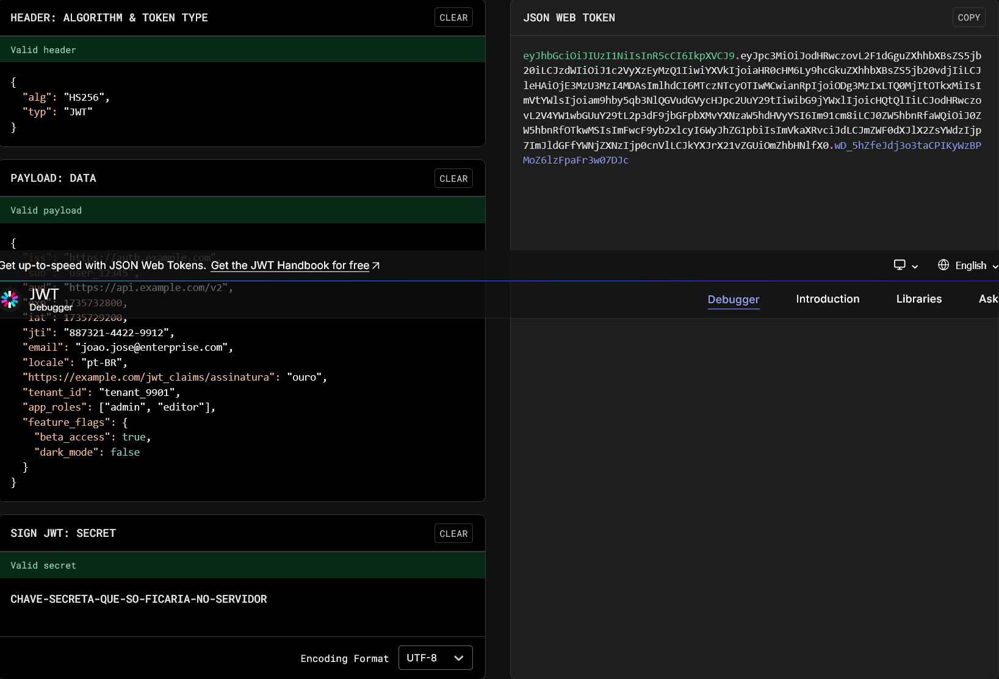

Do próprio [jwt.io](https://www.jwt.io/introduction#what-is-json-web-token) (tradução própria):

>JSON Web Token (JWT) é um padrão aberto ([RFC 7519](https://tools.ietf.org/html/rfc7519)) que define uma forma compacta e autossuficiente para transmitir informações de forma segura entre partes, como um objeto JSON. Essa informação pode ser verificada e confiada por utilizar assinaturas digitais. JWTs podem ser assinados usando um segredo (com o algoritmo HMAC) ou um par de chaves públicas/privadas através de RSA ou ECDSA".

Vamos entender porque isso é útil e como pode ser realizado.

## Em que JWT são úteis

JSON Web Tokens tem como principal uso a autenticação de usuários. Se obtém um token JWT ao logar em um servidor e utiliza-se em cabeçalhos de requisições posteriores. Pode-se incluir nele informações como nivel de acesso e permissões, por exemplo. Os servidores que confiam na autoridade que gerou o JWT, confirmam que foi emitido por ela com uma chave compartilhada secreta ou uma chave pública, e então podem confiar nos dados presentes naquele JWT sem consultar uma API de validação, o que deixa as consultas mais assíncronas, performáticas e descentralizadas.

Envia-se geralmente usando o esquema de **Bearer** no cabeçalho, desta forma:

> Authorization: Bearer token

Isto é especialmente útil em cenários de escalabilidade de aplicações e Single Sign On (SSO, login único). Em um cenário de várias instâncias de uma aplicação quanto menos estado você precisar manter, melhor. Gera menos problemas de validação / invalidação de cache. Se for necessário consultar um banco de dados para validar se um usuário é válido ou não, toda requisição acaba gerando uma consulta, o que gera mais tráfego e mais uso do banco de dados, o que não é desejado especialmente em cenários de redundância da camada de aplicação.

Em cenários de SSO também são interessantes por você ter uma entidade central que valida que os usuários são quem são, e vários outros serviços que não precisam realizar este trabalho novamente. Os demais serviços podem confiar através da assinatura digital, que o usuário tem aqueles diretos de acesso.

## Como é a estrutura de um JSON Web Token

Os JWT como dito em seu próprio nome são compostos por 2 objetos JSON, o *header* (cabeçalho) e o *payload* (carga) transformados para [base64Url](https://datatracker.ietf.org/doc/html/rfc4648), além do hash. Estes 3 itens são concatenados com pontos.

O *header* geralmente será sempre composto pelo tipo do token e o algoritmo de assinatura usado. Como exemplo:

``` json {filename="header"}
{
  "alg": "HS256",
  "typ": "JWT"
}
```

O *payload* geralmente contém as *claims*, que são o que seu dono reivindica através dele. Existem 3 tipos de *claims*:

* Registradas: São pré-definidas pela especificação. Não são mandatórias, mas são recomendadas para oferecer um conjunto de informações úteis e interoperáveis entre outros sistemas que usem JWT, alguns como exemplo: *iss* (*issuer*, quem emitiu), *exp* (*expiration*, quando expira). Esta lista pode ser encontrada na [RFC 7519](https://tools.ietf.org/html/rfc7519#section-4.1);
* Públicas: Estas podem ser definidas arbitrariamente, e seu uso seria para todos sistemas que usarem este token. Para evitar colisões, e ter uma padronização, segue-se uma lista padrão definida aqui: [registered, public, and private claims](https://www.iana.org/assignments/jwt/jwt.xhtml). Ou então, pode-se identificar com uma URI (nome de site) único para evitar colisões.
* Privadas: São customizadas e criadas para compartilhar informações entre partes privadas que concordarem em seu uso, e que não são enquadradas nem nas registradas nem públicas.

Como exemplo fictício, abaixo temos um JSON com: 6 registradas, 3 públicas e 3 privadas em sequência:

``` json {filename="payload"}
{
  "iss": "https://auth.example.com",
  "sub": "user_12345",
  "aud": "https://api.example.com/v2",
  "exp": 1735732800,
  "iat": 1735729200,
  "jti": "887321-4422-9912",
  "email": "joao.jose@enterprise.com",
  "locale": "pt-BR",
  "https://example.com/jwt_claims/assinatura": "ouro",
  "tenant_id": "tenant_9901",
  "app_roles": ["admin", "editor"],
  "feature_flags": {
    "beta_access": true,
    "dark_mode": false
  }
}
```

Atente-se que:


  Toda informação presente em um JWT é **pública**


Toda informação em um JWT **não está encriptada** e pode ser lida por qualquer um. Sua assinatura serve para auditar que foi assinado por quem diz ter assinado, mas não oculta as informações. Para informações que devem ser sigilosas, seus valores devem ser encriptados dentro do JSON ou dependendo do caso deve, ser usado JWE (JSON Web Encryption).

Pense em JWTs como documentos assinados digitalente em que todos podem ler seu conteúdo. A assinatura que vai em conjunto do mesmo serve para validar que quem diz ter assinado realmente é o dono da assinatura e que assinou o documento naquela versão, sem edições.

É como um servidor entregar um documento a um usuário que diz: *"Atesto que user_12345 realmente tem os app_roles: admin e editor"* para ele poder apresentar em outros sitemas que confiam nesse autenticador.

Após termos um *header* e um *payload* podemos realizar o restante das ações para gerar o token, que é codificá-los em base64Url, concatenar com ponto, gerar a assinatura com o método escolhido e concatená-la também com ponto ao restante.

Fica visual de entender usando o site da [jwt.io](https://www.jwt.io/) como exemplo:



Com a chave `CHAVE-SECRETA-QUE-SO-FICARIA-NO-SERVIDOR` foi utilizado o algoritmo HS256, que seria um bom uso para aplicações monolito ou serviços distintos em um único servidor. Para sistemas distribuídos, poderia ser usado outro algoritmo como RSA (RS256), por exemplo, para ser verificado através do par público da chave do servidor, diminuindo a chance da chave ser comprometida através de um dos sitemas.

É assim que utiliza-se o login social do Google e Facebook, por exemplo, garantindo com suas chaves públicas que os tokens foram assinados por eles.

## Revogações e Renovações

Uma grande vantagem do JWT como dito anteriormente é ser 
*stateless* e não precisar de consultas a bancos de dados para autenticação, mas isso traz um desafio. E como saber quando o acesso de um usuário mudou ou foi revogado?

Imagine a necessidade de banir um usuário imediatamente ou alterar seu nível de acesso. Se ele já tinha um token salvo em seu navegador poderia seguir usando os sistemas sem fazer um novo login e usando seu acesso antigo indefinidamente?

Para resolver isso, é usado na prática 2 tokens:
* Access Token: É o token que usamos nas requisições (com o Bearer) e tem um tempo de vida curto, 15 minutos por exemplo.
* Refresh Token: É um token de vida longa, 7 dias por exemplo, e geralmente é um código opaco (aleatório) salvo no banco de dados e devolvido ao usuário de forma segura, em cookies HttpOnly por exemplo. Ele não é aceito em requisições além da própria renovação.

Note que é recomendado o Refesh Token ser armazenado em Cookie do tipo HttpOnly para que códigos JavaScript no navegador não consigam ler ou acessar. O próprio navegador o reenvia quando for uma solicitação para o mesmo domínio.

Assim, o fluxo para o usuário (na prática, a aplicação cliente), funciona da seguinte forma:
1. Cliente faz login e recebe o Access Token e o Refresh Token;
1. As requisições são realizadas com o Access Token;
1. Ao perceber que está próximo da expiração (através do campo *exp*) o cliente solicita um novo Access Token ao servidor (o Refresh Token é enviado automaticamente pelo navegador);
1. O servidor verifica se teve alteração ou não e retorna um novo Access Token válido para a próxima janela de tempo.

Isso cria um modelo híbrido em que a maioria das requisições seja rápida e *stateless* diminuindo a validação que envolve banco de dados e estado, porém mantendo a segurança do usuário não poder seguir usando permissões e acessos antigos por muito tempo.

Note que cabe aos servidores implementarem a função de não aceitarem JWT expirados.