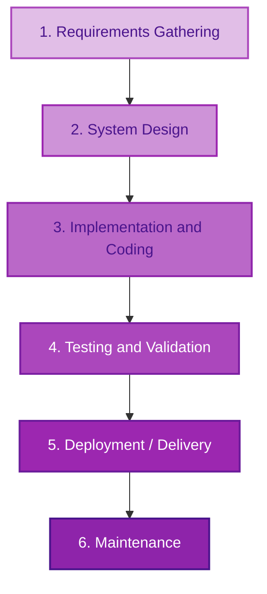
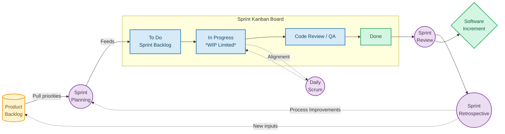

## Why software management is different

Software project management is unlike anything else. Unlike other engineering disciplines, software has no physical constraints. There are no laws of gravity limiting what can be built, no scarce materials, no natural forces resisting progress. Equally, software is intangible — it's impossible to have a clear visual sense of its size or complexity, especially for non-technical people.

Building a bridge is a fundamentally predictable endeavor. Civil engineering deals with constant laws of physics, materials with unchanging properties, and terrain that, once mapped and prepared, rarely undergoes drastic changes during project execution. The final result is known in advance, and structural engineering requirements don't shift from one month to the next.

It was natural that, when they started, large software projects were managed in the same way as engineering projects. But with frequent deadline and cost failures, it soon became clear that software cannot be treated the same way. The client changes their mind. The market changes. Technology changes. What was urgent in January may be irrelevant by March.

Users see the interface, but all of the infrastructure, automations, and workflows beneath it aren't explicitly visible. These characteristics make the work inherently optimistic and simultaneously difficult to estimate, which in turn makes its management complex. On top of that, it's always hard to argue with finance for the time needed for documentation, automated testing, and refactoring — precisely because they're invisible and their ROI (Return on Investment) is often hard to quantify.

This has been understood since at least 1975. In *The Mythical Man-Month*, Fred Brooks calculated that only 1/6 of his team's time was spent on pure programming. The rest was consumed by testing, bug fixing, unplanned work, and the inevitable idle time inherent to any human activity. Decades later, some teams and managers still plan as if those 5/6 don't exist.

Brooks also precisely identified unique difficulties in software projects, which he called *essential difficulties*:

- **Complexity**: Systems grow nonlinearly as features are added, resulting in escalating communication difficulties, failures, and delays;
- **Conformity**: A system is also built around requirements outside the team's control, such as business rules, laws, and external systems, making an 'ideal' project impossible;
- **Changeability**: While physical products are replaced by new models, software is modified in the product already in use, adding the additional complexity of maintaining functionality compatibility with existing data and flows;
- **Invisibility**: Software is abstract — with no natural physical or geometric representation. Diagrams, documentation, and analogies can approximate its understanding, but the pure representation of software is only the code itself and the imagination of it running in the developer's mind.

The conclusion, known as *No Silver Bullet*, was: there is no solution that will yield order-of-magnitude improvements in productivity or reliability in software development. Better tools, more expressive languages, and practices like DevOps can reduce *accidental difficulties* — the friction created by the development process itself — but the essential difficulties will remain.

The journey of software engineering management since then has been a transition from attempting rigid control to accepting and managing unpredictability. In this article, we'll briefly trace that history and, at the end, present a practical guide to management that delivers solid results for most modern teams. We'll also close with an analysis of whether advances in artificial intelligence may change any of this.

## The waterfall model

In the early days of software engineering, during the 1960s and 1970s, the development of information systems began to demand a more formal methodology. As projects grew in size and complexity (driven primarily by government and aerospace contracts), the need for a structured process became apparent. The industry's initial response was to import and adapt management models from civil engineering and hardware manufacturing.

The waterfall model was the first software development lifecycle paradigm to emerge and consolidate, treating the construction of systems exactly like construction work. The basic premise was sequencing: gather all requirements, design the architecture, develop (program), test, and finally, deliver and maintain. Work flowed in only one direction, from one stage to the next — hence the name "waterfall." There was also no systemic provision for returning to a previous stage.

The first formal description of these sequential phases is widely attributed to a 1970 paper by Dr. Winston W. Royce, titled *Managing the Development of Large Software Systems*. Drawing on his extensive experience with aerospace mission planning systems, Royce drew the sequential flow that would dominate the industry. However, in the opening pages of his paper, Royce explicitly warned that the strict implementation of that purely linear model was fundamentally flawed, stating that the approach was "risky and invited failure."

Royce intimately understood the essential complexity that Brooks would describe a decade later. He knew that the testing phase would inevitably reveal serious conceptual flaws in the original design, and that constant iterations and returns to previous stages would be necessary. To mitigate this risk of massive rework, Royce proposed the prior creation of throwaway prototypes and the mandatory inclusion of feedback cycles between development stages.

But the industry was seduced by the desire for managerial predictability and adopted only the initial diagram from Royce's paper — the simplified, linear, corporate-contract-friendly view. His warnings about the need for iteration were ignored. The very term "Waterfall" wasn't even coined by Royce; the name first appeared in a 1976 paper by Bell and Thayer, cementing the sequential concept definitively in software engineering literature.

This model offered (the illusion of) absolute control: fixed scope delimited in contracts, detailed long-term schedules, and precise theoretical budgets. The problem occurred when that rigidity collided with the mutable reality of software.

By requiring that all requirements be defined before any code was written, the process forced clients to make all critical decisions at the moment of greatest ignorance about the project and furthest from actual use: the very beginning. The client only saw the product working for the first time at the end of the cycle, months or years after the specifications were agreed upon. The odds that the market had changed or that the client wanted something different when they actually interacted with the software were extremely high. Rearchitecting or altering logical foundations after code delivery became an exponentially expensive process, resulting in projects frequently canceled, blown over budget, and/or delivered with already-obsolete features.

## Managing uncertainty: The rise of Agile

Faced with the constant collapse of plan-driven projects, the 1990s catalyzed a methodological revolution in software engineering. The Agile paradigm abandoned the futile attempt to eliminate uncertainty through exhaustive upfront planning.

Instead of planning everything at the start and delivering only at the end, the approach adopted short, iterative cycles: plan a little, build, show the increment, collect real feedback, adjust the course, and repeat.

Uncertainty is not eliminated in this model; it is managed in much smaller doses. This change in cadence transforms every rework — which inherently exists in development — into something far less costly and traumatic. Two main currents led this revolution: Scrum, focused on management structure and process control, and Extreme Programming (XP), focused more on software engineering practices.

### The structured practical experience of Scrum (1993–1995)

The seeds of Scrum were planted long before the formal agility manifesto, originating from an article published in the Harvard Business Review in 1986, written by Hirotaka Takeuchi and Ikujiro Nonaka, titled "The New New Product Development Game."

Analyzing highly innovative Japanese and American companies in physical product development, the authors noticed that exceptionally fast teams didn't work sequentially, like a relay race. Instead, they acted cohesively, adaptively, and overlappingly, advancing together as a unit on a playing field — a direct analogy to the rugby scrum formation.

Inspired by this self-managing, multidisciplinary team dynamic, Jeff Sutherland adapted the concept for software development in 1993 during his work at Easel Corporation. Sutherland understood that classic predictive charts rarely reflected the real state of a complex system under construction. Working together with Ken Schwaber, Sutherland formalized the Scrum framework, presenting it publicly to the academic and professional community in 1995 at the OOPSLA conference (Object-Oriented Programming, Systems, Languages & Applications).

The theory behind Scrum is based on Empirical Process Control, which states that knowledge comes from experience and decisions should be based on what is factually observed, rather than theoretical plans. To achieve predictability in an unstable environment, agile day-to-day work in Scrum is organized through fixed, protected cycles called Sprints.

| Sprint Characteristics in Scrum   | Implications for Product Development                                                                                                                                                 |
|---------------------------------------------|------------------------------------------------------------------------------------------------------------------------------------------------------------------------------------------------|
| Fixed Time Cycles (Timeboxes)      | Typically ranging from one to four weeks, they impose a risk limit. The maximum effort that can fail or diverge from client expectations equals the duration of the cycle.          |
| Predictability and Rhythm               | The team rigorously plans what they will deliver in that specific cycle and commits to it, creating a sustainable and expected delivery cadence for stakeholders.            |
| Iterative Scope Protection          | During the Sprint, external changes are discouraged to ensure focus. If the market changes drastically, adaptation occurs in the planning of the next Sprint, just days away.   |

Sprints work exceptionally well for innovative product development, where establishing rhythm and short-term predictability matter. The team inspects what was done at the end of each iteration, adjusting not just the product but also their own way of working.

## Technical excellence and Extreme Programming (1996–1999)

While Scrum was establishing the management and governance framework, Kent Beck was formalizing, at the same time, Extreme Programming (XP). XP emerged directly from the trenches of software development in 1996, during the troubled Chrysler Comprehensive Compensation System (C3) project. The project was stalled, and Beck, brought in to rescue it, decided to push software engineering disciplines to the extreme, formalizing the methodology in his 1999 book, *Extreme Programming Explained: Embrace Change*.

XP's philosophy starts from the premise that if a technical practice is beneficial, it should be executed continuously. If code reviews prevent bugs, the code should be reviewed in real time by two developers on the same machine (Pair Programming). If testing ensures stability, tests should be written before the feature code itself (Test-Driven Development — TDD).

XP established revolutionary practices such as very short development cycles, continuous code integration multiple times per day, and, crucially, the direct physical involvement of the client sitting alongside the development team to guide the business.
Many of these practices and philosophies were later absorbed into the general culture of the Agile Manifesto and reappear in varied forms in modern Scrum, especially the emphasis on frequent delivery rhythm and constant, unobstructed feedback from end users.

## The emergence of Story Points as a unit of complexity

One of the most ubiquitous artifacts in modern agile management is the Story Point-based estimate. Interestingly, while it is considered the standard in current Scrum planning, this metric is not an official Scrum Guide prescription, but rather a direct inheritance from the early iterations of Extreme Programming.

Ron Jeffries, one of XP's creators who worked alongside Beck on the Chrysler project, was instrumental in this evolution. In the early days of the methodology, the team estimated User Stories (requirements described from the client's perspective) based on actual execution time. The original metric was called *Ideal Days*, conceptualized as the time it would take a pair of programmers to finish the task assuming absolutely no interruptions, meetings, or bureaucracy. To translate that concept into real calendar dates, the team multiplied the ideal days by a "load factor," which statistically hovered around three. That is, it took three literal corporate working days to complete the effort of one ideal day.

The terminology, however, generated deep social and psychological friction with stakeholders. Senior management aggressively questioned why a developer needed three weeks to deliver "five days" of work, interpreting the estimate as inefficiency. To neutralize the political clash and semantic confusion, Jeffries suggested abstracting the time unit, renaming "ideal days" simply to "points." By removing the chronological connotation, the team focused exclusively on task complexity. A story estimated at 3 points indirectly meant about nine real days, and the abstract term eliminated executive pressure for unrealistic schedules. Around the same time, other abstract and playful units, such as "Gummi Bears" and NUTs (Nebulous Units of Time), were tested by the community to underscore the detachment from exact time.

Today, Story Points are defined as the unit of measure for complexity and relative effort in the agile environment. They don't represent hours, but rather the risk, uncertainty, and volume of work inherent to a backlog item. An 8-point task doesn't necessarily consume exactly twice the clock time of a 4-point task, but it's recognized by the team as significantly more complex and risky. This abstraction eliminates the dangerous managerial illusion that hour-based estimates for creative knowledge work are precise.

Different teams have different levels of technical maturity and intrinsic velocities, making it impossible to compare "point velocity" between distinct teams. However, point comparisons within the same team over time remain statistically consistent, allowing for realistic capacity calculations for future iterations.

## The Agile Manifesto (2001)

The transition from the 1990s into the 2000s was dominated by the fragmentation of "lightweight methodologies." Scrum, Extreme Programming (XP), Dynamic Systems Development Method (DSDM), Feature-Driven Development (FDD), Crystal, and Adaptive Software Development competed conceptually, but their creators recognized that they shared certain ethical and operational values.

There was widespread consensus around repulsion toward strict command-and-control governance, documentation as an end in itself, and micromanagement dictated by frozen-scope contracts.

This ideological convergence culminated in one of the most important events in modern technology history. Between February 11 and 13, 2001, at the invitation of engineer Robert C. Martin ("Uncle Bob"), seventeen highly influential professionals gathered at The Lodge at Snowbird ski resort in the mountains of Utah, United States. Among those present were Kent Beck and Ron Jeffries (for XP), Jeff Sutherland and Ken Schwaber (for Scrum), along with other prominent figures such as Martin Fowler, Alistair Cockburn, and Jim Highsmith.

Expectations of consensus were extremely low; Cockburn himself described the group as an assembly of independent "organizational anarchists." Yet the synergy was nearly instantaneous. Frustrated with corporate bureaucratic processes that systematically hindered rather than helped the delivery of quality software, they drafted and signed the Manifesto for Agile Software Development (the term "agile" was chosen after debate, winning over options like "lightweight").
The Manifesto imposed no new technical framework, nor did it dictate programming practices; it wrote the cultural constitution for a new way of cognitive work. The document was built on 4 non-negotiable pillars, which formally outlined the evolution of technology project management:

| The 4 Pillars of the Agile Manifesto                                      | Interpretation and Application in Software Management                                                                                                                                                                                                                                                                                                                                                                                                                                                                                                                                                                                                                                                                                                                                                                                                                                         |
|---------------------------------------------------------------------------------|-----------------------------------------------------------------------------------------------------------------------------------------------------------------------------------------------------------------------------------------------------------------------------------------------------------------------------------------------------------------------------------------------------------------------------------------------------------------------------------------------------------------------------------------------------------------------------------------------------------------------------------------------------------------------------------------------------------------------------------------------------------------------------------------------------------------------------------------------------------------------------------------------------|
| 1. Individuals and interactions over processes and tools     | Systems development is, first and foremost, a complex human endeavor. If two developers can solve a logical or architectural problem in 5 minutes of direct conversation, forcing them to create a support ticket, wait for managerial triage, reply via formal email, and schedule a deliberative meeting constitutes pure flow waste. Processes and tools exist to scale the organization and record history, not to replace or rigidify live communication. When an institutional process hinders collaboration and direct conversation between the minds solving the problem, that process must be questioned and subverted.                                                                                                                                                                                                                                                                  |
| 2. Working software over comprehensive documentation            | In the old Waterfall model, the approval of hundreds of pages of specifications was celebrated as a progress milestone, even without a single line of working code. The Manifesto subverts this illusion: meticulously documenting a product that doesn't perform its real-world functions serves no economic purpose. The focus falls on creating the minimum artifact necessary for the work to be understood and maintained — nothing more. The maxim doesn't irresponsibly mean "document nothing," but emphatically guides: "prioritize delivering real, testable, tangible value over producing bureaucratic paperwork."                                                                                                                                                                                                                                               |
| 3. Customer collaboration over contract negotiation             | Traditional management positions the client as an external requisitioner who signs dogmatic specifications, transfers legal risk, and awaits the result at the end of the schedule. In agile management, the client is transmuted into an intrinsic daily development partner (a direct echo of XP's on-site customer practice). Rituals like Scrum's Sprint Reviews — product demonstrations at the end of each two-week cycle — exist for exactly this purpose: to show the built increment, receive constructive criticism, and correct the course before committing to the next engineering stage. The model is one of continuous co-creation, abolishing the "final surprise delivery" that inevitably disappoints stakeholders.                                                                                                                                            |
| 4. Responding to change over following a plan                          | The most severe cultural transition for established companies rests on this pillar. Planning is inevitable and necessary for resource allocation, but predictive plans are treated rigorously as scientific hypotheses that must be tested against the friction of reality. Unforeseen events aren't failures — they're the norm: a competitor launches a disruptive feature that needs to be replicated immediately, the client alters their global business strategy, or a critical security bug surfaces in the database. The original plan exists only as a guiding reference (and it's vital that this understanding be aligned among all executives and stakeholders), never as a punitive, immutable contract. The capacity to adapt economically in real time is worth orders of magnitude more than processual obedience to a roadmap established in the past.   |

Jim Highsmith, one of the signatories, noted that the explosive adoption of agile methodologies that followed the Manifesto occurred not because of pair programming mechanics or visual boards, but because the values allowed organizational environments based on trust, collaboration, and respect for the human intelligence of developers, freeing them from the micromanagement culture that penalized dynamic adaptation.

## Optimizing continuous flow: The integration of Kanban (2004 onward)

After the Manifesto, Scrum consolidated itself as the hegemonic framework for managing projects and product development. However, throughout the 2000s, technology organizations began to realize that closed iterations (Sprints) didn't perfectly suit all ecosystems.

Level 3 support teams, infrastructure maintenance, operations, and later DevOps practices faced characteristically unpredictable demands. Pausing work to conduct a two-week closed-cycle planning session was dysfunctional when incidents and emergency requests arrived intermittently.
It was in this vacuum that methodological evolution looked, ironically, back toward industrial manufacturing — but not toward rigid control, rather toward the philosophy of organic optimization from the Toyota Production System (TPS).

### From the factory floor to knowledge work

Between the late 1940s and the 1970s, engineer Taiichi Ohno conceived the Toyota Production System in Japan. To eliminate the waste of overproduction, Ohno used concepts from supermarket shelf replenishment to institute Just-in-Time.

The operational mechanism controlling this was Kanban (a Japanese term meaning "visual board" or "signal card"). On the factory floor, one assembly stage would only start producing parts when it received a visual card from the subsequent stage indicating that there was capacity or need. Born there was the concept of the "pull system," where work is not pushed down onto workers, but rather pulled as productive capacity is freed up, avoiding bottlenecks and excessive intermediate inventory.

In 2003, Lean thinking was decisively translated into the software sphere through the academic and practical work of Mary and Tom Poppendieck in the book *Lean Software Development*. Shortly after, engineer and manager David J. Anderson became the pioneer in the methodical crystallization of Kanban for software engineering.

In 2004, Anderson published his studies on agile management applying the Theory of Constraints and systems flows. In 2005, while managing the sustained technical engineering team at Microsoft, he designed a pull-flow system focused on alleviating quality testing bottlenecks. But the definitive turning point occurred between 2006 and 2007, when Anderson implemented a mature system to manage the flow of change requests at Corbis. Unlike previous methodologies, the Corbis team abandoned the time-boxed iterations (Sprints) used in Scrum, balancing demand strictly against real-time productive capacity.

Formalized in the book *Kanban: Successful Evolutionary Change for Your Technology Business* (2010), Anderson's method does not require the organization to change its hierarchical roles or abruptly restructure its processes overnight. Instead, Kanban encourages evolutionary, gradual changes from what the company already does, grounded in rigorous principles:

| Essential Kanban Method Practices                                                                        | Theory and Practical Application in Development                                                                                                                                                                                                                                                                                                                                                                                                                                                                                                                                                                                                                                                                                                                                                                                                                                                                                                                                                                                                                                                                                                   |
|-------------------------------------------------------------------------------------------------------------------------------|--------------------------------------------------------------------------------------------------------------------------------------------------------------------------------------------------------------------------------------------------------------------------------------------------------------------------------------------------------------------------------------------------------------------------------------------------------------------------------------------------------------------------------------------------------------------------------------------------------------------------------------------------------------------------------------------------------------------------------------------------------------------------------------------------------------------------------------------------------------------------------------------------------------------------------------------------------------------------------------------------------------------------------------------------------------------------------------------------------------------------------------------------------------------|
| Visualize the Workflow                                                                                          | The invisible cognitive process of software creation is externalized on a visual board (typically columns such as To Do, In Progress, and Done). The tangible representation of the knowledge and stage of each request allows the team, and even external stakeholders, to immediately understand the state of the system and organically identify obstructive bottlenecks.                                                           |
| Limit Work in Progress (WIP)     | This is the backbone of Kanban. WIP (Work in Progress) is rigidly capped per column. If a stage reaches its stipulated limit, the system prohibits new items from entering it, forcing the team to converge efforts to finish active tasks and unblock the production line. This directly attacks the paradox that starting multiple simultaneous projects delays the final delivery of all of them. The focus shifts from "starting work" to "completing value."     |
| Active Management of Continuous Flow                                                                             | Kanban abandons Scrum's fixed cycles. Demands enter the system dynamically, are prioritized, and executed continuously as soon as the WIP limit of the first column permits. Results are measured not by the packaged Sprint velocity, but by Lead Time (the total time a request takes from order to actual delivery to the client).                                                  |

## Sprints, Continuous Flow, and the Small Batches principle

Today, the best management understands that Scrum and Kanban are not mutually exclusive (and often coexist in the hybrid known as Scrumban), but serve distinct operational profiles.

Sprints (fixed-cadence cycles) work extraordinarily well for innovation and new product development fronts — scenarios where two weeks of focal isolation, strategic planning, and orchestrated collective rhythm create stability over market chaos. The commitment established by the development team in a Sprint Planning serves to protect engineering from untimely commercial whims, generating predictability across time blocks.

Kanban, operating with an uninterrupted throughput flow system, shines where demand is stochastic and uncontrollable. It is widely recommended and adopted by infrastructure support and continuous operations teams, where problems arise unpredictably and absolute control of work congestion through WIP restriction is the only way to avoid human burnout and system paralysis.

The success of both, however, inevitably anchors itself in the imperative of slicing large deliverables, reflecting the DevOps cultural principle of small batches and Lean manufacturing flow integration. Queue theory and complex systems demonstrate that the smaller the atomic unit of work, the faster code moves through the flow, minimizing friction. A massive, poorly scoped task consuming 3 full weeks of development delays the entire process, retains invested capital, and delivers value and quality validation only at the end of its cycle.

In contrast, slicing that monolith into three smaller, independent tasks ensures that value is delivered progressively. More importantly, small batches reveal structural deficiencies, design deviations, or test automation failures dramatically sooner, allowing the course correction imposed by human imperfection — theorized since Royce in 1970 — to happen within hours, permanently mitigating the exponential risk of classical methods.

The true evolution of technology management is not the replacement of one closed methodology by another, but the progressive understanding that empirical tools — like Sprints for creative momentum and Kanban for bottleneck clearance — create a framework for dealing with the essential complexity of software.

## Practical guide for modern teams

### 1. Backlog: the PO's strategic funnel

The *Product Owner* (PO) is the non-negotiable guardian of the backlog — the prioritized list of everything the product needs. Every single demand, whether the development of a new feature or a bug report from a client, must obligatorily pass through them.

Centralizing this flow may seem bureaucratic at first glance, but it acts as a protective shield against unplanned work. Without this filter, the development team quickly degrades into a *help desk*: any department in the company imposes urgencies and interrupts focused thinking. The PO's role is to assess real impact, prioritize based on business value, and decide what deserves to enter the next work cycle.

### 2. The 2-week Sprint rhythm

The two-week duration has consolidated itself as the industry standard for a simple reason: it's short enough to maintain tactical focus and mitigate risks, but long enough to deliver real software increments.

A high-impact practical detail is to fix the Sprint's start and end on the same day of the week. If the cycle invariably begins on a Monday and ends on the Friday of the following week, the entire organization syncs with that cadence. *Stakeholders* learn exactly when to expect news, and the engineering team internalizes the operational rhythm.

### 3. Continuous refinement

Refinement is the dedicated moment for the technical team and the PO to prepare, debate, and detail backlog items for upcoming cycles. The goal is to arrive at the planning meeting (*Sprint Planning*) with tasks perfectly understood and estimated.

As a best practice, refinement should not consume more than **10% of the team's total capacity**. In an 80-hour cycle (8h per day for 2 weeks), that represents a maximum of about 4 hours per week.

During this session, the PO should explain demands by priority to obtain the technical team's feedback on feasibility and difficulty. Items are also broken down into work tasks of at most 2 difficulty points.

Depending on the team, *Planning Poker* may be used for estimates, or consensus can simply be reached through conversation.

If refinement meetings are running over time, the problem is rarely the duration itself, but rather the PO bringing demands in raw, uncurated form. The solution is to refine the specification before the technical meeting and focus on *how* to do it and the technical difficulty.

### 4. Sprint Planning and the north star of the Sprint Goal

At the start of each cycle, the team holds the *Sprint Planning* to select backlog items and, more importantly, define the *Sprint Goal*.

The *Sprint Goal* is frequently the most neglected element in agile methodologies. Instead of declaring a generic "we'll deliver these 12 tickets," the PO should establish a clear north star: *"The goal of this Sprint is to stabilize the integration with logistics partner X."* Having a unified objective changes how the team makes autonomous decisions. When an unexpected issue arises mid-cycle, developers know exactly what can be sacrificed without compromising the main goal, eliminating the need to escalate every micro-decision.

**The 2-day rule:** Every task accepted in the *Planning* must be scoped to take at most two working days.

If the estimate is larger, the task must be decomposed. Although not part of the *Scrum Guide*, this is a central characteristic of high-performance teams. A ticket that remains four days "In Progress" creates a managerial blind spot: nobody knows for certain whether there's a technical blocker, whether the estimate was off, or whether the developer needs help.

### 5. Daily Scrum: Walk the Board

The *Daily* is a strict 15-minute tactical alignment. The outdated model focused on three questions ("what did I do yesterday, what will I do today, any impediments?"), which frequently degraded the meeting into a monotonous individual status report where everyone waited for their turn to speak without paying attention to their colleagues.

Modern management practices *Walk the Board*. The flow reading begins with the rightmost columns (items closest to "Done") and works back to the left. The central question shifts from "what are you doing?" to **"what's still needed for this item to move forward and be finished?"** This forces the team to focus on completing work in progress before pulling new tasks, and to be clear about what they will deliver that day or what remains to enable that.

### 6. Sprint Review

At the end of the cycle, the team demonstrates software increments to *stakeholders* and clients. The focus is on showing the software running in a real environment, abolishing slide presentations about what was coded.

The empirical *feedback* collected here is the oxygen of the backlog. It's the moment when the client observes the product and concludes: *"This isn't quite what I had in mind"* or *"Can we leverage this to add another feature?"* This is the essence of agile course correction: adaptation based on usage evidence, not assumptions documented months earlier.

For external clients or executives who can't attend synchronously, the PO can use the *Review* results to record short product demonstration videos and update *release* documentation.

### 7. Sprint Retrospective

Although the *Scrum Guide* makes it mandatory, the Retrospective is the most frequently skipped ceremony. It happens internally, with the technical team only. The central provocation is: **"How can we improve the way we work in the next cycle?"**

When the Retrospective is suppressed, process dysfunctions accumulate invisibly. The volume of urgencies doesn't decrease because no one investigates their root cause; the *Daily* continues to be inefficient because no one proposes a new format. The same friction corrodes team morale Sprint after Sprint.

A successful Retrospective must generate at least one non-negotiable action item for the next cycle: a changed process, a newly adopted practice, or a piece of technical debt mapped for resolution.

## Managing urgencies: Using the Buffer

Reserving a slice of the team's capacity (whether in time or *Story Points*) for unplanned work is a lifelong necessity. Any system operating in production will inevitably generate incidents or emergency demands.

The healthy range for this *buffer* oscillates between **10% and 15%**. Consistently exceeding this limit triggers a red alert that typically points to two dysfunctions:

1. **Technical debt out of control:** The codebase has fragile architecture, generating incidents and cascading corrective maintenance.
2. **Flow shielding failure:** *Stakeholders* are bypassing the PO and escalating requests directly to developers, corrupting the process.

The solution is to use the Retrospective for auditing. Every two or three cycles, measure how much of the *buffer* was actually consumed and why. The goal is to act on root causes and gradually reduce the urgency allocation (about 5% per cycle) until stabilizing within the healthy range.

## Post-release bugs: Triage and routing

When a client reports a failure after a delivery, the containment flow must be relentless and predictable:

**Every occurrence must enter exclusively through the PO.** There's no room for direct emails to the developer or private Slack messages to the *Tech Lead*. The PO formalizes the report in the backlog and takes responsibility for triage by answering two fundamental questions:

**1. What is the nature of the report?**
* **Bug:** The system deviates from the behavior documented in the *Definition of Done*. (Ex: The save button freezes the interface.)
* **Improvement:** The system operates exactly as designed, but the client wants a refinement. (Ex: "The report works, but I'd like to see comparative history.")
* **Critical Blocker:** System unavailability or complete interruption of a vital business flow.

**2. What is the severity of the impact?**
* **Critical:** Affects all users, corrupts data, or paralyzes financial/commercial operations.
* **High:** Affects a wide user base and requires complex temporary workarounds.
* **Low:** Minor inconvenience, with a simple and intuitive operational workaround.

With these answers, routing the solution becomes a logical decision process:

| Severity | Destination in the Workflow |
| :--- | :--- |
| **Critical** | Interrupts planning, enters the current Sprint, and consumes the urgency *buffer*. |
| **High / Low** | Directed to the Backlog → Prioritized in Refinement → Inserted into a future Sprint. |

**The *Spike* concept for uncertainties:** When a bug has an unknown root cause, or when an existing feature lacks documentation, demanding that the team estimate the effort will result in guesswork.

The correct practice is to create a *Spike* — a strict investigation task with a closed *timebox* (typically a maximum of 4 hours, one shift). At the end of that time, the team acquires the empirical knowledge needed to realistically estimate the solution, and the PO decides when the work will be prioritized.

As an improvement and knowledge management practice, part of the Spike is to document what was learned or to analyze in the Retrospective how to surface the data more clearly.

## Emergency escalation

The most common friction scenario between teams occurs when the support team (N1/N2) cannot reproduce an error and demands that engineering analyze logs or investigate the database.

To protect developers' focus, escalation is only permitted if support provides minimum context. For example:
* Affected user or transaction ID.
* Isolated logs from the exact moment of the failure.
* *Payload* (structured data) of the failed request.
* Partial or complete steps to reproduce the scenario.

Without these artifacts, the software engineer will waste valuable hours acting as a data detective instead of solving the system logic.

**Investigative limit (*Spike* of 4 hours):** If escalation is unavoidable, a developer dedicates a non-negotiable limit of 4 hours to the investigation. After the time limit, they report findings to support and return to the *Sprint Goal*, preventing a debug "black hole" from destroying the week's planning.

One option to prevent interruptions from hitting the team randomly is to establish a rotating "Guardian." Each Sprint, a different developer takes on the role of focal point for escalations and urgencies. While they absorb the operational impacts, the rest of the team operates shielded and focused on planned deliveries.

## Summary of management practices

| Practice | Operational Recommendation |
| :--- | :--- |
| **Sprint Duration** | 2 weeks, always starting and ending on the same day of the week. |
| **Refinement** | Last at most 10% of team capacity. Obtain technical information about the feature. |
| **Task Size** | Maximum 2 days of effort per ticket; decompose if larger. |
| **Daily Scrum** | *Walk the board*: read the board from right (closest to done) to left, and state what will be delivered that day and what's needed to release. |
| **Sprint Goal** | Establishes the main objective of the cycle. |
| **Retrospective** | Must generate at least one concrete process improvement action. |
| **Uncertainty Buffer** | 10% to 15% of capacity reserved for failures; progressively reduce until reaching this value. |
| **Triage Management** | Every bug entry passes exclusively through the PO, never directly to the developer. |
| **Escalation Control** | Use of *Spike* (4h timebox) associated with the rotating "Guardian" role. |

## The individual metric trap and true performance management

There is a natural temptation among managers to track performance by measuring the number of *Story Points* each developer delivers individually over time, in search of the "most productive."

**This practice is a profound conceptual mistake.** *Story Points* are an abstract unit of measurement created to gauge effort, risk, and relative complexity for the *team*, not to time individual hours. Turning them into a personal evaluation metric (KPI) invariably causes estimate inflation (developers start overestimating tasks to hit targets) and corrodes the collaboration culture, discouraging mutual assistance and pair programming.

High performance in software engineering is measured by the collective predictability of delivery (the team's stabilized average velocity), by the reduction of *Lead Time* (time from conception to production), and by the empirical consistency in achieving the proposed *Sprint Goal*.

If success is measured by collective delivery, how does leadership operate meritocracy, salary increases, and individual dismissals? Evaluating an engineer by delivery volume is like evaluating a surgeon by the number of scalpels used. Mature management, especially in the context of enterprise software platforms, replaces volume metrics (*output*) with metrics of **impact, behavior, and quality** that can be obtained through feedback from the team itself.

### Identifying High Performance: Who to Promote

Promotion in technology should rarely be a prize for "writing a lot of code fast," but rather for increasing the technical and commercial maturity of the product. The real indicators of who should move up are:

* **The Multiplier Effect:** A high-performance developer doesn't just deliver their own work; they elevate the entire team's technical level. This is visible in who does the best code reviews (*Pull Requests*), who unblocks colleagues stuck on logical problems, and who documents obscure processes. The true senior makes the entire team go faster.
* **Business Vision over Code:** The professional ready for the next level understands the *why* behind the software. They don't just ask "how do I integrate this API?", but question the business impact: "If the client's flow is X, does this feature actually solve their pain point or just add complexity?" They protect return on investment (ROI).
* **Resolving Complexity and Reducing Technical Debt:** Mediocre professionals create features by adding accidental complexity. Excellent professionals solve the same problem by removing useless code, simplifying the architecture, and ensuring the feature doesn't generate structural incidents the following month.
* **Autonomy and Reliability:** You hand them an ambiguous problem and know it will come back resolved — or with clear, risk-grounded decision options.

### Identifying Friction: Who to Let Go

Firing in an agile context requires identifying who is slowing the system down or corroding the operational culture, often silently:

* **The "Net Negative" (Rework Generator):** This is the developer who does deliver their Sprint tasks, but the code is so fragile and poorly tested that it generates dozens of extra hours of work for infrastructure or QA teams the following week. The cost of maintaining their code exceeds the value they produce.
* **The Toxic Knowledge Silo (The "Lone Genius"):** May be the most technically capable professional, but refuses to adopt standards, doesn't document their work, is hostile in *Code Reviews*, and centralizes critical tasks. They destroy the productivity and morale of others.
* **Low Adaptability and Chronic Resistance:** Development changes rapidly. The professional who systematically refuses to learn a new architectural tool, or who constantly fights against the operational flow, stalls the gears.
* **Post-Feedback Stagnation:** Every professional fails. The dismissal criterion solidifies when, after clear feedback in *One-on-One* sessions, the pattern of technical or behavioral failures repeats cycle after cycle with no signs of evolution.

### The Competency Matrix (*Career Ladder*)

To ensure that career decisions are objective and disconnected from managerial favoritism or the fallacy of hour-based estimates, the **Competency Matrix** is adopted.

This is a transparent framework that maps expectations for each level (Junior, Mid-level, Senior, Staff, Tech Lead) structured around major axes:
1.  **Technical Skill:** Proficiency in architecture, testing, and code best practices.
2.  **Impact and Delivery:** Quality of complex resolutions and structural autonomy.
3.  **Communication and Leadership:** Peer mentoring and ability to guide technical decisions.
4.  **Culture and Business:** Strategic understanding of the product and corporate proactivity.

The manager and technical leadership cross the developer's behaviors over months against this documented matrix, transforming *feedback* into a process grounded in concrete evidence of professional maturity.

## What a process can (and cannot) solve

Fred Brooks, in *The Mythical Man-Month*, was categorically correct: there is no silver bullet. The *essential* difficulties of building software — algorithmic complexity, rigorous conformity, business changeability, and structural invisibility — will never be eliminated by *Scrum* or *Kanban* flows. **No *framework* will make the client's mind immutable or reduce the logical complexity of a scalable ecosystem.**

The real value of modern agile management lies in imposing rhythm and the clarity of visibility. Short cycles force architectural failures to surface sooner. The Retrospective institutionalizes continuous sanitation of the way of working itself. The *Sprint Goal* decentralizes decision-making, putting an end to micromanagement.

Kent Beck, creator of *Extreme Programming* (XP), summarized the ultimate goal of these dynamics with the phrase: *"Embrace change."* Success doesn't come from following methodological playbooks to the letter, but from internalizing continuous change not as a disruption in the schedule, but as the natural state of engineering excellence — and training people capable of doing the same.

## And Artificial Intelligence? And "Vibe Coding"?

The advent of advanced AI assistants — such as GitHub Copilot, Claude Code, and the trend of natural language-driven creation (the newly coined *"vibe coding"*) — raises understandable questions about the future of technology management. Are we approaching the end of project management as we know it?

Returning to Brooks's definitions, the answer lies in understanding that **Artificial Intelligence attacks accidental difficulties, but not essential ones.**

AI acts as a tireless pair programming partner, reducing the friction of language syntax, generating repetitive tests, and navigating and documenting legacy systems in seconds. The technical barrier of writing boilerplate code has dropped dramatically, accelerating development throughput to unprecedented levels.

However, essential difficulties remain in the human domain. Software will continue to have to adapt to ambiguous tax rules, unverbalized client expectations, and unpredictable market rule changes. Artificial intelligence can generate a thousand lines of code in a fraction of a second, but who guides its commercial utility?

If more code is generated more rapidly by potentially smaller teams — or even just by business professionals dialoguing with autonomous agents — the need for a management model that imposes continuous integration limits (like the *Kanban* flow) and value priority alignment (like the PO role and the *Sprint Review*) becomes **even more critical**, not less.

The bottleneck has shifted from the capacity to *type* software to the capacity to *decide and validate* the right software safely — which is precisely what the best known management practices are designed to support.
