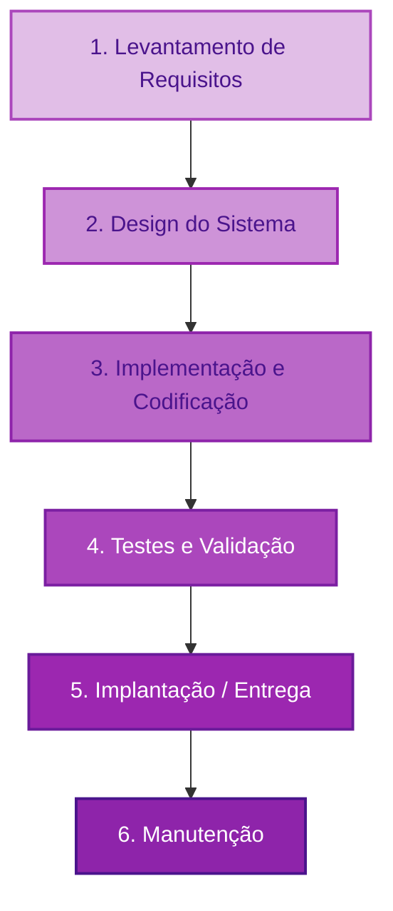
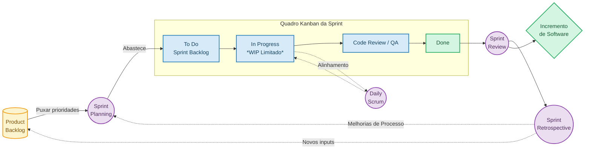

## Por que gestão de software é diferente

Gestão de projetos de software é algo único. Diferente de outras engenharias, softwares não possuem restrições físicas. Não há leis da gravidade limitando o que pode ser construído, nenhum material escasso, nenhuma força natural resistindo ao progresso. Na mesma linha, software é intangível, não é possível ter uma dimensão visual clara de seu tamanho ou complexidade, principalmente para pessoas não técnicas.

Construir uma ponte é um empreendimento fundamentalmente previsível. A engenharia civil lida com leis da física constantes, materiais com propriedades imutáveis e um terreno que, uma vez mapeado e preparado, raramente sofre alterações drásticas durante a execução do projeto. Sabe-se previamente como será o resultado final, e os requisitos de engenharia estrutural não mudam de um mês para o outro. 

Foi natural que ao começarem, os grandes projetos de software foram geridos da mesma forma dos projetos de engenharia. Porém  com fracassos de prazo e custo frequentes, logo foi visto que software não pode esr tratado igual. O cliente muda de ideia. O mercado muda. A tecnologia muda. O que era urgente em janeiro pode ser irrelevante em março.

O usuário vê a interface, mas toda a parte de infraestrutura, automações e fluxos não é explicitamente visível. Estas características tornam o trabalho inerentemente otimista e ao mesmo tempo de difícil estimativa, o que por sua vez torna sua gestão complexa. Além disso, é sempre difícil argumentar com o financeiro a alocação do tempo necessário para documentação, testes automatizados, refatoração, justamente por serem invisíveis e muitas vezes de difícil cálculo de ROI (Retorno sobre o investimento).

Desde no mínimo 1975 isto já é conhecido. No livro *The Mythical Man-Month* de Fred Brooks, ele já calculava apenas 1/6 do tempo de sua equipe para a programação puramente dita. O restante seria consumido por testes, correção de bugs, trabalho não previsto e o inevitável tempo ocioso inerente a qualquer atividade humana. Décadas depois, alguns times e gestores ainda planejam como se esses 5/6 não existissem.

Brooks também identificou precisamente dificuldades únicas em projetos de software, o que chamou de *dificuldades essenciais*, que são:

- **Complexidade**: Sistemas crescem de forma não linear conforme aumentam em funcionalidades, o que resulta em dificuldades crescentes de comunicação, falhas e atrasos;
- **Conformidade**: Um sistema é construído também com  requisitos fora do controle da equipe, como regras de negócio, leis e sistemas externos, o que faz não ser possível um projeto 'ideal';
- **Mutabilidade**: Enquanto produtos físicos são substituídos por novos modelos, software é modificado no próprio produto já em uso, trazendo uma complexidade adicional de mantenibilidade de funções e compatibilidade com dados e fluxos existentes;
- **Invisibilidade**: Software é abstrato — sem representação física ou geométrica natural. Diagramas, documentações e analogias podem aproximar a sua compreensão, mas a representação pura do software é apenas o próprio código em si e a imaginação do mesmo em execução na mente do desenvolvedor.

A conclusão, conhecida como *Não há bala de prata* foi: não existe solução que proporcione saltos significativos de produtividade ou confiabilidade no desenvolvimento de software. Ferramentas melhores, linguagens mais expressivas e práticas como DevOps podem reduzir as *dificuldades acidentais* — os atritos criados pelo próprio processo de desenvolvimento, mas as dificuldades essenciais permanecerão.

A jornada da gestão da engenharia de software desde então foi uma transição da tentativa de controle rigoroso para a aceitação e gestão da imprevisibilidade. Abordaremos neste artigo brevemente esta história e ao final um guia prático de uma gestão que traz bons resultados para a maioria dos times modernos. Também teremos ao final, uma análise se os avanços em inteligência artificial poderão mudar algo.

## O modelo cascata

No início da engenharia de software, durante as décadas de 1960 e 1970, o desenvolvimento de sistemas de informação passou a demandar uma metodologia mais formal. À medida que os projetos cresciam em tamanho e complexidade (principalmente impulsionados por contratos governamentais e aeroespaciais), a necessidade de um processo estruturado tornou-se necessário. A resposta inicial da indústria foi importar e adaptar modelos de gestão da engenharia civil e da manufatura de hardware.

O modelo cascata (waterfall) foi o primeiro paradigma de ciclo de vida de desenvolvimento de software a surgir e se consolidar, tratando a construção de sistemas exatamente como era na construção civil. A premissa básica era o sequenciamento: levantar todos requisitos, fazer o design da arquitetura, desenvolvimento (programação), testes e, finalmente, entrega e manutenção. O trabalho fluía em apenas uma direção, de uma etapa a outra, por isso o nome “cascata”. Também não existia uma previsão sistêmica de retorno a uma etapa anterior.

A primeira descrição formal dessas fases sequenciais é amplamente atribuída a um artigo de 1970 escrito pelo Dr. Winston W. Royce, intitulado Managing the Development of Large Software Systems. Royce, baseando-se em sua vasta experiência com sistemas de planejamento de missões aeroespaciais, desenhou o fluxo sequencial que dominaria a indústria. No entanto, logo nas páginas iniciais de seu artigo, Royce alertou explicitamente que a implementação estrita daquele modelo puramente linear era fundamentalmente falha, afirmando que a abordagem era "arriscada e convidava ao fracasso".

Royce compreendia intimamente a complexidade essencial que Brooks descreveria uma década depois. Ele sabia que a fase de testes certamente revelaria falhas conceituais graves no design original, e seria necessário iterações constantes e retornos às fases anteriores. Para mitigar esse risco de retrabalho massivo, Royce propôs a criação prévia de protótipos descartáveis e a inclusão mandatória de ciclos de feedback entre as etapas de desenvolvimento. 

Mas, a indústria foi seduzida pelo desejo da previsibilidade gerencial e adotou apenas o diagrama inicial do artigo de Royce — a visão simplificada, linear e palatável para contratos corporativos. Foram ignoradas suas advertências sobre a necessidade de iteração. O próprio termo "Cascata" sequer foi cunhado por Royce; a nomenclatura apareceu pela primeira vez em um artigo de 1976 publicado por Bell e Thayer, consolidando o conceito sequencial definitivo na literatura de engenharia de software.

Este modelo oferecia (a ilusão) de controle absoluto: escopo fixo delimitado em contratos, cronogramas detalhados de longo prazo e orçamentos teóricos precisos. O problema ocorria no momento em que essa rigidez colidia com a realidade mutável do software. 

Ao exigir que todos os requisitos fossem definidos antes de qualquer código ser escrito, o processo forçava o cliente a tomar todas as decisões críticas no momento de maior ignorância sobre o projeto e o mais distante do uso: o seu início. O cliente só via o produto funcionando de fato pela primeira vez no final do ciclo, meses ou anos depois do acordo das especificações. As chances do mercado ter mudado ou do cliente querer algo diferente ao interagir com o software eram altíssimas. Refazer a arquitetura ou alterar as fundações lógicas após a entrega do código se tornava um processo exponencialmente caro, resultando em projetos frequentemente cancelados, estourados em orçamento e/ou entregues com funcionalidades já obsoletas.

## A gestão de incertezas: A ascensão do Ágil

Diante do colapso constante de projetos orientados a planos rígidos, a década de 1990 catalisou uma revolução metodológica na engenharia de software. O paradigma Ágil abandonou a tentativa fútil de eliminar a incerteza através de planejamento exaustivo prévio.

Em vez de planejar tudo no início e entregar somente no final, a abordagem adotou ciclos curtos e iterativos: planejar um pouco, construir, mostrar o incremento, coletar feedback real, ajustar a rota e repetir o processo.

A incerteza não é eliminada neste modelo; ela é gerenciada em doses muito menores. Essa quebra de cadência transforma cada retrabalho, que inerentemente existe no desenvolvimento, em algo muito menos custoso e traumático. Duas correntes principais lideraram essa revolução: o Scrum, focado na estrutura de gestão e no controle do processo, e o Extreme Programming (XP), focado mais em práticas de engenharia de software.

### A experiência prática estruturada do Scrum (1993-1995)
As sementes do Scrum foram plantadas muito antes do manifesto formal da agilidade, originando-se de um artigo publicado na Harvard Business Review em 1986, escrito por  Hirotaka Takeuchi e Ikujiro Nonaka e intitulado “The New New Product Development Game”. 

Analisando empresas japonesas e americanas altamente inovadoras no desenvolvimento de produtos físicos, os autores notaram que equipes excepcionalmente rápidas não trabalhavam de forma sequencial, como em uma corrida de revezamento. Em vez disso, atuavam de forma coesa, adaptativa e sobreposta, avançando juntas como uma unidade em um campo de jogo — uma analogia direta à formação scrum do rugby.

Inspirado por essa dinâmica de equipe autogerenciável e multidisciplinar, Jeff Sutherland adaptou o conceito para o desenvolvimento de software em 1993, durante seu trabalho na Easel Corporation. Sutherland compreendeu que gráficos preditivos clássicos raramente refletiam o estado real de um sistema complexo em construção. Trabalhando em conjunto com Ken Schwaber, Sutherland formalizou o framework Scrum, apresentando-o publicamente à comunidade acadêmica e profissional em 1995, na conferência OOPSLA (Object-Oriented Programming, Systems, Languages & Applications).

A teoria por trás do Scrum baseia-se no Controle de Processo Empírico, que afirma que o conhecimento advém da experiência e as decisões devem ser baseadas no que é factualmente observado, em vez de planos teóricos. Para atingir previsibilidade em um ambiente instável, o trabalho ágil no dia a dia do Scrum é organizado através de ciclos fixos e protegidos, denominados Sprints.

| Característica das Sprints no Scrum   | Implicação no Desenvolvimento de Produto                                                                                                                                                 |
|---------------------------------------------|------------------------------------------------------------------------------------------------------------------------------------------------------------------------------------------------|
| Ciclos de Tempo Fixo (Timeboxes)      | Normalmente variando de uma a quatro semanas, impõem um limite de risco. O máximo de esforço que pode falhar ou divergir da expectativa do cliente equivale à duração do ciclo.          |
| Previsibilidade e Ritmo               | O time planeja rigorosamente o que vai entregar naquele ciclo específico e se compromete com isso, criando uma cadência de entrega sustentável e esperada pelos stakeholders.            |
| Proteção de Escopo Iterativo          | Durante a Sprint, mudanças externas são desencorajadas para garantir foco. Se o mercado mudar drasticamente, a adaptação ocorre no planejamento da próxima Sprint, apenas dias depois.   |

Sprints funcionam de maneira excepcional para o desenvolvimento de produtos inovadores, onde o estabelecimento de um ritmo e a previsibilidade a curto prazo importam. A equipe inspeciona o que foi feito no final de cada iteração, ajustando não apenas o produto, mas também o próprio modo de trabalho da mesma.

## A excelência técnica e o Extreme Programming (1996-1999)

Enquanto o Scrum estabelecia o arcabouço de gestão e governança, Kent Beck formalizava, na mesma época, o Extreme Programming (XP). O XP surgiu diretamente das trincheiras do desenvolvimento de software em 1996, durante o problemático projeto do Sistema de Remuneração Abrangente da Chrysler (C3). O projeto estava estagnado, e Beck, trazido para salvá-lo, decidiu instituir disciplinas de engenharia de software ao extremo, formalizando a metodologia em seu livro de 1999, Extreme Programming Explained: Embrace Change.

A filosofia do XP parte do princípio de que se uma prática técnica é benéfica, ela deve ser executada continuamente. Se revisões de código evitam bugs, o código deve ser revisado em tempo real por dois desenvolvedores na mesma máquina (Programação em Par). Se testar garante a estabilidade, os testes devem ser escritos antes mesmo da codificação da funcionalidade (Test-Driven Development - TDD).

O XP estabeleceu práticas revolucionárias como ciclos de desenvolvimento curtíssimos, integração contínua do código várias vezes ao dia e, crucialmente, o envolvimento físico e direto do cliente sentando-se junto à equipe de desenvolvimento para guiar os negócios. 
Muitas dessas práticas e filosofias foram posteriormente absorvidas pela cultura geral do Manifesto Ágil e reaparecem em formas variadas no Scrum moderno, especialmente a ênfase no ritmo de entregas frequentes e no feedback constante e desimpedido do usuário final.

## O surgimento dos Story Points como unidade de complexidade
Um dos artefatos mais onipresentes na gestão ágil moderna é a estimativa baseada em Story Points. Curiosamente, embora seja considerada o padrão em planejamentos do Scrum atual, esta métrica não é uma prescrição oficial do Scrum Guide, mas sim uma herança direta das iterações iniciais do Extreme Programming.

Ron Jeffries, um dos criadores do XP que atuou ao lado de Beck no projeto da Chrysler, foi fundamental nesta evolução. No início da metodologia, a equipe estimava as Histórias de Usuário (requisitos descritos pela perspectiva do cliente) baseando-se no tempo real de execução. A métrica original chamava-se Ideal Days (Dias Ideais), conceituada como o tempo que levaria para uma dupla de programadores finalizar a tarefa assumindo que não houvesse absolutamente nenhuma interrupção, reunião ou burocracia. Para traduzir esse conceito em datas de calendário reais, a equipe multiplicava os dias ideais por um "fator de carga" (load factor), que estatisticamente girava em torno de três. Ou seja, eram necessários três dias literais de trabalho corporativo para concluir o esforço de um dia ideal.

A terminologia, no entanto, gerou profundo atrito social e psicológico com os stakeholders. A alta gerência questionava agressivamente por que um desenvolvedor exigia três semanas para entregar "cinco dias" de trabalho, interpretando a estimativa como ineficiência. Para neutralizar o embate político e a confusão semântica, Jeffries sugeriu abstrair a unidade de tempo, renomeando os "dias ideais" simplesmente para "pontos". Ao remover a conotação cronológica, a equipe focou exclusivamente na complexidade da tarefa. Uma história estimada em 3 pontos significava, de forma indireta, cerca de nove dias reais, e o termo abstrato eliminou a pressão executiva por cronogramas irreais. Na mesma época, outras unidades abstratas e lúdicas, como "Gummi Bears" (Ursos de Goma) e NUTs (Nebulous Units of Time), foram testadas pela comunidade para sublinhar o descolamento do tempo exato.

Hoje, os Story Points são definidos como a unidade de medida de complexidade e esforço relativo no ambiente ágil. Eles não representam horas, mas sim o risco, a incerteza e o volume de trabalho inerentes a um item do backlog. Uma tarefa de 8 pontos não consome necessariamente o dobro exato do tempo cronometrado de uma tarefa de 4 pontos, mas é reconhecida pela equipe como significativamente mais complexa e arriscada. Essa abstração elimina a perigosa ilusão gerencial de que estimativas em horas para trabalhos de conhecimento criativo são precisas. 

Times diferentes possuem níveis de maturidade técnica e velocidades intrínsecas diferentes, o que torna impossível comparar a "velocidade de pontos" entre equipes distintas. No entanto, a comparação dos pontos dentro de um mesmo time ao longo do tempo permanece estatisticamente consistente, permitindo um cálculo realista de capacidade para iterações futuras.

## O Manifesto Ágil (2001)

A transição da década de 1990 para os anos 2000 foi dominada pela fragmentação de "metodologias leves". Scrum, Extreme Programming (XP), Dynamic Systems Development Method (DSDM), Feature-Driven Development (FDD), Crystal e Adaptive Software Development competiam conceitualmente, mas seus criadores reconheciam que compartilhavam alguns valores éticos e operacionais.

Havia um consenso generalizado sobre a repulsa à governança estrita de comando e controle, à documentação como fim em si mesma e à microgestão ditada por contratos de escopo congelado.

Essa convergência ideológica culminou em um dos eventos mais importantes da história da tecnologia moderna. Entre os dias 11 e 13 de fevereiro de 2001, a convite do engenheiro Robert C. Martin (O "Uncle Bob"), dezessete profissionais altamente influentes reuniram-se no resort de esqui The Lodge at Snowbird, nas montanhas de Utah, Estados Unidos. Entre os presentes encontravam-se Kent Beck e Ron Jeffries (pelo XP), Jeff Sutherland e Ken Schwaber (pelo Scrum), além de outras figuras proeminentes como Martin Fowler, Alistair Cockburn e Jim Highsmith.

A expectativa de consenso era baixíssima; o próprio Cockburn descreveu o grupo como um ajuntamento de "anarquistas organizacionais" independentes. Contudo, a sinergia foi quase instantânea. Frustrados com processos burocráticos corporativos que sistematicamente mais atrapalhavam a entrega de software de qualidade do que ajudavam, eles elaboraram e assinaram o Manifesto para Desenvolvimento Ágil de Software (o termo "ágil" foi escolhido após debate, vencendo opções como "leve").
O Manifesto não impôs um novo framework técnico, nem ditou práticas de programação; ele redigiu a constituição cultural de uma nova forma de trabalho cognitivo. O documento foi erguido sobre 4 pilares inegociáveis, que delinearam formalmente a evolução da gestão de projetos de tecnologia :

| Os 4 Pilares do Manifesto Ágil                                      | Interpretação e Aplicação na Gestão de Software                                                                                                                                                                                                                                                                                                                                                                                                                                                                                                                                                                                                                                                                                                                                                                                                                                         |
|---------------------------------------------------------------------------------|-----------------------------------------------------------------------------------------------------------------------------------------------------------------------------------------------------------------------------------------------------------------------------------------------------------------------------------------------------------------------------------------------------------------------------------------------------------------------------------------------------------------------------------------------------------------------------------------------------------------------------------------------------------------------------------------------------------------------------------------------------------------------------------------------------------------------------------------------------------------------------------------------------|
| 1. Interações entre indivíduos acima de processos e ferramentas     | O desenvolvimento de sistemas é, antes de mais nada, um esforço humano complexo. Se dois desenvolvedores podem resolver um problema lógico ou de arquitetura em 5 minutos de conversa direta, obrigá-los a criar um ticket de suporte, aguardar triagem gerencial, responder por e-mail formal e agendar uma reunião deliberativa constitui puro desperdício de fluxo. Processos e ferramentas existem para dar escala à organização e registrar histórico, não para substituir ou engessar a comunicação viva. Quando um processo institucional dificulta a colaboração e a conversa direta entre as mentes que resolvem o problema, esse processo deve ser questionado e subvertido.                                                                                                                                                                                                  |
| 2. Software funcionando acima de documentação abrangente            | No antigo modelo Cascata, a aprovação de especificações de centenas de páginas era celebrada como um marco de progresso, mesmo sem uma linha de código operante. O Manifesto subverte essa ilusão: documentar minuciosamente um produto que não executa suas funções no mundo real não serve a nenhum propósito econômico. O foco recai na criação do mínimo artefato necessário para que o trabalho seja compreendido e mantido — nada mais. A máxima não significa, irresponsavelmente, "não documente nada", mas orienta enfaticamente: "priorize a entrega de valor real, testável e tangível sobre a produção de papel burocrático".                                                                                                                                                                                                                                               |
| 3. Colaboração com o cliente acima de negociação de contratos             | A gestão tradicional posiciona o cliente como um requisitante externo que assina especificações dogmáticas, transfere o risco legal e aguarda o resultado no final do cronograma. Na gestão ágil, o cliente é transmutado em um parceiro intrínseco de desenvolvimento diário (um eco direto da prática de cliente on-site do XP). Rituais como as Sprint Reviews do Scrum — demonstrações de produto ao final de cada ciclo quinzenal — existem exatamente para este fim: mostrar o incremento construído, receber críticas construtivas e corrigir a rota antes de se comprometer com a próxima etapa de engenharia. O modelo é de co-criação contínua, abolindo a figura da "entrega final surpresa" que fatalmente decepciona os stakeholders.                                                                                                                                            |
| 4. Responder a mudanças acima de seguir um plano                          | A transição cultural mais severa para empresas estabelecidas repousa neste pilar. Planejar é inevitável e necessário para a alocação de recursos, mas planos preditivos são tratados rigorosamente como hipóteses científicas que precisam ser testadas contra o atrito da realidade. Imprevistos não são falhas, são a norma: um concorrente lança uma função disruptiva que precisa ser replicada imediatamente, o cliente altera sua estratégia global de negócios ou um bug crítico de segurança surge na base de dados. O plano original existe apenas como um referencial norteador (sendo vital que esse entendimento esteja alinhado entre todos os executivos e stakeholders), e nunca como um contrato punitivo e imutável. A capacidade de adaptação econômica em tempo real vale ordens de grandeza a mais do que a obediência processual a um roteiro estabelecido no passado.   |

Jim Highsmith, um dos signatários, notou que a explosão de adoção das metodologias ágeis que se seguiu ao Manifesto ocorreu não por causa das mecânicas de programação em par ou quadros visuais, mas porque os valores permitiram ambientes organizacionais baseados em confiança, colaboração e respeito à inteligência humana dos desenvolvedores, libertando-os da cultura de microgerenciamento que penalizava a adaptação dinâmica.

## A otimização do fluxo contínuo: A integração do Kanban (2004 em diante)

Após o Manifesto, o Scrum consolidou-se como o framework hegemônico para gerenciar projetos e desenvolvimento de produtos. Entretanto, ao longo da década de 2000, organizações de tecnologia começaram a perceber que as iterações fechadas (as Sprints) não se adequavam perfeitamente a todos os ecossistemas.

Equipes de suporte nível 3, sustentação de infraestrutura, operações e, mais tarde, práticas DevOps, enfrentavam demandas caracteristicamente imprevisíveis. Interromper o trabalho para realizar um planejamento de ciclo fechado quinzenal era disfuncional quando incidentes e chamados emergenciais chegavam de forma intermitente.
Foi nesse vácuo que a evolução metodológica olhou, ironicamente, de volta para a manufatura industrial — mas não para o controle engessado, e sim para a filosofia de otimização orgânica do Sistema Toyota de Produção (TPS).

### Do chão de fábrica para o trabalho de conhecimento

Entre o final da década de 1940 e os anos 1970, o engenheiro Taiichi Ohno concebeu o Sistema Toyota de Produção no Japão. Para eliminar o desperdício de superprodução, Ohno utilizou conceitos de reposição de gôndolas de supermercados para instituir o Just-in-Time. 

A mecânica operacional que controlava isso era o Kanban (termo japonês que significa "placa visual" ou "cartão de sinalização"). Na fábrica, uma etapa da montagem só começava a produzir peças quando recebia um cartão visual da etapa subsequente indicando que havia capacidade ou necessidade. Nascia ali o conceito de "sistema puxado" (pull system), onde o trabalho não é empurrado goela abaixo para os operários, mas sim puxado conforme a liberação de capacidade produtiva, evitando gargalos e estoques intermediários excessivos.

Em 2003, o pensamento Lean foi traduzido decisivamente para a esfera do software através do trabalho acadêmico e prático de Mary e Tom Poppendieck no livro Lean Software Development. Logo na sequência, o engenheiro e gestor David J. Anderson tornou-se o pioneiro na cristalização metódica do Kanban para a engenharia de software.

Em 2004, Anderson publicou seus estudos sobre o gerenciamento ágil aplicando a Teoria das Restrições e fluxos de sistemas. Em 2005, enquanto geria a equipe técnica de engenharia sustentada na Microsoft, ele desenhou um sistema de fluxo puxado focando no alívio de gargalos de teste de qualidade. Mas o divisor de águas definitivo ocorreu entre 2006 e 2007, quando Anderson implementou um sistema maduro para gerenciar o fluxo de requisições de mudança na empresa Corbis. Diferente das metodologias anteriores, a equipe da Corbis abandonou as iterações limitadas pelo tempo (Sprints) utilizadas no Scrum, equilibrando a demanda estritamente contra a capacidade produtiva em tempo real.

Formalizado no livro Kanban: Successful Evolutionary Change for Your Technology Business (2010), o método de Anderson não exige que a organização mude seus papéis hierárquicos ou reestruture seus processos abruptamente da noite para o dia. Ao invés disso, o Kanban estimula mudanças evolutivas e graduais a partir do que a empresa já faz, fundamentando-se em princípios rigorosos:

| Práticas Essenciais do Método Kanban                                                                        | Interpretação e Aplicação na Gestão de Software  Teoria e Aplicação Prática no Desenvolvimento                                                                                                                                                                                                                                                                                                                                                                                                                                                                                                                                                                                                                                                                                                                                                                                                                                                                                                                                                                                                                                                   |
|-------------------------------------------------------------------------------------------------------------------------------|--------------------------------------------------------------------------------------------------------------------------------------------------------------------------------------------------------------------------------------------------------------------------------------------------------------------------------------------------------------------------------------------------------------------------------------------------------------------------------------------------------------------------------------------------------------------------------------------------------------------------------------------------------------------------------------------------------------------------------------------------------------------------------------------------------------------------------------------------------------------------------------------------------------------------------------------------------------------------------------------------------------------------------------------------------------------------------------------------------------------------------------------------------------------|
| Visualizar o Fluxo de Trabalho                                                                                          | O desenvolvimento de sistemas é, antes de mais nada, um esforço humano complexo. Se dois desenvolvedores podem resolver um problema lógico ou de arquitetura em 5 minutos de conversa direta, obrigá-los a criar um ticket de suporte, aguardar triagem gerencial, responder por e-mail formal e agendar uma reunião deliberativa constitui puro desperdício de fluxo. Processos e ferramentas existem para dar escala à organização e registrar histórico, não para substituir ou engessar a comunicação viva. Quando um processo institucional dificulta a colaboração e a conversa direta entre as mentes que resolvem o problema, esse processo deve ser questionado e subvertido.  O processo cognitivo invisível da criação de software é externalizado em um quadro visual (tipicamente colunas como A Fazer, Em Andamento e Concluído). A representação tangível do conhecimento e do estágio de cada requisição permite que a equipe, e até mesmo stakeholders externos, compreendam imediatamente o estado do sistema e identifiquem gargalos obstrutivos de forma orgânica.                                                           |
| Limitar o Trabalho em Andamento (WIP)     | Esta é a espinha dorsal Kanban. O WIP (Work in Progress) é rigidamente restrito por coluna. Se uma fase atinge seu limite estipulado, o sistema proíbe que novos itens entrem nela, forçando a equipe a convergir esforços para terminar as tarefas ativas e desobstruir a linha de produção. Isso ataca frontalmente o paradoxo de que iniciar múltiplos projetos simultâneos atrasa a entrega final de todos eles. O foco desloca-se de "iniciar trabalho" para "concluir valor".     |
| Gerenciamento Ativo de Fluxo Contínuo                                                                             | Kanban abandona os ciclos fixos do Scrum. Demandas entram no sistema de forma dinâmica, são priorizadas e executadas continuamente assim que o limite de WIP da primeira coluna permite. Medem-se os resultados não pela velocidade empacotada da Sprint, mas pelo Lead Time (o tempo total que uma requisição leva do pedido até a entrega real ao cliente).                                                  |

## Sprints, Fluxo Contínuo e o princípio dos Lotes Pequenos

Atualmente, a melhor gestão entende que Scrum e Kanban não são excludentes (e muitas vezes coexistem no hibridismo conhecido como Scrumban) , mas servem a perfis operacionais distintos.

As Sprints (ciclos de cadência fixa) funcionam extraordinariamente bem para frentes de inovação e desenvolvimento de produtos novos, cenários onde o isolamento focal de duas semanas, o planejamento estratégico e o ritmo coletivo orquestrado criam estabilidade sobre o caos do mercado. O compromisso estabelecido pela equipe de desenvolvimento em uma Sprint Planning serve para proteger a engenharia de devaneios comerciais intempestivos, gerando previsibilidade ao longo de blocos de tempo.

O Kanban, operando com um sistema de fluxo de passagem ininterrupta, brilha onde a demanda é estocástica e incontrolável. Ele é largamente indicado e adotado por times de suporte de infraestrutura e operações contínuas, onde problemas surgem imprevisivelmente e o controle absoluto do engarrafamento do trabalho através da restrição do WIP é a única maneira de evitar o esgotamento humano e a paralisia do sistema.

O sucesso de ambos, no entanto, ancora-se inevitavelmente no imperativo de fatiar grandes entregas, refletindo o princípio cultural do DevOps de lotes pequenos (*small batches*) e integração de fluxos da manufatura Lean. A teoria de filas e sistemas complexos demonstra que quanto menor for a unidade atômica de trabalho, mais rápido o código transita pelo fluxo, minimizando atritos. Uma tarefa maciça e mal dimensionada que consome 3 semanas inteiras de desenvolvimento para ser elaborada atrasa todo o processo, retém capital investido e entrega valor e validação de qualidade somente ao final do seu ciclo.

Em contrapartida, fatiar esse monolito em três tarefas menores e independentes garante que o valor seja entregue progressivamente. Mais importante ainda, lotes diminutos revelam deficiências estruturais, desvios de design ou falhas de automação de testes incrivelmente mais cedo, permitindo que a correção de curso imposta pela imperfeição humana — teorizada desde Royce em 1970 — aconteça em questão de horas, mitigando permanentemente o risco exponencial dos métodos clássicos.

A verdadeira evolução da gestão de tecnologia não é a substituição de uma metodologia fechada por outra, mas o progressivo entendimento de que ferramentas empíricas, como Sprints para fomento criativo e Kanban para saneamento de gargalos, criam um framework para lidar com a complexidade essencial do software.

## Guia prático para equipes modernas

### 1. Backlog: o funil estratégico do PO

O *Product Owner* (PO) é o guardião inegociável do backlog — a lista priorizada de tudo o que o produto necessita. Toda e qualquer demanda, seja o desenvolvimento de uma funcionalidade inédita ou o relato de um bug por parte do cliente, deve obrigatoriamente passar por ele.

Centralizar esse fluxo parece burocrático à primeira vista, mas atua como um escudo protetor contra o trabalho não planejado. Sem esse filtro, a equipe de desenvolvimento rapidamente se degrada a um *help desk*: qualquer área da empresa impõe urgências e interrompe o raciocínio focado. O papel do PO é avaliar o impacto real, priorizar com base no valor de negócio e decidir o que merece entrar no próximo ciclo de trabalho.

### 2. O ritmo da Sprint de 2 semanas

A duração de duas semanas consolidou-se como o padrão da indústria por um motivo simples: é um intervalo curto o suficiente para manter o foco tático e mitigar riscos, mas longo o suficiente para entregar incrementos reais de software.

Um detalhe prático de alto impacto é fixar o início e o fim da Sprint no mesmo dia da semana. Se o ciclo invariavelmente começa em uma segunda-feira e termina na sexta-feira da semana seguinte, toda a organização entra em sintonia com essa cadência. Os *stakeholders* aprendem exatamente quando esperar novidades, e a equipe de engenharia internaliza o ritmo operacional.

### 3. Refinamento contínuo

O refinamento é o momento dedicado para que a equipe técnica e o PO preparem, debatam e detalhem os itens do backlog para os próximos ciclos. O objetivo é chegar à reunião de planejamento (*Sprint Planning*) com as tarefas perfeitamente compreendidas e estimadas.

Como boa prática, o refinamento não deve consumir mais do que **10% da capacidade total da equipe**. Em um ciclo de 80 horas (8h por dia por 2 semanas) isso representa cerca um máximo de 4 horas por semana. 

Durante esta agenda, o PO deve explicar as demandas por prioridade para obter o feedback da equipe técnica da viabilidade e dificuldade. Também é quebrado em itens de trabalho de no máximo 2 pontos de dificuldade.

Dependendo a equipe, pode-se usar *Planning Poker* para estimativas, ou então simplesmente entrar em acordo obtendo o consenso por conversa. 

Se as reuniões de refinamento estão estourando o tempo, o problema raramente é a duração em si, mas sim o PO trazendo demandas em estado bruto, sem uma curadoria prévia. A solução é refinar a especificação antes do encontro técnico, e focar em como fazer e a dificuldade técnica.

### 4. Sprint Planning e o norte do Sprint Goal

No início de cada ciclo, a equipe realiza o *Sprint Planning* para selecionar os itens do backlog e, mais importante, definir o *Sprint Goal* (Objetivo da Sprint).

O *Sprint Goal* é frequentemente o elemento mais negligenciado das metodologias ágeis. Em vez de declarar um genérico "vamos entregar estes 12 tickets", o PO deve estabelecer um norte claro: *"O objetivo desta Sprint é estabilizar a integração com o parceiro logístico X"*. Possuir um objetivo unificado muda a forma como a equipe toma decisões autônomas. Diante de um imprevisto no meio do ciclo, os desenvolvedores sabem exatamente o que pode ser sacrificado sem comprometer a meta principal, eliminando a necessidade de escalar cada microdecisão.

**A regra dos 2 dias:** Toda tarefa aceita no *Planning* deve estar categorizada e de acordo para levar no máximo dois dias de trabalho.

Caso a estimativa seja maior, a tarefa deve ser decomposta. Embora não conste no *Scrum Guide*, essa é uma característica central de times de alta performance. Um ticket que permanece quatro dias "Em Progresso" cria um ponto cego gerencial: ninguém sabe ao certo se há um bloqueio técnico, se a estimativa foi falha ou se o desenvolvedor precisa de ajuda.

### 5. Daily Scrum: Caminhando pelo quadro (Walk the Board)

A *Daily* é um alinhamento tático estrito de 15 minutos. O modelo ultrapassado focava em três perguntas ("o que fiz ontem, o que farei hoje, há impedimentos?"), o que frequentemente degradava a reunião em um monótono relatório de status individual, onde cada um aguardava sua vez de falar sem prestar atenção nos colegas.

A gestão moderna pratica o *Walk the Board* (Caminhar pelo Quadro). A leitura do fluxo começa pelas colunas mais à direita (os itens mais próximos de "Concluído") e retrocede para a esquerda. A pergunta central deixa de ser "o que você está fazendo?" e passa a ser **"o que falta para este item avançar e ser finalizado?"**. Isso força a equipe a focar em terminar o trabalho em andamento antes de puxar novas tarefas e a deixar claro se executará no dia ou o que falta para isso.

### 6. Sprint Review

Ao final do ciclo, a equipe demonstra os incrementos de software para os *stakeholders* e clientes. O foco é exibir o software executando em ambiente real, abolindo apresentações de slides sobre o que foi codificado.

O *feedback* empírico coletado aqui é o oxigênio do backlog. É o momento em que o cliente observa o produto e constata: *"Não era bem isso que eu imaginava"* ou *"Podemos aproveitar isso para adicionar outra função?"*. Essa é a essência da correção de rota ágil: adaptação baseada em evidências de uso, não em suposições documentadas meses antes.

Para clientes externos ou executivos que não podem comparecer sincronicamente, o PO pode utilizar os resultados da *Review* para gravar vídeos curtos de demonstração do produto e atualizar a documentação de *release*.

### 7. Sprint Retrospective

Embora o *Scrum Guide* a torne mandatória, a Retrospectiva é a cerimônia mais frequentemente ignorada. Ela ocorre internamente, apenas com a equipe técnica. A provocação central é: **"Como podemos melhorar a nossa forma de trabalhar no próximo ciclo?"**

Quando a Retrospectiva é suprimida, as disfunções de processo se acumulam de forma invisível. O volume de urgências não diminui porque ninguém investiga sua causa raiz; a *Daily* continua ineficiente porque ninguém propõe um novo formato. Os mesmos atritos corroem o moral da equipe Sprint após Sprint.

Uma Retrospectiva bem-sucedida deve gerar, no mínimo, um item de ação inegociável para o ciclo seguinte: um processo alterado, uma nova prática adotada ou uma dívida técnica mapeada para resolução.

## Gerenciando urgências: O uso do Buffer

Reservar uma fatia da capacidade da equipe (seja em tempo ou *Story Points*) para trabalho não planejado é uma necessidade vitalícia. Qualquer sistema operando em produção inevavelmente gerará incidentes ou demandas emergenciais.

A zona saudável desse *buffer* oscila entre **10% e 15%**. Ultrapassar esse limite de forma recorrente acende um alerta vermelho que geralmente aponta para duas disfunções:

1. **Dívida técnica fora de controle:** O código base possui arquitetura frágil, gerando incidentes e manutenções corretivas em cascata.
2. **Falha na blindagem do fluxo:** *Stakeholders* estão contornando o PO e escalando pedidos diretamente aos desenvolvedores, corrompendo o processo.

A solução é utilizar a Retrospectiva para auditoria. A cada dois ou três ciclos, deve-se medir quanto do *buffer* foi realmente consumido e por quê. O objetivo é atuar nas causas raízes e reduzir a alocação de urgências gradativamente (cerca de 5% por ciclo) até estabilizar na faixa saudável.

## Bugs pós-release: Triagem e roteamento

Quando um cliente reporta uma falha após uma entrega, o fluxo de contenção deve ser implacável e previsível:

**Toda ocorrência entra obrigatoriamente pelo PO.** Não há espaço para e-mails diretos ao desenvolvedor ou mensagens privadas no Slack para o *Tech Lead*. O PO formaliza o relato no backlog e assume a responsabilidade pela triagem respondendo a duas perguntas fundamentais:

**1. Qual é a natureza do relato?**
* **Bug:** O sistema desvia do comportamento documentado no *Definition of Done*. (Ex: O botão de salvar congela a interface).
* **Melhoria:** O sistema opera exatamente como projetado, mas o cliente deseja um refinamento. (Ex: "O relatório funciona, mas gostaria de ver o histórico comparativo").
* **Bloqueio Crítico:** Indisponibilidade de sistema ou interrupção completa de um fluxo vital de negócio.

**2. Qual é a severidade do impacto?**
* **Crítico:** Afeta todos os usuários, corrompe dados ou paralisa a operação financeira/comercial.
* **Alto:** Afeta uma base ampla de usuários e exige contornos temporários (*workarounds*) complexos.
* **Baixo:** Inconveniência menor, com contorno operacional simples e intuitivo.

Com essas respostas, o roteamento da solução torna-se um processo decisório lógico:

| Severidade | Destino no Fluxo de Trabalho |
| :--- | :--- |
| **Crítico** | Interrompe o planejamento, entra na Sprint atual e consome o *buffer* de urgência. |
| **Alto / Baixo** | Direcionado ao Backlog → Priorizado no Refinamento → Inserido em uma Sprint futura. |

**O conceito de *Spike* para incertezas:** Quando um bug apresenta causa raiz desconhecida, ou quando uma funcionalidade atual carece de documentação, exigir que a equipe estime o esforço resultará em achismos.

A prática correta é criar um *Spike* — uma tarefa estrita de investigação com um *timebox* fechado (geralmente um máximo de 4 horas, um turno). Ao final desse tempo, a equipe adquire o conhecimento empírico necessário para estimar a solução de forma realista e o PO decide quando o trabalho será priorizado.

Como melhoria e gestão de conhecimento, parte do splike é deixar Documentado o que se aprendeu ou analisar na retrospectiva como gerar os dados de forma mais clara.

## Escalada de Emergências

O cenário de atrito mais comum entre áreas ocorre quando a equipe de suporte (N1/N2) não consegue reproduzir um erro e exige que a engenharia analise os logs ou investigue o banco de dados.

Para proteger o foco dos desenvolvedores, a escalada só é permitida se o suporte fornecer o contexto mínimo. Ex:
* ID do usuário ou transação afetada.
* Logs isolados do momento exato da falha.
* *Payload* (dados estruturados) da requisição falha.
* Passos parciais ou totais para reprodução do cenário.

Sem esses artefatos, o engenheiro de software desperdiçará horas valiosas atuando como detetive de dados em vez de solucionar a lógica do sistema.

**Limite investigativo (*Spike* de 4 horas):** Caso a escalação seja inevitável, um desenvolvedor dedica um limite inegociável de 4 horas para a investigação. Após o tempo limite, ele reporta as descobertas ao suporte e retorna ao *Sprint Goal*, evitando que um "buraco negro" de debug destrua o planejamento da semana.

Uma opção para evitar que interrupções atinjam a equipe de forma aleatória, é estabelecer um "Guardião" rotativo. A cada Sprint, um desenvolvedor diferente assume a posição de ponto focal para escalações e urgências. Enquanto ele absorve os impactos operacionais, o restante do time opera blindado e focado nas entregas planejadas.

## Resumo das práticas de gestão

| Prática | Recomendação Operacional |
| :--- | :--- |
| **Duração da Sprint** | 2 semanas, com início e término sempre no mesmo dia da semana. |
| **Refinamento** | Durar no máximo de 10% da capacidade da equipe. Obter a informação técnica sobre a funcionalidade. |
| **Tamanho de Tarefas** | Máximo de 2 dias de esforço por ticket; decompor se for maior. |
| **Daily Scrum** | *Walk the board*: ler o quadro da direita (próximo ao fim) para a esquerda e objetivar o que será entregue no dia e o que falta para liberar. |
| **Sprint Goal** | Estabelece o objetivo principal do ciclo. |
| **Retrospectiva** | Deve gerar pelo menos uma ação concreta de melhoria do processo. |
| **Buffer de Incerteza** | 10% a 15% da capacidade reservada para falhas; Reduzir progressivamente até chegar a este valor. |
| **Gestão de Triagem** | Toda entrada de bug passa exclusivamente pelo PO, nunca pelo desenvolvedor. |
| **Controle de Escalada** | Uso de *Spike* (timebox de 4h) associado ao papel rotativo de "Guardião". |

## A armadilha da métrica individual e a verdadeira gestão de performance

Existe uma tentação natural entre gestores de acompanhar a performance medindo a quantidade de *Story Points* que cada desenvolvedor entrega individualmente ao longo do tempo, em busca dos "mais produtivos". 

**Esta prática é um equívoco conceitual profundo.** *Story Points* são uma unidade de medida abstrata criada para aferir o esforço, o risco e a complexidade relativa para a *equipe*, não para cronometrar horas individuais. Transformá-los em métrica de avaliação pessoal (KPI) invariavelmente causa a inflação das estimativas (desenvolvedores passam a superestimar tarefas para bater metas) e corrói a cultura de colaboração, desestimulando o auxílio mútuo e a programação em par. 

A alta performance em engenharia de software mede-se pela previsibilidade coletiva da entrega (a velocidade média do time estabilizada), pela redução do *Lead Time* (tempo desde a concepção até a produção) e pela consistência empírica em atingir o *Sprint Goal* proposto.

Se o sucesso é medido pela entrega coletiva, como a liderança opera a meritocracia, os aumentos salariais e os desligamentos individuais? Avaliar um engenheiro pelo volume de entregas é como avaliar um cirurgião pela quantidade de bisturis utilizados. A gestão madura, especialmente no contexto de plataformas de software empresariais, substitui as métricas de volume (*output*) por métricas de **impacto, comportamento e qualidade** que podem ser obtidas por feedback com a própria equipe.

### Identificando a Alta Performance: Quem Promover

A promoção em tecnologia raramente deve ser um prêmio por "escrever muito código rápido", mas sim por aumentar a maturidade técnica e comercial do produto. Os indicadores reais de quem deve subir são:

* **O Efeito Multiplicador:** Um desenvolvedor de alta performance não apenas entrega o seu trabalho; ele eleva o nível técnico de toda a equipe. Isso é visível em quem faz as melhores revisões de código (*Pull Requests*), quem destrava os colegas que estão presos em problemas lógicos e quem documenta processos obscuros. O sênior verdadeiro faz a equipe inteira acelerar.
* **Visão de Negócio sobre o Código:** O profissional pronto para o próximo nível entende o *porquê* do software. Ele não pergunta apenas "como eu integro essa API?", mas questiona o impacto no negócio: "Se o fluxo do cliente é X, essa funcionalidade realmente resolve a dor dele ou só adiciona complexidade?". Eles protegem o retorno sobre o investimento (ROI).
* **Resolução de Complexidade e Redução de Dívida Técnica:** Profissionais medianos criam funcionalidades adicionando complexidade acidental. Profissionais excelentes resolvem o mesmo problema removendo código inútil, simplificando a arquitetura e garantindo que a funcionalidade não gere incidentes estruturais no mês seguinte.
* **Autonomia e Confiabilidade:** Você entrega um problema ambíguo e sabe que ele voltará resolvido ou com opções claras de decisão embasadas em risco.

### Identificando o Atrito: Quem Demitir

Demitir no escopo ágil exige identificar quem está freando o sistema ou corroendo a cultura operacional, muitas vezes de forma silenciosa:

* **O "Net Negative" (Geração de Retrabalho):** É o desenvolvedor que até entrega suas tarefas na Sprint, mas o código é tão frágil e mal testado que gera dezenas de horas de trabalho extra para as equipes de infraestrutura ou QA na semana seguinte. O custo de manter seu código é maior do que o valor que ele produz.
* **O Silo de Conhecimento Tóxico (O "Gênio Solitário"):** Pode ser o profissional tecnicamente mais apto, mas recusa-se a adotar padrões, não documenta o que faz, é hostil em *Code Reviews* e centraliza tarefas críticas. Ele destrói a produtividade e o moral dos outros.
* **Baixa Adaptação e Resistência Crônica:** O desenvolvimento muda rapidamente. O profissional que se recusa sistematicamente a aprender uma nova ferramenta de arquitetura, ou que luta constantemente contra o fluxo operacional, paralisa a engrenagem.
* **Estagnação Pós-Feedback:** Todo profissional falha. O critério de demissão se consolida quando, após apontamentos claros em sessões de *One-on-One*, o padrão de falhas técnicas ou comportamentais se repete ciclo após ciclo sem sinais de evolução.

### A Matriz de Competências (*Career Ladder*)

Para garantir que decisões de carreira sejam objetivas e desvinculadas da simpatia gerencial ou da falácia de estimativas, adota-se a **Matriz de Competências**. 

Trata-se de um framework transparente que mapeia as expectativas para cada nível (Júnior, Pleno, Sênior, Staff, Tech Lead) estruturado em grandes eixos:
1.  **Habilidade Técnica:** Proficiência em arquitetura, testes e boas práticas de código.
2.  **Impacto e Entrega:** Qualidade das resoluções complexas e autonomia estrutural.
3.  **Comunicação e Liderança:** Mentoria de pares e capacidade de guiar decisões técnicas.
4.  **Cultura e Negócio:** Entendimento estratégico do produto e proatividade corporativa.

O gestor e a liderança técnica cruzam as atitudes do desenvolvedor ao longo dos meses com esta matriz documentada, transformando o *feedback* em um processo baseado em evidências concretas de maturidade profissional.

## O que um processo pode (e não pode) resolver

Fred Brooks, em *The Mythical Man-Month*, estava categoricamente certo: não existe bala de prata. As dificuldades *essenciais* da construção de software — a complexidade algorítmica, a conformidade rigorosa, a mutabilidade dos negócios e a invisibilidade estrutural — jamais serão eliminadas pelo *Scrum* ou por fluxos *Kanban*. **Nenhum *framework* tornará a mente do cliente imutável ou reduzirá a complexidade lógica de um ecossistema escalável**.

O valor real da gestão ágil moderna reside na imposição de ritmo e na clareza da visibilidade. Ciclos curtos forçam as falhas de arquitetura a emergirem mais cedo. A Retrospectiva institucionaliza o saneamento contínuo do próprio modo de trabalho. O *Sprint Goal* descentraliza a tomada de decisão, dando fim ao microgerenciamento. 

Kent Beck, criador do *Extreme Programming* (XP), resumiu o objetivo final dessas dinâmicas com a frase: *"Embrace change"*. O sucesso não advém de seguir cartilhas metodológicas à risca, mas de internalizar a mudança contínua não como uma perturbação no cronograma, mas como o estado natural da engenharia de excelência, e treinar pessoas capazes de fazer o mesmo.

## E a Inteligência Artificial? E o "Vibe Coding"?

O advento de assistentes de IA avançados — como GitHub Copilot, Claude Code e a tendência de criação orientada por linguagem natural (o recém cunhado *"vibe coding"*) — levanta questionamentos compreensíveis sobre o futuro da gestão de tecnologia. Estaríamos nos aproximando do fim do gerenciamento de projetos como o conhecemos?

Retomando as definições de Brooks, a resposta reside em entender que **a Inteligência Artificial ataca as dificuldades acidentais, mas não as dificuldades essenciais**. 

A IA atua como um parceiro de *pair programming* que não cansa, reduz o atrito da sintaxe de linguagens, gera testes repetitivos e navega e documenta sistemas legados em segundos. A barreira técnica da escrita do código (*boilerplate*) caiu drasticamente, o que acelera a vazão do desenvolvimento a níveis inéditos.

Entretanto, as dificuldades essenciais permanecem no domínio humano. O software continuará tendo que se adaptar à regras tributárias ambíguas, expectativas não verbalizadas de clientes e mudanças imprevisíveis de regras de mercado. A inteligência artificial pode gerar mil linhas de código em uma fração de segundo, mas quem orienta sua utilidade comercial?

Se mais código é gerado mais rapidamente por equipes potencialmente menores — ou até mesmo apenas por profissionais de negócio dialogando com agentes autônomos —, a necessidade de um modelo de gestão que imponha limites de integração contínua (como o fluxo *Kanban*) e alinhamento de prioridades de valor (como o papel do PO e a *Sprint Review*) torna-se **ainda mais crítica**, não menos.

O gargalo se deslocou da capacidade de *digitar* software para a capacidade de *decidir e validar* o software correto de maneira segura, o que é auxiliado justamente pelas melhores práticas de gestão já conhecidas.