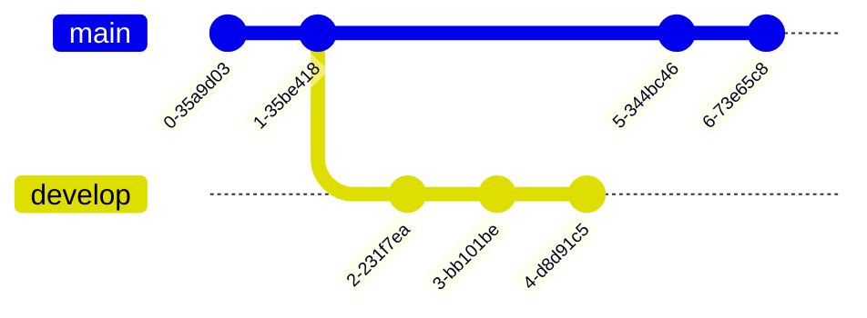
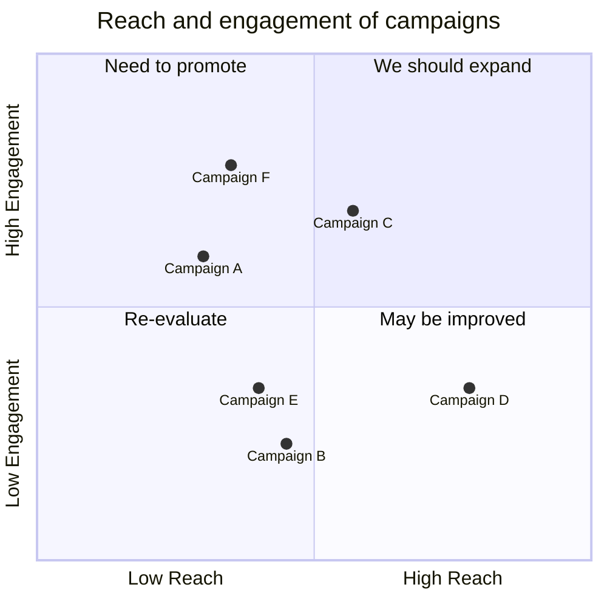
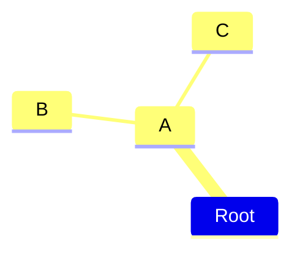
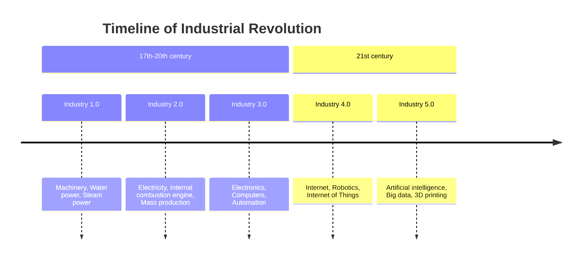
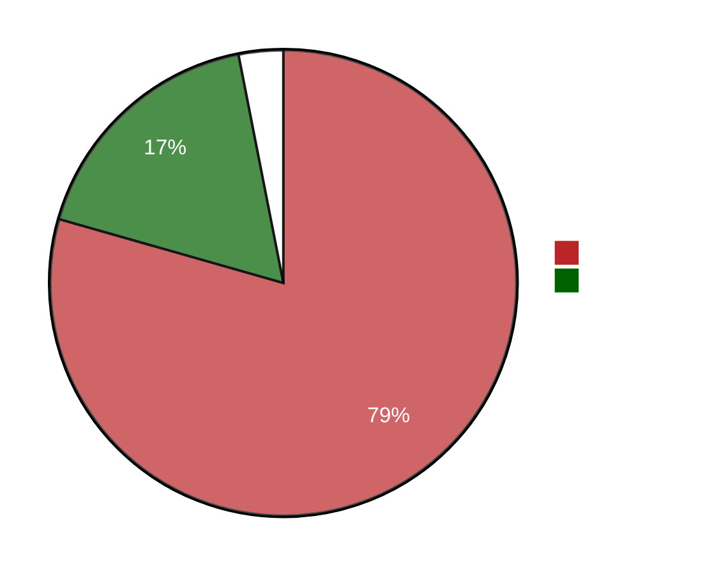

## Teste

teste em portugues

```yaml {filename="hugo.yaml"}
params:
  highlight:
    copy:
      enable: true
      # hover | always
      display: hover

```

$$F(\omega) = \int_{-\infty}^{\infty} f(t) e^{-j\omega t} \, dt$$

This $\sigma(z) = \frac{1}{1 + e^{-z}}$ is inline.

{}

LOREM LOREM

```yaml {filename="hugo.yaml"}
params:
  highlight:
    copy:
      enable: true
      # hover | always
      display: hover
```

Markdown is **supported**.

{}


  Please visit GitHub to see the latest releases.




  
  ```yaml {filename="hugo.yaml"}
  params:
    highlight:
      copy:
        enable: true
        # hover | always
        display: hover
  ```
  
  **YAML**: YAML is a human-readable data serialization language.
  **TOML**: TOML aims to be a minimal configuration file format that's easy to read due to obvious semantics.



https://imfing.github.io/hextra/docs/guide/shortcodes/cards/


  
  
  
  











  
    
    
      
      
      
    
  
  
